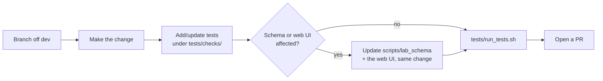

# Contributing to lab-in-a-box

Thanks for considering a contribution. This project welcomes bug reports,
add-ons, documentation fixes, and test coverage. This guide covers the
mechanics of getting a change in; see the [README](README.md) for how the
project itself is put together (architecture, lab definition format,
available commands and add-ons).

By participating, you're expected to follow the
[Code of Conduct](CODE_OF_CONDUCT.md).

## Before you start

- Check open [issues](../../issues) and [pull requests](../../pulls) — someone
  may already be working on the same thing.
- For a substantial change (a new backend, a new provisioning method, a
  restructuring of a shared library), open an issue first to discuss the
  approach before writing code. Small fixes and new add-ons can go straight
  to a pull request.

## Development setup

```shell
git clone https://github.com/SUSE-Technical-Marketing/lab-in-a-box.git
cd lab-in-a-box
git config core.hooksPath .githooks   # runs the test suite before every commit
```

You'll need `python3.11` and `podman` locally (see
[Dependencies](README.md#dependencies) in the README). There is no separate
package install step — the project has no external Python dependencies
beyond the standard library.

## Making a change



1. Create a branch off `dev` (not `main` — `main` tracks released state).
2. Make your change. Match the style of the surrounding code:
   - Python targets **3.11**, stdlib-only. No new third-party dependency
     without discussing it in an issue first.
   - Every `scripts/install_<addon>.py` is self-contained and follows the
     same pattern: a `# JSON section: "<name>" — configurable keys: ...`
     comment block at the top (this is what `--schema`/the web UI read to
     build forms), then `import addon_common`/`primary`/`k8s` from `libs/`,
     then the actual work over SSH. Look at a small existing add-on (e.g.
     `install_argocd.py`) before writing a new one.
   - Logic used by more than one script belongs in `libs/`, not copy-pasted.
   - Don't use a fixed `sleep()` to wait on something coming up (a reboot, a
     service, an API) — poll for the actual condition instead
     (`check_ssh_conn`, a status field, etc).
3. Add or update tests under `tests/checks/` — see [Testing](#testing)
   below. A new library or script gets its own `NN_name.sh` +
   `NN_name_test.py` pair, following the numbering and structure of an
   existing one.
4. If your change affects a script's own configuration schema (new field,
   new JSON section) or anything the web UI reads, update
   `scripts/lab_schema` and the web UI in the **same** change — see
   [Web UI (lab-builder)](README.md#web-ui-lab-builder).

   > [!WARNING]
   > A schema change that isn't reflected in the UI is treated as incomplete.

5. Run the full test suite before opening a PR:
   ```shell
   tests/run_tests.sh
   ```

## Testing

Every check runs in its own disposable `podman` container — see
[Testing](README.md#testing) in the README for the full rationale. To add a
new check, drop an executable script into `tests/checks/`; it's picked up
automatically, no wiring needed. Mocked-SSH unit tests (the `*_test.py`
files) should not require real network access or a real hypervisor — mock
the SSH/subprocess boundary, not the logic under test.

CI (`.github/workflows/ci.yml`) runs the same suite on every push and pull
request, plus a couple of fast standalone checks (byte-compiling everything
on Python 3.11, and confirming every add-on prints its schema) for quicker
feedback than waiting on the full container run.

> [!TIP]
> If your change touches one of the documented [Examples](README.md#examples),
> also run its real-hardware deploy+check test under `tests/examples/`
> (`tests/examples/run_example.sh <name>`) before opening the PR — these need
> a real KVM hypervisor, so they're not part of `tests/run_tests.sh`'s
> automatic sweep, but they're the only thing that actually confirms the
> example still deploys into a *working* cluster/VM, not just that
> `setup_lab.py` exits 0. See [tests/examples/README.md](tests/examples/README.md).

## Commit messages

Short, imperative, factual: `Add X`, `Fix Y`, `Retire Z`. Explain *why* in
the body if it isn't obvious from the diff. No trailing "summary of changes"
boilerplate.

## Pull requests

- Keep a PR focused on one change. A drive-by fix found while working on
  something else is fine to mention, but a large unrelated refactor should
  be its own PR.
- Fill in the PR template — what changed, why, and how it was tested (unit
  tests, and live-tested against real hardware if applicable).
- CI must be green before merge.

## Adding a new add-on

See [Available addons](README.md#available-addons) and
[Lab definition format](README.md#lab-definition-format) in the README for
the JSON shape add-ons plug into. In short:

1. Create `scripts/install_<name>.py` following the pattern of an existing
   add-on (self-contained, `# JSON section:` doc comment, `addon_common`
   dispatch for `--help`/`--version`/`--schema`).
2. Add templates under `templates/addons/<name>/` if the add-on needs any.
3. Add `"<name>"` to the `addons` array of a test lab JSON to exercise it.
4. Add a test under `tests/checks/`.

`install_automation_node_scripts.sh`'s deploy loop and the web UI both
discover a new add-on automatically — no separate registration step.

## Reporting bugs / requesting features

Use the issue templates. For anything that looks like a **security**
vulnerability (as opposed to one of the project's *intentionally* insecure
demo add-ons — see [SECURITY.md](SECURITY.md) for that distinction), please
follow the reporting process there instead of a public issue.
