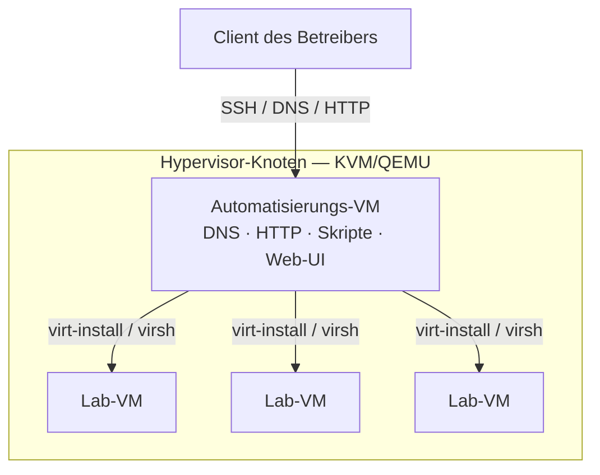
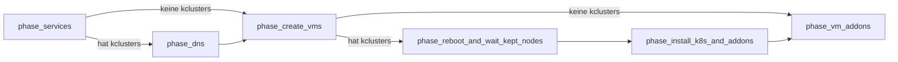
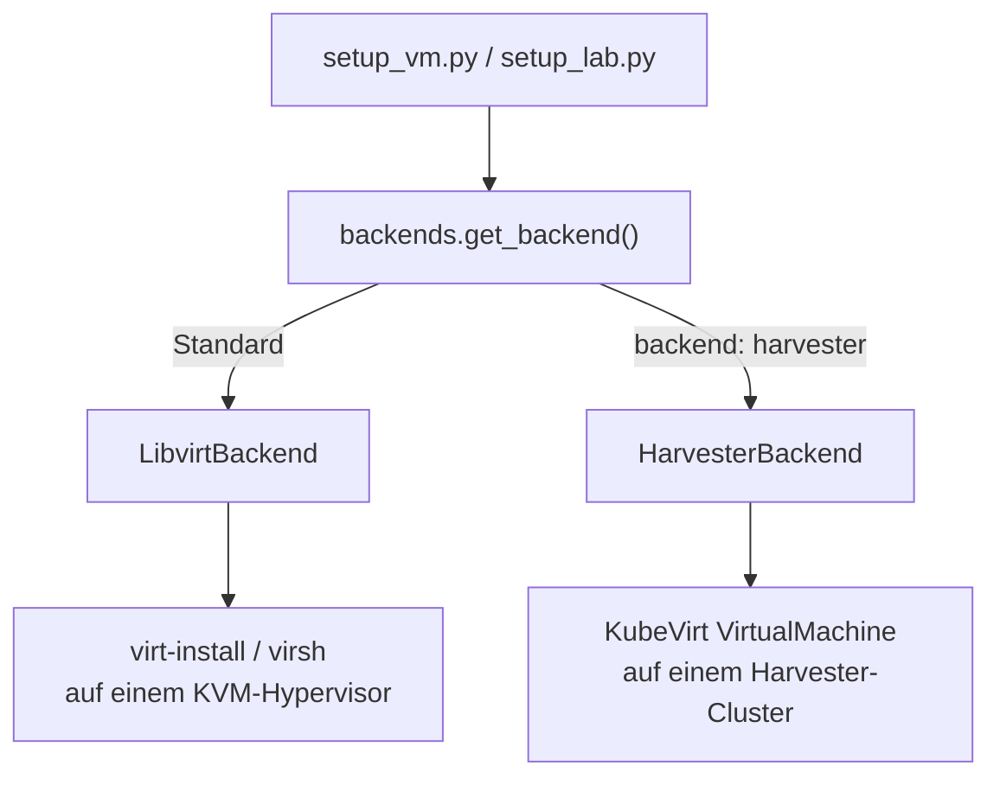
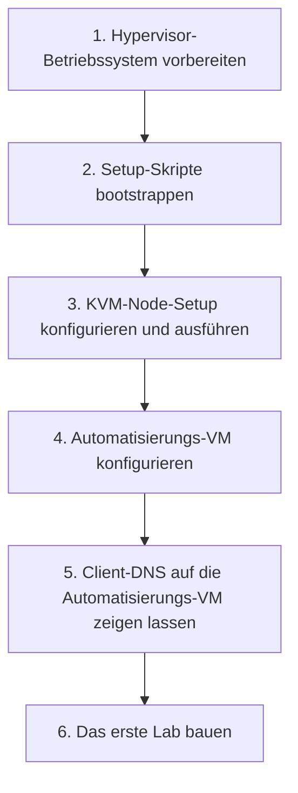
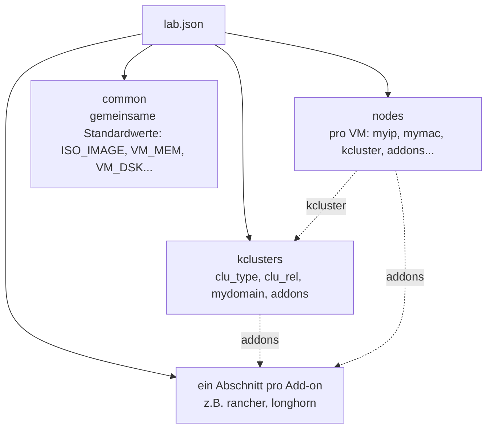

<a id="top"></a>
# lab-in-a-box

<p align="center">
  
  <br/>
  
</p>

<p align="center">
  <a href="https://github.com/SUSE-Technical-Marketing/lab-in-a-box/actions/workflows/ci.yml"></a>
  
  
  
  
</p>

<p align="center">
  <sub>🌐 <a href="README.md">English</a> · <a href="README.es.md">Español</a> · <a href="README.de.md"><strong>Deutsch</strong></a> · <a href="README.fr.md">Français</a> · <a href="README.pt-BR.md">Português (Brasil)</a> · <a href="README.ja.md">日本語</a> · <a href="README.zh-CN.md">简体中文</a></sub>
</p>

> *Dies ist eine von der Community erstellte Übersetzung. Die maßgebliche Quelle ist [README.md](README.md) (Englisch) und kann aktueller sein als diese Seite.*

<p align="center"><em>Auf eine JSON- oder YAML-Datei verweisen. Ein funktionierendes Lab zurückbekommen — VMs, DNS, Kubernetes und Add-ons, alles fertig verdrahtet.</em></p>

<p align="center" float="left">
  <kbd></kbd>
</p>

**lab-in-a-box** verwandelt eine einzelne Bare-Metal-Maschine in eine eigenständige Lab-Fabrik: Man verweist auf eine JSON- oder YAML-Datei, die die gewünschten VMs, Kubernetes-Cluster und Software beschreibt, und das Tool baut alles auf — DNS, Provisionierung, Cluster-Aufbau und Add-ons — ohne dass man `virt-install` oder Ansible von Hand anfassen muss.

## Warum lab-in-a-box?

<table>
<tr>
<td width="50%" valign="top">

**🧱 Eine JSON/YAML-Datei, ein Befehl.**
VMs, Kubernetes-Cluster (RKE2/K3s) und Add-ons deklarativ beschreiben; `setup_lab.py` baut alles in der richtigen Reihenfolge auf.

**🧩 41 fertige Add-ons.**
Rancher, Longhorn, NeuVector, Harbor, Keycloak, Jenkins, Argo CD, SUSE Manager/Uyuni (Aktivierungsschlüssel, RBAC, Content Lifecycle Management, Ansible-Integration und mehr), verwundbare Demo-Apps für Sicherheitsschulungen, und mehr.

**🖥️ Eine dynamische Web-UI.**
[lab-builder](#web-ui-lab-builder) generiert Formulare direkt aus dem eigenen Schema der Add-ons — ein Feld zu einem Skript hinzufügen, und die UI übernimmt es ohne Frontend-Änderungen.

</td>
<td width="50%" valign="top">

**🌐 Multi-Hypervisor-fähig.**
Eine einzige Lab-Definition kann VMs über mehrere KVM-Hosts verteilen, automatisch nach freier CPU/RAM/Disk ausgewählt oder pro Knoten fest zugewiesen.

**🧪 Vollständig containerisierte Testsuite.**
Jede Prüfung läuft in ihrem eigenen wegwerfbaren `podman`-Container, eingebunden in einen Pre-Commit-Hook.

**🔌 Austauschbare Provisionierung.**
Ignition+Combustion (SLE Micro), cloud-init (openSUSE/Ubuntu), `virt-customize` (ältere Distributionen ohne cloud-init/Ignition-Unterstützung) oder eine skriptgesteuerte ISO-Installation (AutoYaST/Kickstart/Preseed/AutoInstall).

</td>
</tr>
</table>

---

## Inhaltsverzeichnis

- [Architektur](#architecture)
- [Funktionsweise](#how-it-works)
- [Schnellstart](#quick-start)
- [Web-UI (lab-builder)](#web-ui-lab-builder)
- [Lab-Definitionsformat](#lab-definition-format)
- [Beispiele](#examples)
- [Schritt-für-Schritt-Anleitungen](#step-by-step-walkthroughs)
- [Verfügbare Befehle](#available-commands)
- [Verfügbare Add-ons](#available-addons)
- [Konfigurationsreferenz](#configuration-reference)
- [Tests](#testing)
- [Mitwirken / Entwicklungsumgebung](#contributing--developer-setup)

<p align="right"><a href="#top">↑ nach oben</a></p>

---

<a id="architecture"></a>
## Architektur

<p align="center" float="left">
  <kbd></kbd>
  <kbd></kbd>
</p>

Das System basiert auf einer **zweistufigen Architektur**:



### Hypervisor-Knoten

Eine oder mehrere physische Bare-Metal-Maschinen, die KVM/QEMU ausführen. Jede hostet Lab-VMs und hält QCOW2-Quellabbilder unter `/var/lib/libvirt/images/sources/`. Ein NUC, eine Workstation oder jede x86_64-Maschine, die KVM ausführen kann, reicht aus. Labs, die mehr Kapazität als eine Box benötigen, können sich über **mehrere KVM-Hosts** erstrecken — siehe [Multi-Host-Labs](#multi-host-labs) weiter unten.

### Automatisierungs-VM

Eine kleine VM, die auf dem Hypervisor läuft und als Steuerungsebene für das gesamte Lab fungiert. Sie stellt bereit:

- **DNS** — BIND (`named`) bedient die Lab-Domain und leitet externe Anfragen weiter, sodass sich alle Lab-Hostnamen von jedem Client auflösen lassen, der darauf zeigt
- **HTTP** — stellt Provisionierungsdateien (Ignition, Combustion, cloud-init) unter `/srv/www/htdocs/lab_creation/` bereit
- **Skripte** — alle Lab-Verwaltungsbefehle, installiert unter `/usr/local/bin/`
- **Web-UI** (optional) — [lab-builder](#web-ui-lab-builder), ein browserbasierter lab.json-Designer

Alle Benutzerbefehle werden **auf der Automatisierungs-VM** ausgeführt. Sie verbindet sich per SSH mit dem/den Hypervisor(n) und den erstellten VMs. Nach der Ersteinrichtung ist kein direkter Hypervisor-Zugriff mehr nötig.

### Unter der Haube

Die Kommandozeilen-Tools und jedes Add-on sind Python 3.11, liegen in `libs/` und `scripts/` und werden nach `/usr/local/lib/lab_creation/` installiert — organisiert um einen kleinen Satz gemeinsamer Bibliotheksmodule (`lab_creation.py`, `backends.py`, `services.py`, `spacecmd_common.py`, …), statt sich gegenseitig zu referenzieren. Die VM-Erstellung läuft über eine austauschbare `VMBackend`-Schnittstelle (heute `LibvirtBackend`), sodass derselbe Orchestrierungscode irgendwann andere Virtualisierungs-Backends (KubeVirt, Harvester) ansteuern kann, ohne Add-ons anzufassen. Ein Legacy-Add-on (`install_ds389`) ist noch reines Bash — es stammt aus der Zeit vor der Python-Portierung und war in Bash bereits defekt, sodass sich eine Portierung nicht lohnte. Die Bash-Ära-Implementierung, die diese ersetzt haben, lebt archiviert unter `legacy_bash/` weiter.

<p align="right"><a href="#top">↑ nach oben</a></p>

---

<a id="how-it-works"></a>
## Funktionsweise

### Deploy-Pipeline

`setup_lab.py` durchläuft eine feste Phasenfolge; die beiden Kubernetes-spezifischen Phasen werden für ein reines VM-Lab (ohne `kclusters`-Abschnitt) komplett übersprungen:



### VM-Provisionierung

Jede VM wird so erstellt:
1. Auflösen, zu welchem KVM-Host sie gehört (das explizite Feld `kvm_host`, oder automatische Auswahl nach freier Kapazität — siehe [Multi-Host-Labs](#multi-host-labs))
2. Kopieren und Größenänderung eines QCOW2-Quellabbilds auf diesem Host
3. Generieren der Provisionierungsdateien aus Vorlagen, gemäß `config_method`
4. Registrieren eines DNS-Eintrags in BIND
5. Ausführen von `virt-install` auf dem Hypervisor per SSH
6. Warten, bis SSH verfügbar ist

Die Provisionierungsmethode wird über `config_method` im Lab-JSON gesteuert (pro Knoten oder in `common`):

| Wert | Methode | Verwendet für |
|---|---|---|
| _(leer, Standard)_ | Ignition + Combustion | SLE Micro |
| `cloud-init` | cloud-init-ISO | openSUSE Leap, Ubuntu |
| `virt_customize` | Ändert die QCOW2 direkt auf dem Hypervisor (`virt-customize`) — keine Ignition/cloud-init-Unterstützung im Gast nötig | CentOS 7, altes Debian/RHEL oder jedes Abbild ohne Ignition/cloud-init |
| `install_iso` | Skriptgesteuerte Installation von einer echten Installer-ISO (AutoYaST, Kickstart, Preseed oder AutoInstall, je nach `install_type`) | Distributionen ohne anderen Provisionierungsweg |

### VM-Backends

Welche Hypervisor-Technologie einen Knoten tatsächlich erstellt, entscheidet eine austauschbare `VMBackend`-Schnittstelle, einmal pro Knoten aufgelöst (`backend: harvester` in der Knotenkonfiguration wählt `HarvesterBackend`; alles andere verwendet standardmäßig `LibvirtBackend`) — jedes Add-on und jedes Orchestrierungsskript spricht mit dem aufgelösten Backend auf die gleiche Weise, unabhängig davon, welches es ist:



### Kubernetes-Einrichtung

Sobald die VMs laufen, installiert `setup_lab.py` Kubernetes auf jedem Knoten gemäß dem `kclusters`-Abschnitt des JSON. Sowohl RKE2 als auch K3s werden unterstützt. Sobald ein Cluster bereit ist, laufen seine Add-ons nacheinander; Add-ons auf VM-Ebene (an einen einzelnen Knoten statt an einen Cluster gebunden) laufen, nachdem dieser Knoten provisioniert wurde.

### Multi-Host-Labs

<a id="multi-host-labs"></a>
Ein Lab ist nicht auf einen Hypervisor beschränkt. Setze `KVM_HOSTS` (durch Leerzeichen getrennt) in `/etc/lab_creation.cfg` auf der Automatisierungs-VM, um mehr als einen Hypervisor verfügbar zu machen:

```ini
KVM_HOSTS="hv1.mydemo.lab hv2.mydemo.lab hv3.mydemo.lab"
```

Für jeden Knoten im Lab-JSON kann man dann entweder:
- **explizit festlegen** — `"kvm_host": "hv2.mydemo.lab"` in der Konfiguration dieses Knotens, oder
- **automatisch auswählen lassen** — `kvm_host` weglassen; der Knoten landet auf dem konfigurierten Host, der gerade genug freie CPU/RAM/Disk hat (live per SSH geprüft).

Knoten ohne `kvm_host` und Boxen mit nur einem konfigurierten Host verhalten sich genau wie vor Einführung dieser Funktion — für ein Single-Hypervisor-Lab ändert sich nichts.

### Reihenfolge des Bibliothek-Ladens

Jedes Skript lädt die Konfiguration in dieser Reihenfolge:

1. `/etc/lab_creation.defaults` — Systemweite Standardwerte, Pfade, Paketlisten
2. `/usr/local/lib/lab_creation/primary.py` — Eingabevalidierung, Konfigurationsladen
3. `/etc/lab_creation.cfg` — Knotenspezifische Einstellungen (`REMOTE_HOST`, `ROOT_SSH_KEY`, `VIRT_SRV`, `KVM_HOSTS`, usw.)
4. `/usr/local/lib/lab_creation/lab_creation.py` — VM-, DNS- und Orchestrierungsfunktionen
5. `/usr/local/lib/lab_creation/k8s.py` — Kubernetes-Cluster-Funktionen

<p align="right"><a href="#top">↑ nach oben</a></p>

---

<a id="quick-start"></a>
## Schnellstart



### Voraussetzungen

- Eine Maschine, die KVM ausführen kann (Intel VT-x oder AMD-V aktiviert)
- Internetzugang (oder ein lokaler Mirror) für Paket- und Image-Downloads
- Ein QCOW2-Abbild für das gewählte Betriebssystem unter `/var/lib/libvirt/images/sources/` auf dem Hypervisor

> [!IMPORTANT]
> Die Automatisierungs-VM benötigt speziell `python3.11` — die Toolchain ist explizit darauf festgelegt. Die meisten Distributionen liefern daneben einen älteren `python3` als Standard mit; das Installationsskript bricht ab, wenn `python3.11` fehlt.

Getestete Abbilder:
- [SLE Micro](https://www.suse.com/download/sle-micro/) — empfohlen, mit Ignition+Combustion
- openSUSE Leap Micro — unterstützt, mit cloud-init

### Schritt 1 — Hypervisor-Betriebssystem vorbereiten

SLES (oder eine andere KVM-fähige Linux-Distribution) auf der Hardware installieren. Bei der Installation wählen:
- **Netzwerk**: eine Bridge-Schnittstelle (`br0`) erstellen, verbunden mit der Haupt-NIC, mit statischer IP
- **Systemrolle**: KVM Virtualization Host

<details>
<summary>Ein bootfähiges USB-Laufwerk unter Linux erstellen</summary>

```shell
# Vor dem Einstecken des USB-Sticks:
cat /proc/partitions > /tmp/partb4

# USB-Stick einstecken, dann:
cat /proc/partitions > /tmp/parta

# Das neue Gerät finden:
diff /tmp/part*
```

> [!WARNING]
> Der nächste Befehl **löscht sämtliche Daten** auf dem Zielgerät. Vor der Ausführung `sdX` unbedingt gegen die obige `diff`-Ausgabe prüfen.

```shell
# ISO schreiben (sdX durch das eigene Gerät ersetzen):
dd if=SLE-15-SP6-Online-x86_64-GM-Media1.iso of=/dev/sdX bs=4k && sync
```

</details>

### Schritt 2 — Setup-Skripte bootstrappen

Von jeder Linux-Maschine mit SSH-Zugriff auf den Hypervisor:

```shell
curl https://raw.githubusercontent.com/SUSE-Technical-Marketing/lab-in-a-box/main/install_demo_server_scripts.sh | bash -
```

Dies lädt die Setup-Skripte nach `/var/tmp/setup_demo_server/` herunter.

### Schritt 3 — KVM-Node-Setup konfigurieren und ausführen

<a id="step-3--configure-and-run-the-kvm-node-setup"></a>

```shell
cd /var/tmp/setup_demo_server/setup_demo_server/
vim lab.cfg
```

Wichtige Einstellungen in `lab.cfg`:

| Einstellung | Beschreibung |
|---|---|
| `ROOT_PWD_HASH` | Gehashtes Root-Passwort — generiert mit `mkpasswd --method=SHA-512 --stdin` |
| `ROOT_SSH_PUB_KEY` | Der eigene öffentliche SSH-Schlüssel für passwortlosen Zugriff |
| `AUTOMATION_HOSTNAME` | Hostname der Automatisierungs-VM (z. B. `automation.mydemo.lab`) |
| `_QCOW_IMAGE` | Dateiname des QCOW2-Quellabbilds |
| Netzwerkeinstellungen | IP, Gateway, Maske, DNS für das Lab-Netzwerk |

Dann das Setup ausführen (`<IP>` durch die Hypervisor-IP ersetzen, oder weglassen für lokal):

```shell
./setup_kvm_node.py <IP>
```

Dies provisioniert die Automatisierungs-VM und startet alle erforderlichen Dienste.

### Schritt 4 — Automatisierungs-VM konfigurieren

Per SSH mit der Automatisierungs-VM verbinden und die Lab-Skripte installieren:

```shell
ssh <AUTOMATION_HOSTNAME>
./install_automation_node_scripts.sh

cp /etc/lab_creation.cfg.example /etc/lab_creation.cfg
vim /etc/lab_creation.cfg
```

Wichtige Einstellungen in `lab_creation.cfg`:

| Einstellung | Beschreibung |
|---|---|
| `REMOTE_HOST` | Hostname oder IP des (primären) KVM-Hypervisors |
| `KVM_HOSTS` | _(optional)_ durch Leerzeichen getrennte Liste zusätzlicher Hypervisoren für ein [Multi-Host-Lab](#multi-host-labs) |
| `ROOT_SSH_KEY` | Inhalt des öffentlichen SSH-Schlüssels, der in VMs injiziert wird |
| `VIRT_SRV` | libvirt-Verbindungs-URI (z. B. `qemu+ssh://root@hypervisor/system`) |
| `NETWORK` | Standard-libvirt-Netzwerk für VMs (z. B. `bridge=br0`) |

### Schritt 5 — Client-DNS auf die Automatisierungs-VM zeigen lassen

<a id="step-5--point-your-client-dns-at-the-automation-vm"></a>

Damit sich Hostnamen vom eigenen Desktop aus auflösen lassen:

```shell
# Linux (NetworkManager):
nmcli con mod <connection> ipv4.dns <AUTOMATION_IP>

# Oder zu /etc/resolv.conf hinzufügen:
nameserver <AUTOMATION_IP>
```

### Schritt 6 — Das erste Lab bauen

```shell
setup_lab.py examples/cluster.json.template
```

Siehe [Beispiele](#examples) unten für weitere Ausgangspunkte, oder die [Web-UI](#web-ui-lab-builder) öffnen, statt JSON von Hand zu schreiben.

<p align="right"><a href="#top">↑ nach oben</a></p>

---

<a id="web-ui-lab-builder"></a>
## Web-UI (lab-builder)

Ein browserbasierter Designer für `lab.json`-Dateien, der **die eigenen Python-Bibliotheken des Projekts zur Laufzeit introspektiert** — er hat kein fest codiertes Wissen über irgendein Add-on. Eine Komponente auswählen, und die UI rendert ein Formular direkt aus dem Schema dieser Komponente; ein Feld zu einem Skript hinzufügen, und die UI zeigt es ohne Frontend-Änderungen an.

```shell
# Der schnellste Weg zum Ausprobieren — keine Abhängigkeiten außer Python:
python3.11 webui/run-local.py            # → http://localhost:8677/
```

Für ein Produktions-Deployment (Apache, oder ein eigenständiger, init-unabhängiger systemd-Dienst, plus HTTPS über ein idempotent generiertes selbstsigniertes Zertifikat) siehe **[README.webui.md](README.webui.md)** — es deckt alle drei Deployment-Modi, die HTTP-API und Fehlerbehebung ab.

<p align="right"><a href="#top">↑ nach oben</a></p>

---

<a id="lab-definition-format"></a>
## Lab-Definitionsformat

Labs werden als JSON- oder YAML-Dateien definiert (automatisch erkannt — siehe Hinweis unten). Das aktuelle Format unterstützt mehrere Kubernetes-Cluster pro Lab (`kclusters`); siehe `examples/cluster.json.template` für das ältere Single-Cluster-Format (`cluster`).



```jsonc
{
  "nodes": {
    "node101.mydemo.lab": {
      "myip":  "192.168.88.101",
      "mymac": "34:8a:b1:4b:1a:c1",
      "INSTALL_RKE2_TYPE": "server",   // "server" oder "agent"
      "kcluster": "cluster1"           // zu welchem kclusters-Eintrag dieser Knoten gehört
    },
    "node102.mydemo.lab": {
      "myip":  "192.168.88.102",
      "mymac": "34:8a:b1:4b:1a:c2",
      "INSTALL_RKE2_TYPE": "agent",
      "kcluster": "cluster1"
    }
  },
  "common": {
    "ISO_IMAGE":  "SL-Micro.x86_64-6.1-Default-qcow-GM.qcow2",
    "VM_MEM":     "24576",
    "VM_DSK":     "80",
    "VM_CPU":     "6",
    "VM_BOOT":    "uefi",             // uefi (Standard), firmware=bios, bios, uefi=off
    "mymask":     "24",
    "mygw":       "192.168.88.1",
    "mydns":      "192.168.88.73",
    "mynet_reverse": "88.168.192"
  },
  "kclusters": {
    "cluster1": {
      "clu_type":  "rke2",             // "rke2" oder "k3s"
      "clu_rel":   "stable",
      "mydomain":  "mydemo.lab",
      "addons": ["rancher", "longhorn"]
    }
  },
  "rancher": {
    "rancher_shorthn":   "rancher",
    "rancher_rel":       "rancher-prime",
    "rancher_repo_url":  "https://charts.rancher.com/server-charts/prime",
    "rancher_helm_rel":  "rancher",
    "rancher_helm_chart": "rancher-prime/rancher",
    "rancher_Version":   "--version 2.13.3",
    "cert_manager_ver":  "--version v1.14.4"
  }
}
```

<details>
<summary>Dasselbe Lab als YAML</summary>

```yaml
nodes:
  node101.mydemo.lab:
    myip: "192.168.88.101"
    mymac: "34:8a:b1:4b:1a:c1"
    INSTALL_RKE2_TYPE: server   # "server" oder "agent"
    kcluster: cluster1          # zu welchem kclusters-Eintrag dieser Knoten gehört
  node102.mydemo.lab:
    myip: "192.168.88.102"
    mymac: "34:8a:b1:4b:1a:c2"
    INSTALL_RKE2_TYPE: agent
    kcluster: cluster1

common:
  ISO_IMAGE: SL-Micro.x86_64-6.1-Default-qcow-GM.qcow2
  VM_MEM: "24576"
  VM_DSK: "80"
  VM_CPU: "6"
  VM_BOOT: uefi                # uefi (Standard), firmware=bios, bios, uefi=off
  mymask: "24"
  mygw: "192.168.88.1"
  mydns: "192.168.88.73"
  mynet_reverse: "88.168.192"

kclusters:
  cluster1:
    clu_type: rke2              # "rke2" oder "k3s"
    clu_rel: stable
    mydomain: mydemo.lab
    addons: [rancher, longhorn]

rancher:
  rancher_shorthn: rancher
  rancher_rel: rancher-prime
  rancher_repo_url: https://charts.rancher.com/server-charts/prime
  rancher_helm_rel: rancher
  rancher_helm_chart: rancher-prime/rancher
  rancher_Version: "--version 2.13.3"
  cert_manager_ver: "--version v1.14.4"
```

</details>

Optionale Felder auf Knotenebene:

| Feld | Beschreibung |
|---|---|
| `addons` | Liste der Add-on-Skripte, die nur für diese eine VM ausgeführt werden |
| `config_method` | Überschreibt die Provisionierungsmethode (`cloud-init`, `virt_customize`, `install_iso`) |
| `kvm_host` | Legt diese VM auf einen bestimmten Hypervisor in einem [Multi-Host-Lab](#multi-host-labs) fest |
| `extra_dsk` | Zusätzliche(s) anzuhängende(s) Laufwerk(e) — `"/dev/sdb"`, oder `"/dev/sdb,bus=scsi"`, um den Standard-Bus pro Laufwerk zu überschreiben |
| `salt_states` | Anzuwendende Salt-States (nur bei der cloud-init-Methode) |

Optionale kcluster-Felder:

| Feld | Beschreibung |
|---|---|
| `mgm_node` | Hostname des Knotens, der die Cluster-Add-on-Installer ausführt; Standard ist der erste Server-Knoten |

Jedes Add-on-Skript unterstützt außerdem `--schema` (Alias für `--input-definition`), das seine eigenen Konfigurationsschlüssel als maschinenlesbares JSON oder YAML ausgibt — dasselbe Schema, das die [Web-UI](#web-ui-lab-builder) zum Erstellen ihrer Formulare liest:

```shell
install_longhorn --schema
setup_lab.py --input-definition yaml   # Basis-Topologieschema (common/nodes/kclusters)
```

<p align="right"><a href="#top">↑ nach oben</a></p>

---

<a id="examples"></a>
## Beispiele

### Minimales Single-VM-Lab

Das kleinstmögliche Lab — eine VM, kein Kubernetes:

```jsonc
{
  "nodes": {
    "standalone.mydemo.lab": { "myip": "192.168.88.50" }
  },
  "common": {
    "ISO_IMAGE": "SL-Micro.x86_64-6.1-Default-qcow-GM.qcow2",
    "VM_MEM": "4096", "VM_DSK": "40", "VM_CPU": "2",
    "mymask": "24", "mygw": "192.168.88.1", "mydns": "192.168.88.73"
  }
}
```

```shell
setup_lab.py standalone.json
```

### RKE2 + Rancher + Longhorn (der "Hello World"-Cluster)

Ein 2-Knoten-Cluster mit einer Management-Plattform und verteiltem Storage — siehe das vollständige Beispiel unter [Lab-Definitionsformat](#lab-definition-format) oben.

```shell
setup_lab.py rancher-cluster.json
# Später erneut ausführen, dabei jede bereits laufende und erreichbare VM überspringen:
setup_lab.py --keep rancher-cluster.json
```

### Einen Cluster auf zwei Hosts verteilen

Den Server fest auf einen Hypervisor legen und die Agents automatisch auf dem [konfigurierten Host](#multi-host-labs) mit freiem Platz platzieren lassen:

```jsonc
{
  "nodes": {
    "srv1.mydemo.lab":   { "myip": "192.168.88.10", "kvm_host": "hv1.mydemo.lab", "kcluster": "prod" },
    "agent1.mydemo.lab": { "myip": "192.168.88.11", "kcluster": "prod" },
    "agent2.mydemo.lab": { "myip": "192.168.88.12", "kcluster": "prod" }
  },
  "common": { "ISO_IMAGE": "SL-Micro.x86_64-6.1-Default-qcow-GM.qcow2", "VM_MEM": "8192", "VM_DSK": "60", "VM_CPU": "4" },
  "kclusters": { "prod": { "clu_type": "rke2", "clu_rel": "stable", "mydomain": "mydemo.lab" } }
}
```

### SUSE-Manager-(Uyuni)-Server + ein registrierter Client

Einen Uyuni-Server mit einem Aktivierungsschlüssel aufsetzen und eine zweite VM als Salt-Client dagegen registrieren — siehe [Verfügbare Add-ons](#available-addons) für den vollen Funktionsumfang (`orgs`, RBAC, Content Lifecycle Management, Ansible-Integration und mehr):

```jsonc
{
  "nodes": {
    "uyuni.mydemo.lab":  { "myip": "192.168.88.30", "addons": ["uyuni"] },
    "client1.mydemo.lab": { "myip": "192.168.88.31", "addons": ["client_registration"] }
  },
  "common": { "ISO_IMAGE": "SL-Micro.x86_64-6.1-Default-qcow-GM.qcow2", "VM_MEM": "8192", "VM_DSK": "60", "VM_CPU": "4" },
  "uyuni": {
    "uyuni_admin": "admin", "uyuni_password": "Uyuni12345",
    "uyuni_activation_key": "1-lab-clients", "uyuni_activation_key_base_channel": "sle-micro-6.1-pool"
  },
  "client_registration": {
    "client_registration_server_type": "uyuni",
    "client_registration_server": "uyuni.mydemo.lab",
    "client_registration_activation_key": "1-lab-clients"
  }
}
```

<p align="right"><a href="#top">↑ nach oben</a></p>

---

<a id="step-by-step-walkthroughs"></a>
## Schritt-für-Schritt-Anleitungen

Die [Beispiele](#examples) oben sind Ausgangspunkte zum Kopieren und Einfügen. Diese drei führen von Anfang bis Ende durch vollständige, reale Szenarien — was auszuführen ist, was bei jedem Schritt passiert und wie man verifiziert, dass es wirklich funktioniert hat. Jedes JSON-Feld und jede Befehlsform unten entspricht der eigenen Testsuite dieses Projekts (`tests/run_tests.sh`) und dem Quellcode.

> [!TIP]
> Die Anleitungen 2 und 3 sind **live getestet** — gegen einen echten Server/echte Hardware ausgeführt, nicht nur isoliert geprüft.

### Anleitung 1 — Der erste Cluster: RKE2 + Rancher + Longhorn

Ziel: zwei SLE-Micro-VMs, ein RKE2-Cluster, Rancher zur Verwaltung, Longhorn für Storage — am Ende über den Browser erreichbar.

1. **Die Lab-Datei schreiben.** Als `rancher-cluster.json` speichern (IPs/Netzwerk an die eigene Lab-Domain anpassen):

   ```jsonc
   {
     "nodes": {
       "node101.mydemo.lab": {
         "myip": "192.168.88.101", "mymac": "34:8a:b1:4b:1a:c1",
         "INSTALL_RKE2_TYPE": "server", "kcluster": "cluster1"
       },
       "node102.mydemo.lab": {
         "myip": "192.168.88.102", "mymac": "34:8a:b1:4b:1a:c2",
         "INSTALL_RKE2_TYPE": "agent", "kcluster": "cluster1"
       }
     },
     "common": {
       "ISO_IMAGE": "SL-Micro.x86_64-6.1-Default-qcow-GM.qcow2",
       "VM_MEM": "24576", "VM_DSK": "80", "VM_CPU": "6",
       "mymask": "24", "mygw": "192.168.88.1", "mydns": "192.168.88.73"
     },
     "kclusters": {
       "cluster1": {
         "clu_type": "rke2", "clu_rel": "stable", "mydomain": "mydemo.lab",
         "addons": ["rancher", "longhorn"]
       }
     },
     "rancher": {
       "rancher_shorthn": "rancher", "rancher_rel": "rancher-prime",
       "rancher_repo_url": "https://charts.rancher.com/server-charts/prime",
       "rancher_helm_rel": "rancher", "rancher_helm_chart": "rancher-prime/rancher",
       "rancher_Version": "--version 2.13.3", "cert_manager_ver": "--version v1.14.4"
     }
   }
   ```

2. **Bauen:**

   ```shell
   setup_lab.py rancher-cluster.json
   ```

   `setup_lab.py` prüft die Datei automatisch vorab, bevor irgendetwas anderes passiert — falsche IPs, eine `kcluster`-Referenz, die nicht existiert, ein fehlendes `ISO_IMAGE` und ähnliche Fehler werden erkannt und ausgegeben (`✗ Preflight FAILED — N error(s)`), ohne dass etwas erstellt wird, statt auf halbem Weg zu scheitern. Eine saubere Datei gibt `✓ Preflight passed` aus und geht direkt zum Bauen über.

   Der Reihe nach passiert Folgendes: beide Knoten im DNS registrieren → beide VMs erstellen (QCOW2-Abbild kopieren, Combustion-Dateien generieren, booten, auf SSH warten) → RKE2 auf `node101` als Server installieren, dann auf `node102` als Agent → `rancher` und `longhorn` auf dem Management-Knoten des Clusters installieren (`mgm_node`, standardmäßig der erste Server-Knoten — hier `node101`). Ein 2-Knoten-Cluster mit Rancher dauert typischerweise 15–25 Minuten; das meiste davon ist RKE2-Bootstrapping und die eigene Helm-Installation von Rancher.

3. **Prüfen, dass DNS auflöst** (vom eigenen Desktop aus, sobald [dieser auf den DNS der Automatisierungs-VM zeigt](#step-5--point-your-client-dns-at-the-automation-vm)):

   ```shell
   dig +short node101.mydemo.lab rancher.mydemo.lab
   ```

   Beide sollten `192.168.88.101` zurückgeben (der Ingress-Hostname von Rancher ist der Wert von `rancher_shorthn`, `rancher`, unter dem `mydomain` des Clusters).

4. **Anmelden.** `https://rancher.mydemo.lab` aufrufen (selbstsigniertes Zertifikat — der Browser warnt einmalig) und sich mit `rancher_initial_pwd` aus `/etc/lab_creation.cfg` auf der Automatisierungs-VM anmelden.

5. **Iterieren, ohne alles neu zu bauen.** Konfiguration eines Knotens geändert, oder eine VM abgestürzt? Erneut mit `--keep` ausführen: jede VM, die bereits existiert, zu ihrer definierten IP/MAC passt und per SSH erreichbar ist, bleibt unangetastet; nur das tatsächlich Fehlende oder Defekte wird (neu) erstellt:

   ```shell
   setup_lab.py --keep rancher-cluster.json
   ```

6. **Abbauen**, wenn fertig:

   ```shell
   destroy_lab.py rancher-cluster.json
   ```

### Anleitung 2 — SUSE-Manager-(Uyuni)-Server mit registriertem Client

Ziel: ein Uyuni-Server mit einem echten Aktivierungsschlüssel, und eine zweite VM, die sich selbst als Salt-verwalteten Client dagegen registriert. **Live end-to-end gegen einen echten Uyuni-Server getestet.**

1. **Die Lab-Datei schreiben** — ein Knoten für den Uyuni-Server, einer für den Client:

   ```jsonc
   {
     "nodes": {
       "uyuni.mydemo.lab":   { "myip": "192.168.88.30", "addons": ["uyuni"] },
       "client1.mydemo.lab": { "myip": "192.168.88.31", "addons": ["client_registration"] }
     },
     "common": {
       "ISO_IMAGE": "SL-Micro.x86_64-6.1-Default-qcow-GM.qcow2",
       "VM_MEM": "8192", "VM_DSK": "60", "VM_CPU": "4",
       "mymask": "24", "mygw": "192.168.88.1", "mydns": "192.168.88.73", "mydomain": "mydemo.lab"
     },
     "uyuni": {
       "uyuni_admin": "admin", "uyuni_password": "Uyuni12345",
       "uyuni_activation_key": "1-lab-clients", "uyuni_activation_key_base_channel": "sle-micro-6.1-pool"
     },
     "client_registration": {
       "client_registration_server_type": "uyuni",
       "client_registration_server": "uyuni.mydemo.lab",
       "client_registration_activation_key": "1-lab-clients"
     }
   }
   ```

2. **Bauen:**

   ```shell
   setup_lab.py uyuni-lab.json
   ```

   Add-ons auf VM-Ebene (sowohl `uyuni` als auch `client_registration` sind an einen Knoten gebunden, nicht an einen Cluster, da hier kein `kclusters`-Abschnitt vorhanden ist) laufen, sobald ihr eigener Knoten läuft. `install_uyuni` startet den Server, wartet, bis er erreichbar ist, und erstellt dann den Aktivierungsschlüssel. `install_client_registration` bootstrappt anschließend `client1` dagegen — installiert das Bootstrap-Skript, führt es aus und fragt periodisch ab, bis der Salt-Key des neuen Minions als ausstehend erscheint, und akzeptiert ihn dann.

3. **Prüfen, dass sich der Client tatsächlich registriert hat.** Per SSH mit dem Uyuni-Server verbinden und direkt nachfragen:

   ```shell
   ssh uyuni.mydemo.lab
   mgrctl exec 'spacecmd -- system_list'
   ```

   `client1.mydemo.lab` sollte in der Liste erscheinen.

4. **In der Web-UI anmelden** unter `https://uyuni.mydemo.lab` mit `uyuni_admin`/`uyuni_password`, um dasselbe visuell zu sehen, den Aktivierungsschlüssel zu durchsuchen oder einen Highstate auszuführen.

Bekannte Unschärfe im Upstream-Projekt (kein Fehler dieses Projekts, hier dokumentiert für den Fall, dass sie auftritt): Das eigene Paket-Upgrade-Scriptlet von `salt-transactional-update` kann einen doppelten YAML-Schlüssel in `/etc/salt/minion.d/transactional_update.conf` auf dem Client hinterlassen, wodurch `salt-minion` in eine Absturzschleife gerät, bis dies manuell bereinigt wird. Nichts in diesem Repository fasst diese Datei an.

### Anleitung 3 — Automatisierungs-VM unter NAT (Laptop mit einer NIC als Hypervisor)

Ziel: die Automatisierungs-VM auf einem Host bootstrappen, der keine freie NIC zum Bridgen hat — stattdessen ein privates, von libvirt verwaltetes Netzwerk, mit bestimmten Ports, die per DNAT von der echten IP des Hosts selbst hereingeleitet werden. **Live end-to-end auf einer wegwerfbaren verschachtelten VM getestet.**

Das ändert nichts am [Standard-Schnellstart](#quick-start)-Ablauf, sofern man es nicht aktiv nutzt — `_network_mode` ist standardmäßig `"bridge"`, byte-für-byte identisch zu jedem bestehenden Setup.

1. **In `lab.cfg`** (Schnellstart [Schritt 3](#step-3--configure-and-run-the-kvm-node-setup)) setzen:

   ```ini
   _network_mode="nat"
   _nat_network_name="labnat"          # gezeigter Standardwert — ein neues virtuelles libvirt-Netzwerk, nicht das echte LAN des Hosts
   _nat_network_cidr="192.168.150.0/24" # gezeigter Standardwert
   _nat_forwarded_ports="22:22/TCP 80:80/TCP 443:443/TCP"  # gezeigter Standardwert — <extern>:<intern>/<Protokoll>
   ```

2. **Das Setup genau wie gewohnt ausführen:**

   ```shell
   ./setup_kvm_node.py
   ```

   Dies definiert das libvirt-Netzwerk `labnat` (NAT, DHCP/Gateway von libvirt selbst gehandhabt — derselbe Mechanismus wie das eingebaute `default`-Netzwerk von libvirt, nur unter dem eigenen Namen/CIDR dieses Projekts) statt einer Bridge, erstellt dann die Automatisierungs-VM darauf mit einer statischen IP innerhalb dieses privaten Bereichs, und leitet anschließend die drei obigen Ports per DNAT von der echten IP des Hosts selbst herein.

3. **Prüfen, dass Netzwerk und Weiterleitungsregeln existieren**, auf dem Hypervisor:

   ```shell
   virsh net-list                              # labnat: active
   iptables -t nat -L LAB_PORTFWD -n -v         # DNAT-Regeln zur privaten IP der Automatisierungs-VM
   iptables -L LAB_PORTFWD_FWD -n -v            # passende ACCEPT-Regeln in der FORWARD-Kette
   ```

4. **Die Automatisierungs-VM von außerhalb des Hypervisors erreichen**, über die echte IP des Hypervisors selbst — nicht über die private `192.168.150.x`-Adresse der Automatisierungs-VM, die von nirgendwo sonst routbar ist:

   ```shell
   ssh root@<echte-hypervisor-ip>          # per DNAT zum SSH der Automatisierungs-VM, Port 22
   ```

   Die Ports 80 und 443 werden standardmäßig ebenfalls weitergeleitet (der HTTP-Server für Provisionierungsdateien und, sobald die [Web-UI](#web-ui-lab-builder) eingerichtet ist, deren HTTPS-Listener) — auf dieselbe Weise über die echte IP des Hypervisors erreichbar.

5. **Weiterleitung für eine Lab-VM hinzufügen**, nicht nur für die Automatisierungs-VM selbst: diesem Knoten ein Feld `forwarded_ports` geben und einmalig den Dienst `portforward` in `common.services` aktivieren:

   ```jsonc
   {
     "nodes": {
       "app1.mydemo.lab": {
         "myip": "192.168.150.20",
         "forwarded_ports": ["8080:80/TCP", "8443:443/TCP"]
       }
     },
     "common": { "services": ["portforward"], "...": "…Rest von common wie gewohnt" }
   }
   ```

   `setup_lab.py`/`setup_vm.py` leiten diese zwei Ports genauso per DNAT von der echten IP des Hypervisors herein, sobald zum ersten Mal irgendein Knoten im Lab `forwarded_ports` deklariert.

<p align="right"><a href="#top">↑ nach oben</a></p>

---

<a id="available-commands"></a>
## Verfügbare Befehle

Alle Befehle laufen auf der **Automatisierungs-VM** und nehmen eine JSON-Lab-Definitionsdatei als erstes Argument.

| Befehl | Beschreibung |
|---|---|
| `setup_lab.py [--keep] <lab.json>` | Erstellt alle VMs, richtet Kubernetes-Cluster ein und installiert jedes Cluster- und VM-Add-on der Reihe nach. `--keep` überspringt jede bereits existierende VM, die zur definierten IP/MAC passt und per SSH erreichbar ist — ohne diese Option wird jede VM zerstört und neu erstellt. |
| `setup_vm.py <lab.json> <hostname>` | Eine einzelne VM erstellen oder neu erstellen |
| `destroy_vm.py <lab.json> <hostname>` | Eine einzelne VM zerstören |
| `destroy_lab.py <lab.json>` | Alle VMs eines Labs zerstören |

Jeder Befehl und jedes `install_<addon>`-Skript unterstützt:

```shell
setup_lab.py --version              # gibt die installierte Version aus
install_longhorn --schema           # gibt das eigene Konfigurationsschema dieses Add-ons aus (JSON)
install_longhorn --schema yaml      # ...oder YAML
```

<p align="right"><a href="#top">↑ nach oben</a></p>

---

<a id="available-addons"></a>
## Verfügbare Add-ons

Add-ons werden namentlich im `addons`-Array eines Kclusters oder Knotens referenziert. Das entsprechende `install_<name>`-Skript muss im `PATH` liegen.

<sub>Direkt zu: <a href="#addons-k8s">Kubernetes &amp; GitOps</a> · <a href="#addons-security">Sicherheit &amp; Compliance</a> · <a href="#addons-suma">SUSE Manager / Uyuni</a> · <a href="#addons-storage">Storage &amp; Datenbanken</a> · <a href="#addons-cicd">CI/CD &amp; Werkzeuge</a> · <a href="#addons-ai">KI / ML</a> · <a href="#addons-virt">Virtualisierung &amp; Demos</a></sub>

<a id="addons-k8s"></a>
<details open>
<summary><strong>Kubernetes-Plattform &amp; GitOps</strong></summary>

| Add-on-Name | Beschreibung |
|---|---|
| `rancher` | SUSE-Rancher-Prime-Kubernetes-Managementplattform |
| `longhorn` | SUSE-Longhorn-verteilter Block-Storage |
| `harbor` | Container-Registry |
| `argocd` | Argo-CD-GitOps-Controller |
| `kubewarden` | Kubernetes-Policy-Engine |
| `istio` | Service-Mesh |
| `linkerd` | Service-Mesh |
| `traefik` | Ingress-Controller |
| `nginx` | Ingress-Controller / Reverse-Proxy |
| `coredns` | Cluster-DNS |
| `kucero` | Zertifikatsrotation für Kubernetes-Cluster |
| `fluid` | Datenorchestrierung/Caching für Cloud-native Workloads |

</details>

<a id="addons-security"></a>
<details open>
<summary><strong>Sicherheit &amp; Compliance</strong></summary>

| Add-on-Name | Beschreibung |
|---|---|
| `neuvector` | SUSE-NeuVector-Container-Sicherheitsplattform |
| `nv_testing` | NeuVector-Sicherheitstest-Workloads (nginx-/node-/redis-Pods) |
| `nv-demo-helm` | NeuVector-Helm-basierte Demo-Workloads |
| `complianceascode` | OpenSCAP/ComplianceAsCode-Operator |
| `keycloak` | Identitäts- und Zugriffsverwaltung |
| `kagent` | Kubernetes-Assistent für agentische KI-Sicherheit |
| `insecure_app` | Absichtlich verwundbare Webanwendung (Demo/Schulung) |
| `struts_demo` | Verwundbare Apache-Struts2-Demoanwendung (CVE-2017-5638) |

</details>

<a id="addons-suma"></a>
<details open>
<summary><strong>SUSE Manager / Uyuni</strong></summary>

| Add-on-Name | Beschreibung |
|---|---|
| `uyuni` | Uyuni-Server (Upstream): Aktivierungsschlüssel, Organisationen, RBAC, Content Lifecycle Management, Ansible-Integration, SCAP/CVE-Auditierung, dev/QA/prod-Umgebungstopologie — siehe `install_uyuni --schema` für die vollständige Feldliste |
| `smlm` | SUSE-Manager-Lifecycle-Management-Server — derselbe Funktionsumfang wie `uyuni`, per Kubernetes/Helm bereitgestellt |
| `smlm_proxy` | SMLM-Proxy |
| `client_registration` | Registriert eine beliebige VM als Salt-Client eines bestehenden `uyuni`/`smlm`-Servers (Aktivierungsschlüssel-Bootstrap + Salt-Key-Akzeptanz) |
| `suma` | SUSE Manager (SUMA), direkt auf dem Betriebssystem via `mgradm` installiert — nicht Kubernetes |

</details>

<a id="addons-storage"></a>
<details open>
<summary><strong>Storage &amp; Datenbanken</strong></summary>

| Add-on-Name | Beschreibung |
|---|---|
| `mariadb` | MariaDB-Datenbank |
| `postgresql` | PostgreSQL-Datenbank |
| `openldap` | OpenLDAP-Verzeichnisdienst |
| `ds389` | 389 Directory Server (LDAP) — das einzige noch in Bash implementierte Add-on |

</details>

<a id="addons-cicd"></a>
<details open>
<summary><strong>CI/CD &amp; Entwicklerwerkzeuge</strong></summary>

| Add-on-Name | Beschreibung |
|---|---|
| `jenkins` | Jenkins CI |
| `appcollection` | SUSE Application Collection |
| `stackpack` | StackState-Monitoring-Integration |
| `trento` | SAP-Infrastrukturmonitoring |

</details>

<a id="addons-ai"></a>
<details open>
<summary><strong>KI / ML</strong></summary>

| Add-on-Name | Beschreibung |
|---|---|
| `ollama` | Lokale LLM-Laufzeitumgebung |
| `deepseek` | DeepSeek-Modell, bereitgestellt über Ollama |
| `gemini` | Google-Gemini-API-Integration |
| `phoebe` | (siehe `install_phoebe --schema`) |

</details>

<a id="addons-virt"></a>
<details open>
<summary><strong>Virtualisierung &amp; Demos</strong></summary>

| Add-on-Name | Beschreibung |
|---|---|
| `harvester` | SUSE-Virtualization-(Harvester/KubeVirt)-Knotenprovisionierung |
| `wordpress` | WordPress-+-MySQL-Demoanwendung |
| `kiwi` | KIWI-Appliance-Builder |
| `fluentd` | Log-Aggregation |

</details>

Um ein neues Add-on hinzuzufügen: `scripts/install_<name>.py` nach dem Muster eines bestehenden erstellen (`addon_common` importieren, den passenden JSON-Abschnitt via `load_definition()` laden, die eigentliche Arbeit per SSH erledigen), bei Bedarf Vorlagen unter `templates/addons/<name>/` hinzufügen, und `"<name>"` im `addons`-Array des eigenen JSON referenzieren — die Deploy-Schleife von `install_automation_node_scripts.sh` und die Web-UI entdecken es beide automatisch.

<p align="right"><a href="#top">↑ nach oben</a></p>

---

<a id="configuration-reference"></a>
## Konfigurationsreferenz

### `/etc/lab_creation.defaults`

Systemweite Standardwerte, geladen von jedem Skript. Definiert Pfade, Standard-Wartezeiten und Paketlisten. **Nicht bearbeiten**, es sei denn, man weiß genau, was man tut.

### `/etc/lab_creation.cfg`

Knotenspezifische Konfiguration für die Automatisierungs-VM. Wird während der Einrichtung von `/etc/lab_creation.cfg.example` kopiert. Wichtige Variablen:

| Variable | Beschreibung |
|---|---|
| `REMOTE_HOST` | Hostname oder IP des KVM-Hypervisors |
| `KVM_HOSTS` | _(optional)_ durch Leerzeichen getrennte Liste von Hypervisoren für ein [Multi-Host-Lab](#multi-host-labs); Standard ist nur `REMOTE_HOST` |
| `VIRT_SRV` | libvirt-URI für den Remote-Hypervisor |
| `ROOT_SSH_KEY` | Inhalt des öffentlichen SSH-Schlüssels, der in provisionierte VMs injiziert wird |
| `NETWORK` | Standard-libvirt-Netzwerkstring |
| `REMOTE_DNS_SERVERS` | Durch Leerzeichen getrennte Liste zusätzlich zu aktualisierender DNS-Server |
| `delay_min` | Wartezeit in Minuten zwischen Provisionierungsphasen (auf langsamer Hardware erhöhen) |

### `/usr/local/lib/lab_creation/`

Installierte Python-Bibliotheksmodule. Wird durch Ausführen von `install_automation_node_scripts.sh` aus dem Repository auf der Automatisierungs-VM aktualisiert.

| Datei | Inhalt |
|---|---|
| `lab_creation.py` | VM-Lebenszyklus-, DNS-, Multi-Host-Auflösungs- und Orchestrierungshilfsfunktionen |
| `backends.py` | `VMBackend`-Schnittstelle + `LibvirtBackend` (VM erstellen/löschen/neu starten, Provisionierungsdateien übertragen) |
| `services.py` | DNS-Dienstverwaltung |
| `spacecmd_common.py` | Gemeinsame SUSE-Manager/Uyuni-Automatisierung (Aktivierungsschlüssel, Organisationen, RBAC, CLM, Ansible, SCAP/CVE), verwendet von `install_uyuni`/`install_smlm`/`install_client_registration` |
| `primary.py` | Eingabevalidierung und Konfigurationsladen |
| `k8s.py` | Schnittstelle für Kubernetes-Cluster-Distributionen (RKE2/K3s) |
| `addon_common.py` | Gemeinsame CLI-Infrastruktur, die jedes `install_*`-Add-on verwendet (Dispatch für `--help`/`--version`/`--schema`, Schemavalidierung) |

Die vier Bash-Hilfsskripte (`lab_creation.bash`, `k8s_functions.bash`, `primary_functions.bash`, `extensions.sh`) sind ebenfalls weiterhin daneben installiert — dauerhaft beibehalten für `install_ds389`, das einzige Add-on, das nie nach Python portiert wurde.

<p align="right"><a href="#top">↑ nach oben</a></p>

---

<a id="testing"></a>
## Tests

Jede Prüfung läuft in ihrem **eigenen unabhängigen, wegwerfbaren `podman`-Container** — ein Absturz, ein Hänger oder ein Restzustand in einer Prüfung kann keine andere beeinträchtigen:

```shell
tests/run_tests.sh
```

Deckt Bash- und Python-Syntax im gesamten Baum ab, Schema-/Web-UI-Konsistenz, Unit-Tests mit simuliertem SSH für jede Kernbibliothek und jedes Orchestrierungsskript sowie Regressionstests für Fehler, die während Live-Tests gefunden wurden. Um eine neue Prüfung hinzuzufügen, ein ausführbares Skript in `tests/checks/` ablegen — es wird automatisch erkannt, keine zusätzliche Verdrahtung nötig.

Eingebunden in einen Pre-Commit-Hook (einmal pro Klon aktivieren, siehe [Mitwirken](#contributing--developer-setup)) — läuft automatisch bei jedem Commit und wird mit einer Warnung übersprungen, falls `podman` nicht installiert ist, statt den Commit zu blockieren.

<p align="right"><a href="#top">↑ nach oben</a></p>

---

<a id="contributing--developer-setup"></a>
## Mitwirken / Entwicklungsumgebung

Siehe **[CONTRIBUTING.md](CONTRIBUTING.md)** (auf Englisch) für die vollständige Anleitung (Entwicklungsumgebung, Code-Konventionen, wie man ein Add-on hinzufügt, PR-Prozess). Dieses Projekt folgt dem [Contributor-Covenant-Verhaltenskodex](CODE_OF_CONDUCT.md); siehe [SECURITY.md](SECURITY.md), um eine Schwachstelle zu melden. Jeder Push und Pull Request durchläuft [CI](https://github.com/SUSE-Technical-Marketing/lab-in-a-box/actions/workflows/ci.yml) — Python-3.11-Syntax-/Import-Prüfungen, das Schema jedes Add-ons, `shellcheck` und die vollständige containerisierte Testsuite von unten.

### Einmalige Git-Einrichtung

Nach dem Klonen des Repositorys ausführen:

```shell
git config core.hooksPath .githooks
```

Dies aktiviert die Hooks unter `.githooks/`, die:
- die vollständige [Testsuite](#testing) vor jedem Commit ausführen
- die Versionsstempelung pro Skript verwalten (siehe unten)

### Wie die Versionierung funktioniert

> [!NOTE]
> Dies wird vollständig von den obigen Git-Hooks gehandhabt — `__LABVERSION__` wird nie von Hand bearbeitet.

Jedes Skript enthält den Platzhalter:

```python
__LABVERSION__ = "__LABVERSION__"
```

Die Hooks unter `.githooks/` expandieren und stellen diesen Platzhalter automatisch wieder her:

| Hook | Auslöser | Aktion |
|---|---|---|
| `post-checkout` | `git checkout` / `git switch` | Ersetzt `__LABVERSION__` in jedem Skript durch den Hash des letzten Commits, der diese Datei geändert hat |
| `post-merge` | `git pull` / `git merge` | Wie oben |
| `post-rewrite` | `git rebase` / `git commit --amend` | Wie oben |
| `pre-commit` | `git commit` | Stellt `__LABVERSION__` in allen gestagten Skripten wieder her, bevor der Commit geschrieben wird, sodass Hashes nie im Repository gespeichert werden |

Ergebnis: Jedes Skript im eigenen Arbeitsverzeichnis zeigt seine eigene Version über `--version` an, und das Repository selbst speichert immer den sauberen Platzhalter. Wenn Skripte über `install_automation_node_scripts.sh` installiert werden, wird dieselbe Hash-Ersetzung pro Datei bei der Installation mittels `git log -1 --format=%h` angewendet.

### Skripte auf der Automatisierungs-VM installieren

Von der Repository-Wurzel auf der Automatisierungs-VM (oder jeder Maschine mit geklontem Repository):

```shell
./install_automation_node_scripts.sh
```

Dies sichert die bestehende Installation (sowohl ein eigenes zeitgestempeltes Archiv als auch, separat, was auch immer der eigene Backup-Prozess aufbewahrt), kopiert jedes Skript/jede Bibliothek/Vorlage an seinen Systempfad und stempelt jede installierte Datei mit ihrem Versions-Hash.

### Abhängigkeiten

Laufzeit (auf der Automatisierungs-VM):
`python3.11`, `jq`, `ssh`, `rsync`, `nc`, `helm`, `kubectl`, `named` (BIND)

Die Hypervisor-Einrichtung erfordert zusätzlich:
`virt-install`, `virsh`, `qemu-img`, `zypper`, QCOW2-Quellabbilder unter `/var/lib/libvirt/images/sources/`

Das Ausführen der [Testsuite](#testing) erfordert zusätzlich:
`podman`
