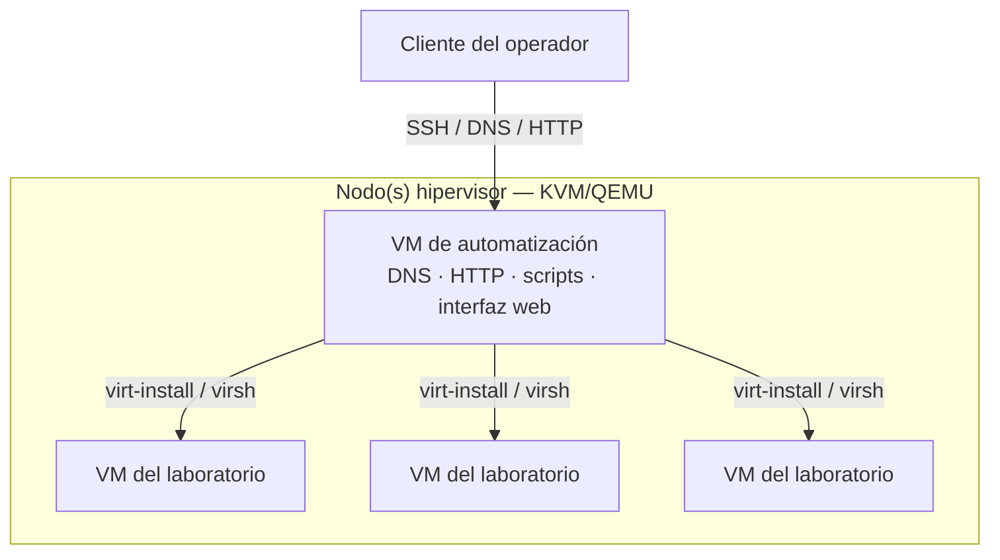
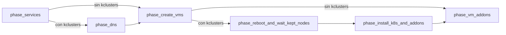
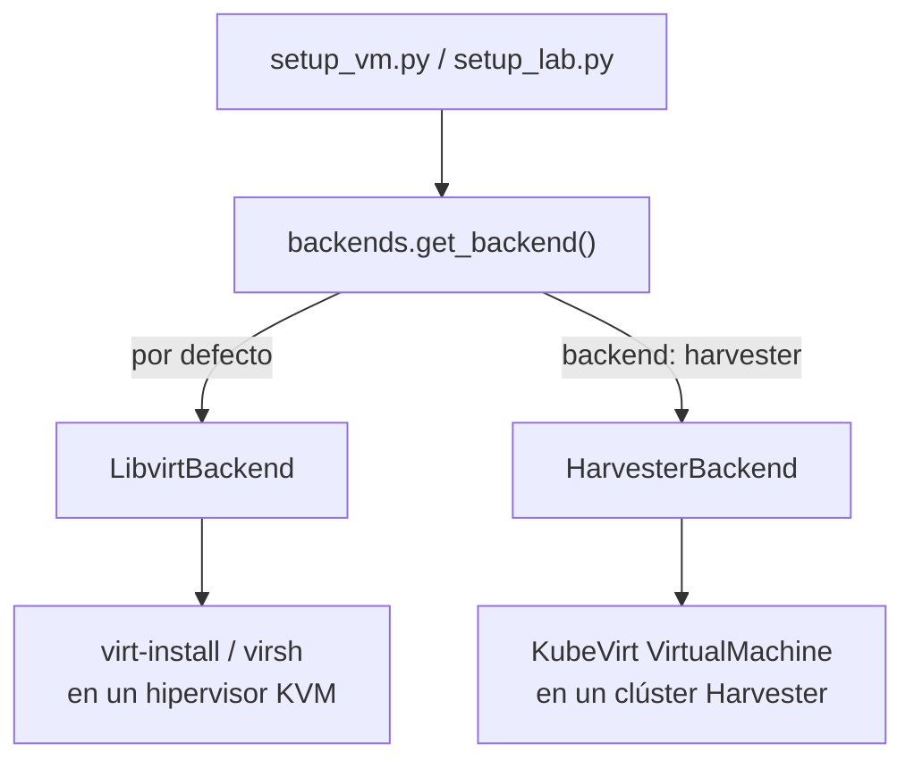
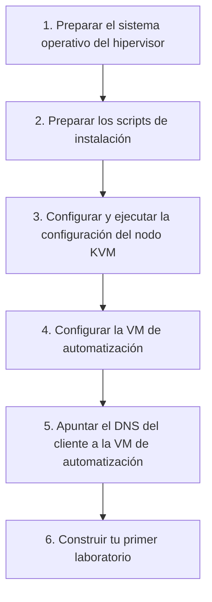
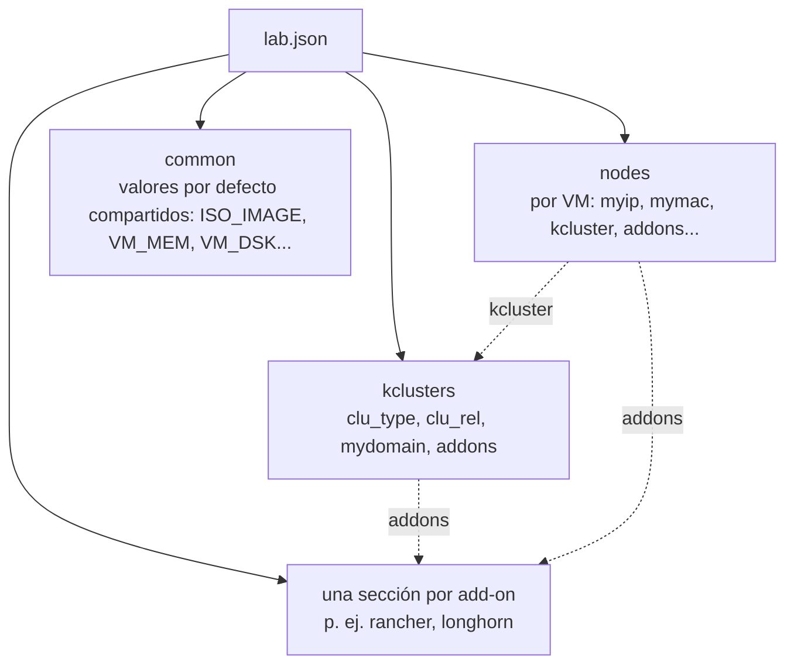

<a id="top"></a>
# lab-in-a-box

<p align="center">
  
  <br/>
  
</p>

<p align="center">
  <a href="https://github.com/SUSE-Technical-Marketing/lab-in-a-box/actions/workflows/ci.yml"></a>
  
  
  
  
</p>

<p align="center">
  <sub>🌐 <a href="README.md">English</a> · <a href="README.es.md"><strong>Español</strong></a> · <a href="README.de.md">Deutsch</a> · <a href="README.fr.md">Français</a> · <a href="README.pt-BR.md">Português (Brasil)</a> · <a href="README.ja.md">日本語</a> · <a href="README.zh-CN.md">简体中文</a></sub>
</p>

> *Esta es una traducción de la comunidad. La fuente de referencia es [README.md](README.md) (inglés) y puede estar más actualizada que esta página.*

<p align="center"><em>Apúntalo a un archivo JSON o YAML. Obtén de vuelta un laboratorio funcionando — VMs, DNS, Kubernetes y add-ons, todo conectado.</em></p>

<p align="center" float="left">
  <kbd></kbd>
</p>

**lab-in-a-box** convierte una sola máquina física en una fábrica de laboratorios autocontenida: apúntalo a un archivo JSON o YAML que describa las VMs, los clústeres de Kubernetes y el software que quieres, y construye todo — DNS, aprovisionamiento, puesta en marcha del clúster y add-ons — sin que tengas que tocar `virt-install` o Ansible a mano.

## ¿Por qué lab-in-a-box?

<table>
<tr>
<td width="50%" valign="top">

`setup_lab.py` · **Un archivo JSON/YAML, un comando.**
Describe VMs, clústeres de Kubernetes (RKE2/K3s) y add-ons de forma declarativa; lo construye todo en el orden correcto.

`install_<addon>` · **41 add-ons listos para usar.**
Rancher, Longhorn, NeuVector, Harbor, Keycloak, Jenkins, Argo CD, SUSE Manager/Uyuni (claves de activación, RBAC, Content Lifecycle Management, integración con Ansible, y más), aplicaciones de demostración vulnerables para formación en seguridad, y más.

[`lab-builder`](#web-ui-lab-builder) · **Una interfaz web dinámica.**
Genera formularios directamente a partir del esquema propio de cada add-on — añade un campo a un script y la interfaz lo recoge sin cambios en el frontend.

</td>
<td width="50%" valign="top">

`KVM_HOSTS` · **Consciente de múltiples hipervisores.**
Una sola definición de laboratorio puede repartir VMs entre varios hosts KVM, seleccionados automáticamente según CPU/RAM/disco libres, o fijados por nodo.

`podman` · **Suite de pruebas totalmente containerizada.**
Cada verificación se ejecuta en su propio contenedor desechable, conectada a un hook de pre-commit.

`config_method` · **Aprovisionamiento conectable.**
Ignition+Combustion (SLE Micro), cloud-init (openSUSE/Ubuntu), `virt-customize` (distribuciones antiguas sin soporte de cloud-init/Ignition), o una instalación por ISO guionizada (AutoYaST/Kickstart/Preseed/AutoInstall).

</td>
</tr>
</table>

---

## Tabla de contenidos

- [Arquitectura](#architecture)
- [Cómo funciona](#how-it-works)
- [Inicio rápido](#quick-start)
- [Interfaz web (lab-builder)](#web-ui-lab-builder)
- [Formato de definición del laboratorio](#lab-definition-format)
- [Ejemplos](#examples)
- [Guías paso a paso](#step-by-step-walkthroughs)
- [Comandos disponibles](#available-commands)
- [Add-ons disponibles](#available-addons)
- [Referencia de configuración](#configuration-reference)
- [Pruebas](#testing)
- [Contribuir / Configuración de desarrollo](#contributing--developer-setup)

<p align="right"><a href="#top">↑ volver arriba</a></p>

---

<a id="architecture"></a>
## Arquitectura

<p align="center" float="left">
  <kbd></kbd>
  <kbd></kbd>
</p>

El sistema está construido alrededor de una **arquitectura de dos niveles**:



### Nodo(s) hipervisor

Una o varias máquinas físicas que ejecutan KVM/QEMU. Cada una aloja las VMs del laboratorio y guarda las imágenes QCOW2 de origen en `/var/lib/libvirt/images/sources/`. Sirve un NUC, una estación de trabajo o cualquier máquina x86_64 capaz de ejecutar KVM. Los laboratorios que necesiten más capacidad que una sola máquina pueden repartirse entre **varios hosts KVM** — ver [laboratorios multi-host](#multi-host-labs) más abajo.

### VM de automatización

Una VM pequeña que corre en el hipervisor y actúa como plano de control de todo el laboratorio. Proporciona:

- **DNS** — BIND (`named`) sirve el dominio del laboratorio y reenvía peticiones externas, de modo que todos los nombres de host del laboratorio se resuelven desde cualquier cliente que apunte a ella
- **HTTP** — sirve los archivos de aprovisionamiento (Ignition, Combustion, cloud-init) en `/srv/www/htdocs/lab_creation/`
- **Scripts** — todos los comandos de gestión del laboratorio instalados en `/usr/local/bin/`
- **Interfaz web** (opcional) — [lab-builder](#web-ui-lab-builder), un diseñador de lab.json basado en navegador

Todos los comandos de usuario se ejecutan **en la VM de automatización**. Esta se conecta al/a los hipervisor(es) y a las VMs creadas por SSH. No hace falta acceso directo al hipervisor después de la configuración inicial.

### Por debajo

Las herramientas de línea de comandos y cada add-on son Python 3.11, viven en `libs/` y `scripts/`, y se instalan en `/usr/local/lib/lab_creation/` — organizadas en torno a un pequeño conjunto de módulos de biblioteca compartidos (`lab_creation.py`, `backends.py`, `services.py`, `spacecmd_common.py`, …) en lugar de depender unos de otros. La creación de VMs pasa por una interfaz `VMBackend` conectable (`LibvirtBackend` hoy en día), de modo que el mismo código de orquestación pueda algún día apuntar a otros backends de virtualización (KubeVirt, Harvester) sin tocar los add-ons. Un add-on heredado (`install_ds389`) sigue en bash puro — es anterior a la migración a Python y ya estaba roto en bash, así que no valía la pena portarlo. La implementación de la era bash que estos sustituyen sigue viva, archivada, en `legacy_bash/`.

<p align="right"><a href="#top">↑ volver arriba</a></p>

---

<a id="how-it-works"></a>
## Cómo funciona

### Pipeline de despliegue

`setup_lab.py` ejecuta una secuencia fija de fases; las dos fases exclusivas de Kubernetes se omiten por completo en un laboratorio solo de VMs (sin sección `kclusters`):



### Aprovisionamiento de VMs

Cada VM se crea siguiendo estos pasos:
1. Resolver a qué host KVM pertenece (el campo explícito `kvm_host`, o autoselección por capacidad libre — ver [laboratorios multi-host](#multi-host-labs))
2. Copiar y redimensionar una imagen QCOW2 de origen en ese host
3. Generar los archivos de aprovisionamiento a partir de plantillas, según su `config_method`
4. Registrar una entrada DNS en BIND
5. Ejecutar `virt-install` en el hipervisor por SSH
6. Esperar a que SSH esté disponible

El método de aprovisionamiento se controla con `config_method` en el JSON del laboratorio (por nodo o en `common`):

| Valor | Método | Usado para |
|---|---|---|
| _(vacío, por defecto)_ | Ignition + Combustion | SLE Micro |
| `cloud-init` | ISO de cloud-init | openSUSE Leap, Ubuntu |
| `virt_customize` | Modifica la QCOW2 directamente en el hipervisor (`virt-customize`) — no requiere soporte de Ignition/cloud-init en el invitado | CentOS 7, Debian/RHEL antiguos, o cualquier imagen sin Ignition/cloud-init |
| `install_iso` | Instalación guionizada desde una ISO de instalador real (AutoYaST, Kickstart, Preseed o AutoInstall, según `install_type`) | Distribuciones sin ninguna otra vía de aprovisionamiento |

### Backends de VM

Qué tecnología de hipervisor crea realmente un nodo lo decide una interfaz `VMBackend` intercambiable, resuelta una vez por nodo (`backend: harvester` en la configuración de ese nodo selecciona `HarvesterBackend`; cualquier otro valor usa `LibvirtBackend` por defecto) — cada add-on y script de orquestación habla con el backend resuelto de la misma manera, sea cual sea:



### Configuración de Kubernetes

Una vez que las VMs están arriba, `setup_lab.py` instala Kubernetes en cada nodo según la sección `kclusters` del JSON. Se admiten tanto RKE2 como K3s. Una vez que un clúster está listo, sus add-ons se ejecutan en secuencia; los add-ons a nivel de VM (asociados a un único nodo en lugar de a un clúster) se ejecutan después de que ese nodo esté aprovisionado.

### Laboratorios multi-host

<a id="multi-host-labs"></a>
Un laboratorio no está limitado a un solo hipervisor. Define `KVM_HOSTS` (separados por espacios) en `/etc/lab_creation.cfg` en la VM de automatización para disponer de más de un hipervisor:

```ini
KVM_HOSTS="hv1.mydemo.lab hv2.mydemo.lab hv3.mydemo.lab"
```

Luego, para cada nodo del JSON del laboratorio, puedes:
- **fijarlo explícitamente** — `"kvm_host": "hv2.mydemo.lab"` en la configuración de ese nodo, o
- **dejar que se autoseleccione** — omite `kvm_host`; el nodo aterriza en el host configurado que tenga en ese momento suficiente CPU/RAM/disco libres (comprobado en vivo por SSH).

Los nodos que no especifican `kvm_host` y las máquinas con un solo host configurado se comportan exactamente igual que antes de que existiera esta función — nada cambia para un laboratorio de un solo hipervisor.

### Orden de carga de bibliotecas

Cada script carga su configuración en este orden:

1. `/etc/lab_creation.defaults` — valores por defecto del sistema, rutas, listas de paquetes
2. `/usr/local/lib/lab_creation/primary.py` — validación de entradas, carga de configuración
3. `/etc/lab_creation.cfg` — configuración específica del nodo (`REMOTE_HOST`, `ROOT_SSH_KEY`, `VIRT_SRV`, `KVM_HOSTS`, etc.)
4. `/usr/local/lib/lab_creation/lab_creation.py` — funciones de VM, DNS y orquestación
5. `/usr/local/lib/lab_creation/k8s.py` — funciones de clúster de Kubernetes

<p align="right"><a href="#top">↑ volver arriba</a></p>

---

<a id="quick-start"></a>
## Inicio rápido



### Requisitos

- Una máquina capaz de ejecutar KVM (Intel VT-x o AMD-V activado)
- Acceso a Internet (o una réplica local) para descargar paquetes e imágenes
- Una imagen QCOW2 del sistema operativo elegido, colocada en `/var/lib/libvirt/images/sources/` en el hipervisor

> [!IMPORTANT]
> La VM de automatización necesita específicamente `python3.11` — el conjunto de herramientas se fija explícitamente a esa versión. La mayoría de distribuciones traen un `python3` por defecto más antiguo junto a él; el script de instalación se niega a continuar si falta `python3.11`.

Imágenes probadas:
- [SLE Micro](https://www.suse.com/download/sle-micro/) — recomendado, usado con Ignition+Combustion
- openSUSE Leap Micro — soportado, usado con cloud-init

### Paso 1 — Preparar el sistema operativo del hipervisor

Instala SLES (u otro Linux capaz de KVM) en tu hardware. Durante la instalación, elige:
- **Red**: crea una interfaz bridge (`br0`) enlazada a tu NIC principal con IP estática
- **Rol del sistema**: KVM Virtualization Host

<details>
<summary>Crear un USB de arranque desde Linux</summary>

```shell
# Antes de insertar el USB:
cat /proc/partitions > /tmp/partb4

# Inserta el USB, luego:
cat /proc/partitions > /tmp/parta

# Encuentra el nuevo dispositivo:
diff /tmp/part*
```

> [!WARNING]
> El siguiente comando **destruye todos los datos** del dispositivo indicado. Verifica dos veces `sdX` contra la salida de `diff` de arriba antes de ejecutarlo.

```shell
# Escribe la ISO (sustituye sdX por tu dispositivo):
dd if=SLE-15-SP6-Online-x86_64-GM-Media1.iso of=/dev/sdX bs=4k && sync
```

</details>

### Paso 2 — Preparar los scripts de instalación

Desde cualquier máquina Linux con acceso SSH al hipervisor:

```shell
curl https://raw.githubusercontent.com/SUSE-Technical-Marketing/lab-in-a-box/main/install_demo_server_scripts.sh | bash -
```

Esto descarga los scripts de configuración en `/var/tmp/setup_demo_server/`.

### Paso 3 — Configurar y ejecutar la configuración del nodo KVM

<a id="step-3--configure-and-run-the-kvm-node-setup"></a>

```shell
cd /var/tmp/setup_demo_server/setup_demo_server/
vim lab.cfg
```

Ajustes clave en `lab.cfg`:

| Ajuste | Descripción |
|---|---|
| `ROOT_PWD_HASH` | Hash de la contraseña de root — generar con `mkpasswd --method=SHA-512 --stdin` |
| `ROOT_SSH_PUB_KEY` | Tu clave pública SSH para acceso sin contraseña |
| `AUTOMATION_HOSTNAME` | Nombre de host de la VM de automatización (p. ej. `automation.mydemo.lab`) |
| `_QCOW_IMAGE` | Nombre del archivo de la imagen QCOW2 de origen |
| Ajustes de red | IP, puerta de enlace, máscara, DNS para la red del laboratorio |

Luego ejecuta la configuración (sustituye `<IP>` por la IP de tu hipervisor, u omítela para local):

```shell
./setup_kvm_node.py <IP>
```

Esto aprovisiona la VM de automatización e inicia todos los servicios necesarios.

### Paso 4 — Configurar la VM de automatización

Conéctate por SSH a la VM de automatización e instala los scripts del laboratorio:

```shell
ssh <AUTOMATION_HOSTNAME>
./install_automation_node_scripts.sh

cp /etc/lab_creation.cfg.example /etc/lab_creation.cfg
vim /etc/lab_creation.cfg
```

Ajustes clave en `lab_creation.cfg`:

| Ajuste | Descripción |
|---|---|
| `REMOTE_HOST` | Nombre de host o IP del hipervisor KVM (primario) |
| `KVM_HOSTS` | _(opcional)_ lista de hipervisores adicionales, separados por espacios, para un [laboratorio multi-host](#multi-host-labs) |
| `ROOT_SSH_KEY` | Contenido de la clave pública SSH a inyectar en las VMs |
| `VIRT_SRV` | URI de conexión libvirt (p. ej. `qemu+ssh://root@hypervisor/system`) |
| `NETWORK` | Red libvirt por defecto para las VMs (p. ej. `bridge=br0`) |

### Paso 5 — Apuntar el DNS de tu cliente a la VM de automatización

<a id="step-5--point-your-client-dns-at-the-automation-vm"></a>

Para que los nombres de host se resuelvan desde tu escritorio:

```shell
# Linux (NetworkManager):
nmcli con mod <connection> ipv4.dns <AUTOMATION_IP>

# O añade a /etc/resolv.conf:
nameserver <AUTOMATION_IP>
```

### Paso 6 — Construye tu primer laboratorio

```shell
setup_lab.py examples/cluster.json.template
```

Ver [Ejemplos](#examples) más abajo para más puntos de partida, o abre la [interfaz web](#web-ui-lab-builder) en lugar de escribir JSON a mano.

<p align="right"><a href="#top">↑ volver arriba</a></p>

---

<a id="web-ui-lab-builder"></a>
## Interfaz web (lab-builder)

Un diseñador de archivos `lab.json` basado en navegador que **introspecciona en tiempo de ejecución las propias bibliotecas Python del proyecto** — no tiene ningún conocimiento fijo de ningún add-on. Elige un componente y genera un formulario directamente a partir del esquema de ese componente; añade un campo a un script y la interfaz lo muestra sin cambios en el frontend.

```shell
# La forma más rápida de probarlo — sin dependencias más allá de Python:
python3.11 webui/run-local.py            # → http://localhost:8677/
```

Para un despliegue en producción (Apache, o un servicio independiente systemd/sin dependencia de init, más HTTPS mediante un certificado autofirmado generado de forma idempotente), ver **[README.webui.md](README.webui.md)** — cubre los tres modos de despliegue, la API HTTP y la resolución de problemas.

<p align="right"><a href="#top">↑ volver arriba</a></p>

---

<a id="lab-definition-format"></a>
## Formato de definición del laboratorio

Los laboratorios se definen como archivos JSON o YAML (detectado automáticamente — ver la nota más abajo). El formato actual admite varios clústeres de Kubernetes por laboratorio (`kclusters`); ver `examples/cluster.json.template` para el formato heredado de un solo clúster (`cluster`).



```jsonc
{
  "nodes": {
    "node101.mydemo.lab": {
      "myip":  "192.168.88.101",
      "mymac": "34:8a:b1:4b:1a:c1",
      "INSTALL_RKE2_TYPE": "server",   // "server" o "agent"
      "kcluster": "cluster1"           // a qué entrada de kclusters pertenece este nodo
    },
    "node102.mydemo.lab": {
      "myip":  "192.168.88.102",
      "mymac": "34:8a:b1:4b:1a:c2",
      "INSTALL_RKE2_TYPE": "agent",
      "kcluster": "cluster1"
    }
  },
  "common": {
    "ISO_IMAGE":  "SL-Micro.x86_64-6.1-Default-qcow-GM.qcow2",
    "VM_MEM":     "24576",
    "VM_DSK":     "80",
    "VM_CPU":     "6",
    "VM_BOOT":    "uefi",             // uefi (por defecto), firmware=bios, bios, uefi=off
    "mymask":     "24",
    "mygw":       "192.168.88.1",
    "mydns":      "192.168.88.73",
    "mynet_reverse": "88.168.192"
  },
  "kclusters": {
    "cluster1": {
      "clu_type":  "rke2",             // "rke2" o "k3s"
      "clu_rel":   "stable",
      "mydomain":  "mydemo.lab",
      "addons": ["rancher", "longhorn"]
    }
  },
  "rancher": {
    "rancher_shorthn":   "rancher",
    "rancher_rel":       "rancher-prime",
    "rancher_repo_url":  "https://charts.rancher.com/server-charts/prime",
    "rancher_helm_rel":  "rancher",
    "rancher_helm_chart": "rancher-prime/rancher",
    "rancher_Version":   "--version 2.13.3",
    "cert_manager_ver":  "--version v1.14.4"
  }
}
```

<details>
<summary>El mismo lab, en YAML</summary>

```yaml
nodes:
  node101.mydemo.lab:
    myip: "192.168.88.101"
    mymac: "34:8a:b1:4b:1a:c1"
    INSTALL_RKE2_TYPE: server   # "server" o "agent"
    kcluster: cluster1          # a qué entrada de kclusters pertenece este nodo
  node102.mydemo.lab:
    myip: "192.168.88.102"
    mymac: "34:8a:b1:4b:1a:c2"
    INSTALL_RKE2_TYPE: agent
    kcluster: cluster1

common:
  ISO_IMAGE: SL-Micro.x86_64-6.1-Default-qcow-GM.qcow2
  VM_MEM: "24576"
  VM_DSK: "80"
  VM_CPU: "6"
  VM_BOOT: uefi                # uefi (por defecto), firmware=bios, bios, uefi=off
  mymask: "24"
  mygw: "192.168.88.1"
  mydns: "192.168.88.73"
  mynet_reverse: "88.168.192"

kclusters:
  cluster1:
    clu_type: rke2              # "rke2" o "k3s"
    clu_rel: stable
    mydomain: mydemo.lab
    addons: [rancher, longhorn]

rancher:
  rancher_shorthn: rancher
  rancher_rel: rancher-prime
  rancher_repo_url: https://charts.rancher.com/server-charts/prime
  rancher_helm_rel: rancher
  rancher_helm_chart: rancher-prime/rancher
  rancher_Version: "--version 2.13.3"
  cert_manager_ver: "--version v1.14.4"
```

</details>

Campos opcionales a nivel de nodo:

| Campo | Descripción |
|---|---|
| `addons` | Lista de scripts de add-on a ejecutar solo para esta VM |
| `config_method` | Sobrescribe el método de aprovisionamiento (`cloud-init`, `virt_customize`, `install_iso`) |
| `kvm_host` | Fija esta VM a un hipervisor concreto en un [laboratorio multi-host](#multi-host-labs) |
| `extra_dsk` | Disco(s) adicionales a conectar — `"/dev/sdb"`, o `"/dev/sdb,bus=scsi"` para sobrescribir el bus por defecto por disco |
| `salt_states` | Estados de Salt a aplicar (solo con el método cloud-init) |

Campos opcionales de kcluster:

| Campo | Descripción |
|---|---|
| `mgm_node` | Nombre de host del nodo que ejecuta los instaladores de add-ons del clúster; por defecto el primer nodo servidor |

Cada script de add-on también admite `--schema` (alias de `--input-definition`), que imprime sus propias claves de configuración en JSON o YAML legible por máquina — el mismo esquema que lee la [interfaz web](#web-ui-lab-builder) para construir sus formularios:

```shell
install_longhorn --schema
setup_lab.py --input-definition yaml   # esquema base de topología (common/nodes/kclusters)
```

<p align="right"><a href="#top">↑ volver arriba</a></p>

---

<a id="examples"></a>
## Ejemplos

### Laboratorio mínimo de una sola VM

El laboratorio más pequeño posible — una VM, sin Kubernetes:

```jsonc
{
  "nodes": {
    "standalone.mydemo.lab": { "myip": "192.168.88.50" }
  },
  "common": {
    "ISO_IMAGE": "SL-Micro.x86_64-6.1-Default-qcow-GM.qcow2",
    "VM_MEM": "4096", "VM_DSK": "40", "VM_CPU": "2",
    "mymask": "24", "mygw": "192.168.88.1", "mydns": "192.168.88.73"
  }
}
```

```shell
setup_lab.py standalone.json
```

### RKE2 + Rancher + Longhorn (el clúster "hola mundo")

Un clúster de 2 nodos con una plataforma de gestión y almacenamiento distribuido — ver el ejemplo completo de [Formato de definición del laboratorio](#lab-definition-format) más arriba.

```shell
setup_lab.py rancher-cluster.json
# Vuelve a ejecutarlo más tarde, saltando cualquier VM que ya esté activa y sea alcanzable:
setup_lab.py --keep rancher-cluster.json
```

### Repartir un clúster entre dos hosts

Fija el servidor a un hipervisor y deja que los agentes se autoubiquen en el que tenga sitio de los [hosts configurados](#multi-host-labs):

```jsonc
{
  "nodes": {
    "srv1.mydemo.lab":   { "myip": "192.168.88.10", "kvm_host": "hv1.mydemo.lab", "kcluster": "prod" },
    "agent1.mydemo.lab": { "myip": "192.168.88.11", "kcluster": "prod" },
    "agent2.mydemo.lab": { "myip": "192.168.88.12", "kcluster": "prod" }
  },
  "common": { "ISO_IMAGE": "SL-Micro.x86_64-6.1-Default-qcow-GM.qcow2", "VM_MEM": "8192", "VM_DSK": "60", "VM_CPU": "4" },
  "kclusters": { "prod": { "clu_type": "rke2", "clu_rel": "stable", "mydomain": "mydemo.lab" } }
}
```

### Servidor SUSE Manager (Uyuni) + un cliente registrado

Levanta un servidor Uyuni con una clave de activación, y registra una segunda VM como cliente Salt frente a él — ver [Add-ons disponibles](#available-addons) para el conjunto completo de funciones (`orgs`, RBAC, Content Lifecycle Management, integración con Ansible, y más):

```jsonc
{
  "nodes": {
    "uyuni.mydemo.lab":  { "myip": "192.168.88.30", "addons": ["uyuni"] },
    "client1.mydemo.lab": { "myip": "192.168.88.31", "addons": ["client_registration"] }
  },
  "common": { "ISO_IMAGE": "SL-Micro.x86_64-6.1-Default-qcow-GM.qcow2", "VM_MEM": "8192", "VM_DSK": "60", "VM_CPU": "4" },
  "uyuni": {
    "uyuni_admin": "admin", "uyuni_password": "Uyuni12345",
    "uyuni_activation_key": "1-lab-clients", "uyuni_activation_key_base_channel": "sle-micro-6.1-pool"
  },
  "client_registration": {
    "client_registration_server_type": "uyuni",
    "client_registration_server": "uyuni.mydemo.lab",
    "client_registration_activation_key": "1-lab-clients"
  }
}
```

<p align="right"><a href="#top">↑ volver arriba</a></p>

---

<a id="step-by-step-walkthroughs"></a>
## Guías paso a paso

Los [Ejemplos](#examples) de arriba son puntos de partida para copiar y pegar. Estas tres guías recorren escenarios completos y reales de principio a fin — qué ejecutar, qué ocurre en cada paso y cómo verificar que realmente funcionó. Cada campo JSON y forma de comando de abajo coincide con la propia suite de pruebas de este proyecto (`tests/run_tests.sh`) y con el código fuente.

> [!TIP]
> Las guías 2 y 3 están **probadas en vivo** — ejecutadas contra un servidor/hardware real, no solo verificadas de forma aislada.

### Guía 1 — Tu primer clúster: RKE2 + Rancher + Longhorn

Objetivo: dos VMs SLE Micro, un clúster RKE2, Rancher para gestión, Longhorn para almacenamiento — accesible desde tu navegador al final.

1. **Escribe el archivo del laboratorio.** Guárdalo como `rancher-cluster.json` (ajusta IPs/red a tu dominio de laboratorio):

   ```jsonc
   {
     "nodes": {
       "node101.mydemo.lab": {
         "myip": "192.168.88.101", "mymac": "34:8a:b1:4b:1a:c1",
         "INSTALL_RKE2_TYPE": "server", "kcluster": "cluster1"
       },
       "node102.mydemo.lab": {
         "myip": "192.168.88.102", "mymac": "34:8a:b1:4b:1a:c2",
         "INSTALL_RKE2_TYPE": "agent", "kcluster": "cluster1"
       }
     },
     "common": {
       "ISO_IMAGE": "SL-Micro.x86_64-6.1-Default-qcow-GM.qcow2",
       "VM_MEM": "24576", "VM_DSK": "80", "VM_CPU": "6",
       "mymask": "24", "mygw": "192.168.88.1", "mydns": "192.168.88.73"
     },
     "kclusters": {
       "cluster1": {
         "clu_type": "rke2", "clu_rel": "stable", "mydomain": "mydemo.lab",
         "addons": ["rancher", "longhorn"]
       }
     },
     "rancher": {
       "rancher_shorthn": "rancher", "rancher_rel": "rancher-prime",
       "rancher_repo_url": "https://charts.rancher.com/server-charts/prime",
       "rancher_helm_rel": "rancher", "rancher_helm_chart": "rancher-prime/rancher",
       "rancher_Version": "--version 2.13.3", "cert_manager_ver": "--version v1.14.4"
     }
   }
   ```

2. **Constrúyelo:**

   ```shell
   setup_lab.py rancher-cluster.json
   ```

   `setup_lab.py` valida el archivo automáticamente antes de hacer nada más — IPs incorrectas, una referencia a `kcluster` que no existe, un `ISO_IMAGE` ausente y errores similares se detectan y se imprimen (`✗ Preflight FAILED — N error(s)`) sin crear nada, en lugar de fallar a mitad de camino. Un archivo correcto imprime `✓ Preflight passed` y pasa directamente a la construcción.

   En orden, esto: registra ambos nodos en DNS → crea ambas VMs (copia la imagen QCOW2, genera los archivos de Combustion, las arranca, espera a SSH) → instala RKE2 en `node101` como servidor, luego en `node102` como agente → instala `rancher` y `longhorn` en el nodo de gestión del clúster (`mgm_node`, por defecto el primer nodo servidor — `node101` aquí). Un clúster de 2 nodos con Rancher tarda normalmente entre 15 y 25 minutos; la mayor parte es el arranque de RKE2 y la propia instalación Helm de Rancher.

3. **Verifica que el DNS resuelve** (desde tu propio escritorio, una vez [apuntado al DNS de la VM de automatización](#step-5--point-your-client-dns-at-the-automation-vm)):

   ```shell
   dig +short node101.mydemo.lab rancher.mydemo.lab
   ```

   Ambos deberían devolver `192.168.88.101` (el nombre de host de ingress de Rancher es el valor de `rancher_shorthn`, `rancher`, bajo el `mydomain` del clúster).

4. **Inicia sesión.** Navega a `https://rancher.mydemo.lab` (certificado autofirmado — tu navegador avisará una vez) e inicia sesión con `rancher_initial_pwd` de `/etc/lab_creation.cfg` en la VM de automatización.

5. **Itera sin reconstruir todo.** ¿Cambiaste la configuración de un nodo, o se cayó una VM? Vuelve a ejecutar con `--keep`: cualquier VM que ya exista, coincida con su IP/MAC definida y sea alcanzable por SSH se deja intacta; solo se (re)crea lo que realmente falta o está roto:

   ```shell
   setup_lab.py --keep rancher-cluster.json
   ```

6. **Destrúyelo** cuando termines:

   ```shell
   destroy_lab.py rancher-cluster.json
   ```

### Guía 2 — Servidor SUSE Manager (Uyuni) con un cliente registrado

Objetivo: un servidor Uyuni con una clave de activación real, y una segunda VM que se registra a sí misma como cliente gestionado por Salt frente a él. **Probado en vivo** de principio a fin contra un servidor Uyuni real.

1. **Escribe el archivo del laboratorio** — un nodo para el servidor Uyuni, otro para el cliente:

   ```jsonc
   {
     "nodes": {
       "uyuni.mydemo.lab":   { "myip": "192.168.88.30", "addons": ["uyuni"] },
       "client1.mydemo.lab": { "myip": "192.168.88.31", "addons": ["client_registration"] }
     },
     "common": {
       "ISO_IMAGE": "SL-Micro.x86_64-6.1-Default-qcow-GM.qcow2",
       "VM_MEM": "8192", "VM_DSK": "60", "VM_CPU": "4",
       "mymask": "24", "mygw": "192.168.88.1", "mydns": "192.168.88.73", "mydomain": "mydemo.lab"
     },
     "uyuni": {
       "uyuni_admin": "admin", "uyuni_password": "Uyuni12345",
       "uyuni_activation_key": "1-lab-clients", "uyuni_activation_key_base_channel": "sle-micro-6.1-pool"
     },
     "client_registration": {
       "client_registration_server_type": "uyuni",
       "client_registration_server": "uyuni.mydemo.lab",
       "client_registration_activation_key": "1-lab-clients"
     }
   }
   ```

2. **Constrúyelo:**

   ```shell
   setup_lab.py uyuni-lab.json
   ```

   Los add-ons a nivel de VM (tanto `uyuni` como `client_registration` están asociados a un nodo, no a un clúster, ya que aquí no hay sección `kclusters`) se ejecutan en cuanto su propio nodo está arriba. `install_uyuni` levanta el servidor, espera a que sea alcanzable y luego crea la clave de activación. `install_client_registration` a continuación arranca `client1` frente a él — instala el script de arranque, lo ejecuta y comprueba periódicamente hasta que la clave Salt del nuevo minion aparece como pendiente, momento en el que la acepta.

3. **Verifica que el cliente se registró de verdad.** Conéctate por SSH al servidor Uyuni y pregúntale directamente:

   ```shell
   ssh uyuni.mydemo.lab
   mgrctl exec 'spacecmd -- system_list'
   ```

   `client1.mydemo.lab` debería aparecer en la lista.

4. **Inicia sesión en la interfaz web** en `https://uyuni.mydemo.lab` con `uyuni_admin`/`uyuni_password` para ver lo mismo de forma visual, revisar la clave de activación, o ejecutar un highstate.

Detalle conocido del proyecto upstream (no es un fallo de este proyecto, se documenta por si te lo encuentras): el propio scriptlet de actualización de paquetes de `salt-transactional-update` puede dejar una clave YAML duplicada en `/etc/salt/minion.d/transactional_update.conf` en el cliente, provocando que `salt-minion` entre en un bucle de fallos hasta que se elimine la duplicación manualmente. Nada en este repositorio toca ese archivo.

### Guía 3 — VM de automatización bajo NAT (portátil de una sola NIC como hipervisor)

Objetivo: arrancar la VM de automatización en un host sin NIC libre para hacer bridge — en su lugar, una red privada gestionada por libvirt, con puertos concretos redirigidos (DNAT) desde la IP real del propio host. **Probado en vivo** de principio a fin en una VM anidada desechable.

Esto no cambia nada del flujo por defecto de [Inicio rápido](#quick-start) si no lo activas — `_network_mode` es `"bridge"` por defecto, byte a byte igual que cualquier configuración existente.

1. **En `lab.cfg`** ([Paso 3](#step-3--configure-and-run-the-kvm-node-setup) de Inicio rápido), define:

   ```ini
   _network_mode="nat"
   _nat_network_name="labnat"          # valor por defecto mostrado — una nueva red virtual de libvirt, no la LAN real de tu host
   _nat_network_cidr="192.168.150.0/24" # valor por defecto mostrado
   _nat_forwarded_ports="22:22/TCP 80:80/TCP 443:443/TCP"  # valor por defecto mostrado — "<puerto en la IP REAL del HIPERVISOR>:<puerto en la VM de automatización>/<protocolo>"
   ```

   Esto redirige los puertos 22/80/443 de la **IP real y accesible desde el exterior del hipervisor** (`<externo>`) hacia los mismos puertos en la **dirección NAT privada de la VM de automatización** (`<interno>`) — en este punto, la VM de automatización es lo único que escucha en esta red privada, así que "interno" siempre significa "en la VM de automatización" aquí. (El paso 5, más abajo, reutiliza esta misma sintaxis `<externo>:<interno>/<protocolo>` para redirigir hacia una VM del *lab* en su lugar, una vez que exista — ahí, "interno" pasa a significar la dirección NAT privada de esa VM, no la de la VM de automatización.)

2. **Ejecuta la configuración exactamente como siempre:**

   ```shell
   ./setup_kvm_node.py
   ```

   Esto define la red libvirt `labnat` (con NAT, DHCP/gateway gestionados por el propio libvirt — el mismo mecanismo que la red `default` integrada de libvirt, solo que con el nombre/CIDR propios de este proyecto) en lugar de un bridge, luego crea la VM de automatización en ella con una IP estática dentro de ese rango privado, y por último redirige (DNAT) los tres puertos anteriores desde la IP real del propio host.

3. **Verifica que la red y las reglas de reenvío existen**, en el hipervisor:

   ```shell
   virsh net-list                              # labnat: active
   iptables -t nat -L LAB_PORTFWD -n -v         # reglas DNAT hacia la IP privada de la VM de automatización
   iptables -L LAB_PORTFWD_FWD -n -v            # reglas ACCEPT correspondientes en la cadena FORWARD
   ```

4. **Accede a la VM de automatización desde fuera del hipervisor**, usando la IP real del propio hipervisor — no la dirección privada `192.168.150.x` de la VM de automatización, que no es enrutable desde ningún otro sitio:

   ```shell
   ssh root@<ip-real-del-hipervisor>          # redirigido (DNAT) al SSH de la VM de automatización, puerto 22
   ```

   Los puertos 80 y 443 también se reenvían por defecto (el servidor HTTP de archivos de aprovisionamiento y, una vez configures la [interfaz web](#web-ui-lab-builder), su listener HTTPS) — accesibles de la misma forma, a través de la IP real del hipervisor.

5. **Añade reenvío para una VM del laboratorio**, no solo para la propia VM de automatización: dale a ese nodo un campo `forwarded_ports` y activa una vez el servicio `portforward`, en `common.services`:

   ```jsonc
   {
     "nodes": {
       "app1.mydemo.lab": {
         "myip": "192.168.150.20",
         "forwarded_ports": ["8080:80/TCP", "8443:443/TCP"]
       }
     },
     "common": { "services": ["portforward"], "...": "…resto de common como siempre" }
   }
   ```

   `setup_lab.py`/`setup_vm.py` reenvían (DNAT) esos dos puertos desde la IP real del hipervisor de la misma forma, la primera vez que cualquier nodo del laboratorio declara `forwarded_ports`.

<p align="right"><a href="#top">↑ volver arriba</a></p>

---

<a id="available-commands"></a>
## Comandos disponibles

Todos los comandos se ejecutan en la **VM de automatización** y toman un archivo JSON de definición de laboratorio como primer argumento.

| Comando | Descripción |
|---|---|
| `setup_lab.py [--keep] <lab.json>` | Crea todas las VMs, configura los clústeres de Kubernetes e instala cada add-on de clúster y de VM en orden. `--keep` omite cualquier VM que ya exista, coincida con la IP/MAC definida y sea alcanzable por SSH — sin esta opción, cada VM se destruye y se recrea. |
| `setup_vm.py <lab.json> <hostname>` | Crea o recrea una sola VM |
| `destroy_vm.py <lab.json> <hostname>` | Destruye una sola VM |
| `destroy_lab.py <lab.json>` | Destruye todas las VMs de un laboratorio |

Cada comando y cada script `install_<addon>` admite:

```shell
setup_lab.py --version              # imprime la versión instalada
install_longhorn --schema           # imprime el esquema de configuración de este add-on (JSON)
install_longhorn --schema yaml      # ...o YAML
```

<p align="right"><a href="#top">↑ volver arriba</a></p>

---

<a id="available-addons"></a>
## Add-ons disponibles

Los add-ons se referencian por nombre en el array `addons` de un kcluster o nodo. El script `install_<name>` correspondiente debe estar en el `PATH`.

<sub>Ir a: <a href="#addons-k8s">Kubernetes y GitOps</a> · <a href="#addons-security">Seguridad y cumplimiento</a> · <a href="#addons-suma">SUSE Manager / Uyuni</a> · <a href="#addons-storage">Almacenamiento y bases de datos</a> · <a href="#addons-cicd">CI/CD y herramientas</a> · <a href="#addons-ai">IA / ML</a> · <a href="#addons-virt">Virtualización y demos</a></sub>

<a id="addons-k8s"></a>
<details open>
<summary><strong>Plataforma Kubernetes y GitOps</strong></summary>

| Nombre del add-on | Descripción |
|---|---|
| `rancher` | Plataforma de gestión de Kubernetes SUSE Rancher Prime |
| `longhorn` | Almacenamiento en bloque distribuido SUSE Longhorn |
| `harbor` | Registro de contenedores |
| `argocd` | Controlador GitOps Argo CD |
| `kubewarden` | Motor de políticas de Kubernetes |
| `istio` | Malla de servicios |
| `linkerd` | Malla de servicios |
| `traefik` | Controlador de ingress |
| `nginx` | Controlador de ingress / proxy inverso |
| `coredns` | DNS del clúster |
| `kucero` | Rotación de certificados del clúster de Kubernetes |
| `fluid` | Orquestación/caché de datos para cargas de trabajo cloud-native |

</details>

<a id="addons-security"></a>
<details open>
<summary><strong>Seguridad y cumplimiento</strong></summary>

| Nombre del add-on | Descripción |
|---|---|
| `neuvector` | Plataforma de seguridad de contenedores SUSE NeuVector |
| `nv_testing` | Cargas de trabajo de prueba de seguridad de NeuVector (pods nginx/node/redis) |
| `nv-demo-helm` | Cargas de trabajo de demostración de NeuVector basadas en Helm |
| `complianceascode` | Operador OpenSCAP/ComplianceAsCode |
| `keycloak` | Gestión de identidades y accesos |
| `kagent` | Asistente de seguridad de IA agéntica para Kubernetes |
| `insecure_app` | Aplicación web intencionadamente vulnerable (demo/formación) |
| `struts_demo` | Aplicación de demostración vulnerable Apache Struts2 (CVE-2017-5638) |

</details>

<a id="addons-suma"></a>
<details open>
<summary><strong>SUSE Manager / Uyuni</strong></summary>

| Nombre del add-on | Descripción |
|---|---|
| `uyuni` | Servidor Uyuni (upstream): claves de activación, organizaciones, RBAC, Content Lifecycle Management, integración con Ansible, auditoría SCAP/CVE, topología de entornos dev/QA/prod — ver `install_uyuni --schema` para la lista completa de campos |
| `smlm` | Servidor SUSE Manager Lifecycle Management — el mismo conjunto de funciones que `uyuni`, desplegado con Kubernetes/Helm |
| `smlm_proxy` | Proxy de SMLM |
| `client_registration` | Registra cualquier VM como cliente Salt de un servidor `uyuni`/`smlm` existente (arranque con clave de activación + aceptación de la clave salt) |
| `suma` | SUSE Manager (SUMA), instalado directamente en el sistema operativo vía `mgradm` — no en Kubernetes |

</details>

<a id="addons-storage"></a>
<details open>
<summary><strong>Almacenamiento y bases de datos</strong></summary>

| Nombre del add-on | Descripción |
|---|---|
| `mariadb` | Base de datos MariaDB |
| `postgresql` | Base de datos PostgreSQL |
| `openldap` | Servicio de directorio OpenLDAP |
| `ds389` | 389 Directory Server (LDAP) — el único add-on todavía implementado en bash |

</details>

<a id="addons-cicd"></a>
<details open>
<summary><strong>CI/CD y herramientas de desarrollo</strong></summary>

| Nombre del add-on | Descripción |
|---|---|
| `jenkins` | Jenkins CI |
| `appcollection` | SUSE Application Collection |
| `stackpack` | Integración de monitorización StackState |
| `trento` | Monitorización de infraestructura SAP |

</details>

<a id="addons-ai"></a>
<details open>
<summary><strong>IA / ML</strong></summary>

| Nombre del add-on | Descripción |
|---|---|
| `ollama` | Runtime local de LLM |
| `deepseek` | Modelo DeepSeek, servido a través de Ollama |
| `gemini` | Integración con la API de Google Gemini |
| `phoebe` | (ver `install_phoebe --schema`) |

</details>

<a id="addons-virt"></a>
<details open>
<summary><strong>Virtualización y demos</strong></summary>

| Nombre del add-on | Descripción |
|---|---|
| `harvester` | Aprovisionamiento de nodos SUSE Virtualization (Harvester/KubeVirt) |
| `wordpress` | Aplicación de demostración WordPress + MySQL |
| `kiwi` | Constructor de appliances KIWI |
| `fluentd` | Agregación de logs |

</details>

Para añadir un nuevo add-on: crea `scripts/install_<name>.py` siguiendo el patrón de uno existente (importa `addon_common`, carga la sección JSON correspondiente vía `load_definition()`, haz el trabajo por SSH), añade plantillas en `templates/addons/<name>/` si hace falta, y referencia `"<name>"` en el array `addons` de tu JSON — el bucle de despliegue de `install_automation_node_scripts.sh` y la interfaz web lo descubren automáticamente.

<p align="right"><a href="#top">↑ volver arriba</a></p>

---

<a id="configuration-reference"></a>
## Referencia de configuración

### `/etc/lab_creation.defaults`

Valores por defecto de todo el sistema, cargados por cada script. Define rutas, temporizadores de espera por defecto y listas de paquetes. **No lo edites** a menos que sepas lo que haces.

### `/etc/lab_creation.cfg`

Configuración específica del nodo para la VM de automatización. Se copia de `/etc/lab_creation.cfg.example` durante la instalación. Variables clave:

| Variable | Descripción |
|---|---|
| `REMOTE_HOST` | Nombre de host o IP del hipervisor KVM |
| `KVM_HOSTS` | _(opcional)_ lista de hipervisores separados por espacios para un [laboratorio multi-host](#multi-host-labs); por defecto solo `REMOTE_HOST` |
| `VIRT_SRV` | URI de libvirt para el hipervisor remoto |
| `ROOT_SSH_KEY` | Contenido de la clave pública SSH inyectada en las VMs aprovisionadas |
| `NETWORK` | Cadena de red libvirt por defecto |
| `REMOTE_DNS_SERVERS` | Lista de servidores DNS adicionales a actualizar, separados por espacios |
| `delay_min` | Minutos de espera entre etapas de aprovisionamiento (auméntalo en hardware lento) |

### `/usr/local/lib/lab_creation/`

Módulos de biblioteca Python instalados. Se actualizan ejecutando `install_automation_node_scripts.sh` desde el repositorio en la VM de automatización.

| Archivo | Contenido |
|---|---|
| `lab_creation.py` | Funciones auxiliares de ciclo de vida de VMs, DNS, resolución multi-host y orquestación |
| `backends.py` | Interfaz `VMBackend` + `LibvirtBackend` (crear/eliminar/reiniciar una VM, envío de archivos de aprovisionamiento) |
| `services.py` | Gestión del servicio DNS |
| `spacecmd_common.py` | Automatización compartida de SUSE Manager/Uyuni (claves de activación, organizaciones, RBAC, CLM, Ansible, SCAP/CVE) usada por `install_uyuni`/`install_smlm`/`install_client_registration` |
| `primary.py` | Validación de entradas y carga de configuración |
| `k8s.py` | Interfaz de distribución de clúster de Kubernetes (RKE2/K3s) |
| `addon_common.py` | Infraestructura de CLI compartida que usa cada add-on `install_*` (despacho de `--help`/`--version`/`--schema`, validación de esquema) |

Los cuatro auxiliares en bash (`lab_creation.bash`, `k8s_functions.bash`, `primary_functions.bash`, `extensions.sh`) también siguen instalados junto a estos — se mantienen indefinidamente para `install_ds389`, el único add-on que nunca se portó a Python.

<p align="right"><a href="#top">↑ volver arriba</a></p>

---

<a id="testing"></a>
## Pruebas

Cada verificación se ejecuta en su **propio contenedor `podman` independiente y desechable** — un fallo, un bloqueo o un estado residual en uno no puede afectar a ningún otro:

```shell
tests/run_tests.sh
```

Cubre la sintaxis de bash y Python en todo el árbol, la consistencia del esquema/interfaz web, pruebas unitarias con SSH simulado para cada biblioteca central y script de orquestación, y pruebas de regresión para errores encontrados durante pruebas en vivo. Para añadir una nueva verificación, coloca un script ejecutable en `tests/checks/` — se detecta automáticamente, sin conexiones adicionales.

Conectado a un hook de pre-commit (actívalo una vez por clon, ver [Contribuir](#contributing--developer-setup)) — se ejecuta automáticamente en cada commit y se salta con una advertencia si `podman` no está instalado, en lugar de bloquear el commit.

<p align="right"><a href="#top">↑ volver arriba</a></p>

---

<a id="contributing--developer-setup"></a>
## Contribuir / Configuración de desarrollo

Ver **[CONTRIBUTING.md](CONTRIBUTING.md)** (en inglés) para la guía completa (configuración de desarrollo, convenciones de código, cómo añadir un add-on, proceso de PR). Este proyecto sigue el [Código de Conducta de Contributor Covenant](CODE_OF_CONDUCT.md); ver [SECURITY.md](SECURITY.md) para reportar una vulnerabilidad. Cada push y pull request pasa por [CI](https://github.com/SUSE-Technical-Marketing/lab-in-a-box/actions/workflows/ci.yml) — comprobaciones de sintaxis/importación en Python 3.11, el esquema de cada add-on, `shellcheck` y la suite de pruebas containerizada completa de abajo.

### Configuración de git única

Después de clonar el repositorio, ejecuta:

```shell
git config core.hooksPath .githooks
```

Esto activa los hooks en `.githooks/`, que:
- ejecutan la [suite de pruebas](#testing) completa antes de cada commit
- gestionan el sellado de versión por script (ver más abajo)

### Cómo funciona el versionado

> [!NOTE]
> Esto lo gestionan por completo los hooks de git de arriba — nunca editas `__LABVERSION__` a mano.

Cada script contiene el marcador de posición:

```python
__LABVERSION__ = "__LABVERSION__"
```

Los hooks en `.githooks/` expanden y restauran este marcador automáticamente:

| Hook | Disparador | Acción |
|---|---|---|
| `post-checkout` | `git checkout` / `git switch` | Reemplaza `__LABVERSION__` en cada script con el hash del último commit que tocó ese archivo |
| `post-merge` | `git pull` / `git merge` | Igual que arriba |
| `post-rewrite` | `git rebase` / `git commit --amend` | Igual que arriba |
| `pre-commit` | `git commit` | Restaura `__LABVERSION__` en cualquier script preparado antes de escribir el commit, de modo que los hashes nunca se almacenan en el repositorio |

El resultado: cada script en tu árbol de trabajo muestra su propia versión vía `--version`, y el propio repositorio siempre guarda el marcador limpio. Cuando los scripts se instalan vía `install_automation_node_scripts.sh`, se aplica la misma sustitución de hash por archivo en el momento de la instalación usando `git log -1 --format=%h`.

### Instalar los scripts en la VM de automatización

Desde la raíz del repositorio en la VM de automatización (o cualquier máquina con el repositorio clonado):

```shell
./install_automation_node_scripts.sh
```

Esto respalda la instalación existente (tanto su propio archivo comprimido con marca de tiempo como, por separado, lo que sea que guarde tu propio proceso de respaldo), copia cada script/biblioteca/plantilla a su ruta del sistema, y sella cada archivo instalado con su hash de versión.

### Dependencias

En tiempo de ejecución (en la VM de automatización):
`python3.11`, `jq`, `ssh`, `rsync`, `nc`, `helm`, `kubectl`, `named` (BIND)

La configuración del hipervisor requiere además:
`virt-install`, `virsh`, `qemu-img`, `zypper`, imágenes QCOW2 de origen en `/var/lib/libvirt/images/sources/`

Ejecutar la [suite de pruebas](#testing) requiere además:
`podman`
