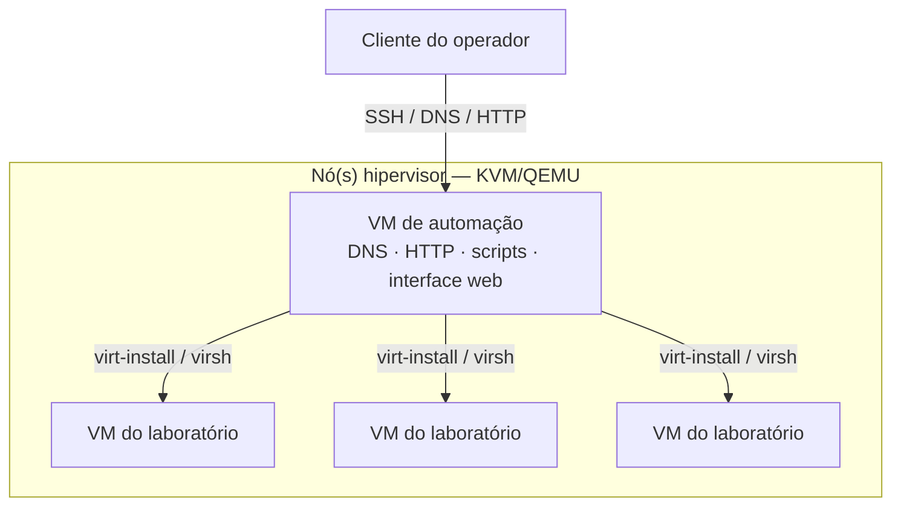
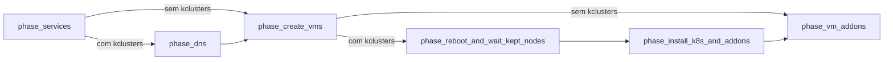
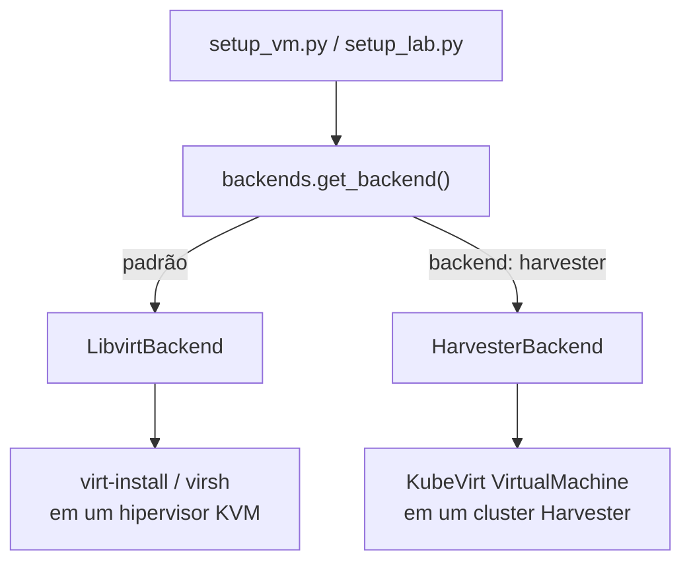
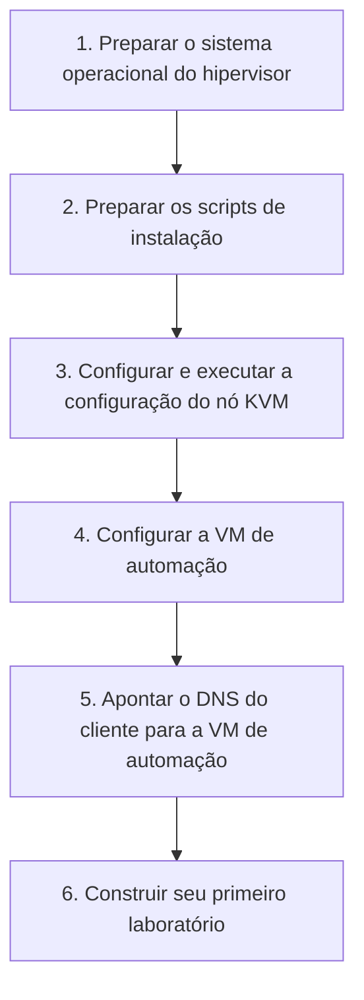
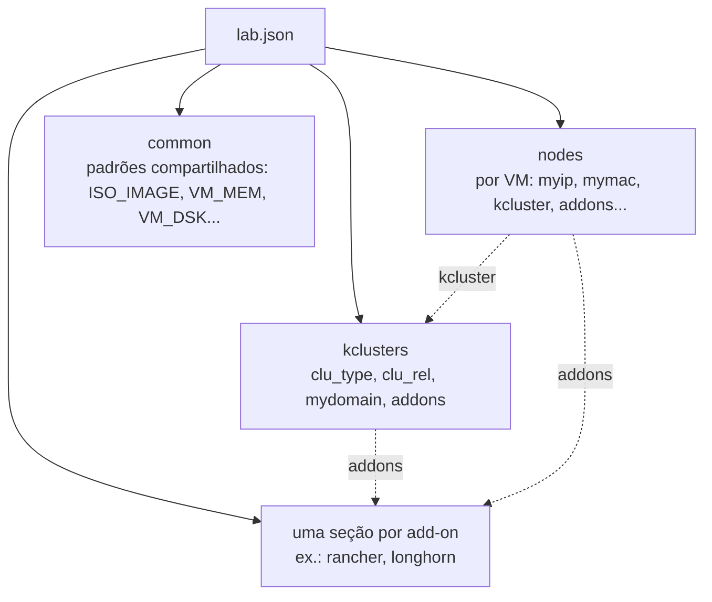

<a id="top"></a>
# lab-in-a-box

<p align="center">
  
  <br/>
  
</p>

<p align="center">
  <a href="https://github.com/SUSE-Technical-Marketing/lab-in-a-box/actions/workflows/ci.yml"></a>
  
  
  
  
</p>

<p align="center">
  <sub>🌐 <a href="README.md">English</a> · <a href="README.es.md">Español</a> · <a href="README.de.md">Deutsch</a> · <a href="README.fr.md">Français</a> · <a href="README.pt-BR.md"><strong>Português (Brasil)</strong></a> · <a href="README.ja.md">日本語</a> · <a href="README.zh-CN.md">简体中文</a></sub>
</p>

> *Esta é uma tradução da comunidade. A fonte de referência é o [README.md](README.md) (inglês) e pode estar mais atualizada do que esta página.*

<p align="center"><em>Aponte para um arquivo JSON ou YAML. Receba de volta um laboratório funcionando — VMs, DNS, Kubernetes e add-ons, tudo conectado.</em></p>

<p align="center" float="left">
  <kbd></kbd>
</p>

**lab-in-a-box** transforma uma única máquina física em uma fábrica de laboratórios autocontida: aponte-o para um arquivo JSON ou YAML descrevendo as VMs, os clusters Kubernetes e o software desejados, e ele constrói tudo — DNS, provisionamento, subida do cluster e add-ons — sem que você precise mexer no `virt-install` ou no Ansible manualmente.

## Por que lab-in-a-box?

<table>
<tr>
<td width="50%" valign="top">

**🧱 Um arquivo JSON/YAML, um comando.**
Descreva VMs, clusters Kubernetes (RKE2/K3s) e add-ons de forma declarativa; o `setup_lab.py` constrói tudo na ordem correta.

**🧩 41 add-ons prontos para uso.**
Rancher, Longhorn, NeuVector, Harbor, Keycloak, Jenkins, Argo CD, SUSE Manager/Uyuni (chaves de ativação, RBAC, Content Lifecycle Management, integração com Ansible, e mais), aplicações de demonstração vulneráveis para treinamento de segurança, e mais.

**🖥️ Uma interface web dinâmica.**
O [lab-builder](#web-ui-lab-builder) gera formulários diretamente a partir do próprio esquema de cada add-on — adicione um campo a um script, e a interface o reconhece sem nenhuma mudança no frontend.

</td>
<td width="50%" valign="top">

**🌐 Consciente de múltiplos hipervisores.**
Uma única definição de laboratório pode distribuir VMs entre vários hosts KVM, selecionados automaticamente por CPU/RAM/disco livres, ou fixados por nó.

**🧪 Suíte de testes totalmente containerizada.**
Cada verificação roda em seu próprio container `podman` descartável, integrada a um hook de pre-commit.

**🔌 Provisionamento plugável.**
Ignition+Combustion (SLE Micro), cloud-init (openSUSE/Ubuntu), `virt-customize` (distribuições antigas sem suporte a cloud-init/Ignition), ou uma instalação via ISO com script (AutoYaST/Kickstart/Preseed/AutoInstall).

</td>
</tr>
</table>

---

## Sumário

- [Arquitetura](#architecture)
- [Como funciona](#how-it-works)
- [Início rápido](#quick-start)
- [Interface web (lab-builder)](#web-ui-lab-builder)
- [Formato de definição do laboratório](#lab-definition-format)
- [Exemplos](#examples)
- [Guias passo a passo](#step-by-step-walkthroughs)
- [Comandos disponíveis](#available-commands)
- [Add-ons disponíveis](#available-addons)
- [Referência de configuração](#configuration-reference)
- [Testes](#testing)
- [Contribuindo / Configuração de desenvolvimento](#contributing--developer-setup)

<p align="right"><a href="#top">↑ voltar ao topo</a></p>

---

<a id="architecture"></a>
## Arquitetura

<p align="center" float="left">
  <kbd></kbd>
  <kbd></kbd>
</p>

O sistema é construído em torno de uma **arquitetura de dois níveis**:



### Nó(s) hipervisor

Uma ou mais máquinas físicas (bare-metal) executando KVM/QEMU. Cada uma hospeda as VMs do laboratório e guarda as imagens QCOW2 de origem em `/var/lib/libvirt/images/sources/`. Um NUC, uma workstation, ou qualquer máquina x86_64 capaz de rodar KVM serve. Laboratórios que precisam de mais capacidade do que uma única máquina podem se espalhar por **múltiplos hosts KVM** — veja [laboratórios multi-host](#multi-host-labs) abaixo.

### VM de automação

Uma VM pequena rodando no hipervisor que atua como o plano de controle de todo o laboratório. Ela fornece:

- **DNS** — o BIND (`named`) serve o domínio do laboratório e encaminha requisições externas, de modo que todos os hostnames do laboratório se resolvem a partir de qualquer cliente que aponte para ela
- **HTTP** — serve os arquivos de provisionamento (Ignition, Combustion, cloud-init) em `/srv/www/htdocs/lab_creation/`
- **Scripts** — todos os comandos de gerenciamento do laboratório, instalados em `/usr/local/bin/`
- **Interface web** (opcional) — [lab-builder](#web-ui-lab-builder), um designer de lab.json baseado em navegador

Todos os comandos do usuário são executados **na VM de automação**. Ela se conecta ao(s) hipervisor(es) e às VMs criadas via SSH. Nenhum acesso direto ao hipervisor é necessário após a configuração inicial.

### Por baixo dos panos

As ferramentas de linha de comando e cada add-on são em Python 3.11, vivem em `libs/` e `scripts/` e são instalados em `/usr/local/lib/lab_creation/` — organizados em torno de um pequeno conjunto de módulos de biblioteca compartilhados (`lab_creation.py`, `backends.py`, `services.py`, `spacecmd_common.py`, …), em vez de dependerem uns dos outros. A criação de VMs passa por uma interface `VMBackend` plugável (`LibvirtBackend` hoje), de modo que o mesmo código de orquestração possa eventualmente atingir outros backends de virtualização (KubeVirt, Harvester) sem tocar nos add-ons. Um add-on legado (`install_ds389`) ainda é bash puro — é anterior à migração para Python e já estava quebrado em bash, então não valeu a pena portá-lo. A implementação da era bash que estes substituíram continua viva, arquivada, em `legacy_bash/`.

<p align="right"><a href="#top">↑ voltar ao topo</a></p>

---

<a id="how-it-works"></a>
## Como funciona

### Pipeline de implantação

O `setup_lab.py` executa uma sequência fixa de fases; as duas fases exclusivas do Kubernetes são completamente ignoradas em um laboratório somente de VMs (sem a seção `kclusters`):



### Provisionamento de VMs

Cada VM é criada assim:
1. Resolvendo a qual host KVM ela pertence (o campo explícito `kvm_host`, ou autosseleção por capacidade livre — veja [laboratórios multi-host](#multi-host-labs))
2. Copiando e redimensionando uma imagem QCOW2 de origem naquele host
3. Gerando os arquivos de provisionamento a partir de templates, conforme `config_method`
4. Registrando uma entrada DNS no BIND
5. Executando `virt-install` no hipervisor via SSH
6. Aguardando o SSH ficar disponível

O método de provisionamento é controlado por `config_method` no JSON do laboratório (por nó ou em `common`):

| Valor | Método | Usado para |
|---|---|---|
| _(vazio, padrão)_ | Ignition + Combustion | SLE Micro |
| `cloud-init` | ISO de cloud-init | openSUSE Leap, Ubuntu |
| `virt_customize` | Modifica a QCOW2 diretamente no hipervisor (`virt-customize`) — não requer suporte a Ignition/cloud-init no convidado | CentOS 7, Debian/RHEL antigos, ou qualquer imagem sem Ignition/cloud-init |
| `install_iso` | Instalação com script a partir de uma ISO de instalador real (AutoYaST, Kickstart, Preseed ou AutoInstall, conforme `install_type`) | Distribuições sem nenhuma outra via de provisionamento |

### Backends de VM

Qual tecnologia de hipervisor realmente cria um nó é decidido por uma interface `VMBackend` intercambiável, resolvida uma vez por nó (`backend: harvester` na configuração daquele nó seleciona o `HarvesterBackend`; qualquer outro valor usa o `LibvirtBackend` por padrão) — todo add-on e script de orquestração conversa com o backend resolvido da mesma forma, seja ele qual for:



### Configuração do Kubernetes

Depois que as VMs estão de pé, o `setup_lab.py` instala o Kubernetes em cada nó conforme a seção `kclusters` do JSON. Tanto RKE2 quanto K3s são suportados. Assim que um cluster está pronto, seus add-ons rodam em sequência; add-ons de nível de VM (associados a um único nó em vez de a um cluster) rodam depois que aquele nó é provisionado.

### Laboratórios multi-host

<a id="multi-host-labs"></a>
Um laboratório não fica limitado a um único hipervisor. Defina `KVM_HOSTS` (separados por espaço) em `/etc/lab_creation.cfg` na VM de automação para disponibilizar mais de um hipervisor:

```ini
KVM_HOSTS="hv1.mydemo.lab hv2.mydemo.lab hv3.mydemo.lab"
```

Depois, para cada nó no JSON do laboratório, você pode:
- **fixá-lo explicitamente** — `"kvm_host": "hv2.mydemo.lab"` na configuração daquele nó, ou
- **deixar que se autosselecione** — omita `kvm_host`; o nó cai no host configurado que tiver, no momento, CPU/RAM/disco livres suficientes (verificado ao vivo via SSH).

Nós que não especificam `kvm_host` e máquinas com apenas um host configurado se comportam exatamente como antes de essa funcionalidade existir — nada muda para um laboratório de hipervisor único.

### Ordem de carregamento das bibliotecas

Cada script carrega sua configuração nesta ordem:

1. `/etc/lab_creation.defaults` — padrões de todo o sistema, caminhos, listas de pacotes
2. `/usr/local/lib/lab_creation/primary.py` — validação de entrada, carregamento de configuração
3. `/etc/lab_creation.cfg` — configurações específicas do nó (`REMOTE_HOST`, `ROOT_SSH_KEY`, `VIRT_SRV`, `KVM_HOSTS`, etc.)
4. `/usr/local/lib/lab_creation/lab_creation.py` — funções de VM, DNS e orquestração
5. `/usr/local/lib/lab_creation/k8s.py` — funções de cluster Kubernetes

<p align="right"><a href="#top">↑ voltar ao topo</a></p>

---

<a id="quick-start"></a>
## Início rápido



### Requisitos

- Uma máquina capaz de rodar KVM (Intel VT-x ou AMD-V habilitado)
- Acesso à internet (ou um mirror local) para download de pacotes e imagens
- Uma imagem QCOW2 do sistema operacional escolhido, colocada em `/var/lib/libvirt/images/sources/` no hipervisor

> [!IMPORTANT]
> A VM de automação precisa especificamente do `python3.11` — o toolchain é fixado explicitamente nele. A maioria das distribuições traz junto um `python3` padrão mais antigo; o script de instalação se recusa a continuar se o `python3.11` estiver ausente.

Imagens testadas:
- [SLE Micro](https://www.suse.com/download/sle-micro/) — recomendado, usado com Ignition+Combustion
- openSUSE Leap Micro — suportado, usado com cloud-init

### Passo 1 — Preparar o sistema operacional do hipervisor

Instale o SLES (ou outro Linux capaz de rodar KVM) no seu hardware. Durante a instalação, escolha:
- **Rede**: crie uma interface bridge (`br0`) ligada à sua NIC principal com IP estático
- **Papel do sistema**: KVM Virtualization Host

<details>
<summary>Gravando um USB inicializável a partir do Linux</summary>

```shell
# Antes de inserir o USB:
cat /proc/partitions > /tmp/partb4

# Insira o USB, então:
cat /proc/partitions > /tmp/parta

# Encontre o novo dispositivo:
diff /tmp/part*
```

> [!WARNING]
> O próximo comando **destrói todos os dados** do dispositivo alvo. Confira novamente o `sdX` contra a saída do `diff` acima antes de executá-lo.

```shell
# Grave a ISO (substitua sdX pelo seu dispositivo):
dd if=SLE-15-SP6-Online-x86_64-GM-Media1.iso of=/dev/sdX bs=4k && sync
```

</details>

### Passo 2 — Preparar os scripts de instalação

De qualquer máquina Linux com acesso SSH ao hipervisor:

```shell
curl https://raw.githubusercontent.com/SUSE-Technical-Marketing/lab-in-a-box/main/install_demo_server_scripts.sh | bash -
```

Isso baixa os scripts de configuração para `/var/tmp/setup_demo_server/`.

### Passo 3 — Configurar e executar a configuração do nó KVM

<a id="step-3--configure-and-run-the-kvm-node-setup"></a>

```shell
cd /var/tmp/setup_demo_server/setup_demo_server/
vim lab.cfg
```

Configurações-chave em `lab.cfg`:

| Configuração | Descrição |
|---|---|
| `ROOT_PWD_HASH` | Hash da senha de root — gerado com `mkpasswd --method=SHA-512 --stdin` |
| `ROOT_SSH_PUB_KEY` | Sua chave pública SSH para acesso sem senha |
| `AUTOMATION_HOSTNAME` | Hostname da VM de automação (ex.: `automation.mydemo.lab`) |
| `_QCOW_IMAGE` | Nome do arquivo da imagem QCOW2 de origem |
| Configurações de rede | IP, gateway, máscara, DNS para a rede do laboratório |

Depois execute a configuração (substitua `<IP>` pela IP do seu hipervisor, ou omita para local):

```shell
./setup_kvm_node.py <IP>
```

Isso provisiona a VM de automação e inicia todos os serviços necessários.

### Passo 4 — Configurar a VM de automação

Conecte-se via SSH à VM de automação e instale os scripts do laboratório:

```shell
ssh <AUTOMATION_HOSTNAME>
./install_automation_node_scripts.sh

cp /etc/lab_creation.cfg.example /etc/lab_creation.cfg
vim /etc/lab_creation.cfg
```

Configurações-chave em `lab_creation.cfg`:

| Configuração | Descrição |
|---|---|
| `REMOTE_HOST` | Hostname ou IP do hipervisor KVM (primário) |
| `KVM_HOSTS` | _(opcional)_ lista de hipervisores adicionais separados por espaço para um [laboratório multi-host](#multi-host-labs) |
| `ROOT_SSH_KEY` | Conteúdo da chave pública SSH a ser injetada nas VMs |
| `VIRT_SRV` | URI de conexão do libvirt (ex.: `qemu+ssh://root@hypervisor/system`) |
| `NETWORK` | Rede libvirt padrão para as VMs (ex.: `bridge=br0`) |

### Passo 5 — Apontar o DNS do seu cliente para a VM de automação

<a id="step-5--point-your-client-dns-at-the-automation-vm"></a>

Para que os hostnames se resolvam a partir do seu desktop:

```shell
# Linux (NetworkManager):
nmcli con mod <connection> ipv4.dns <AUTOMATION_IP>

# Ou adicione a /etc/resolv.conf:
nameserver <AUTOMATION_IP>
```

### Passo 6 — Construa seu primeiro laboratório

```shell
setup_lab.py examples/cluster.json.template
```

Veja [Exemplos](#examples) abaixo para mais pontos de partida, ou abra a [interface web](#web-ui-lab-builder) em vez de escrever JSON à mão.

<p align="right"><a href="#top">↑ voltar ao topo</a></p>

---

<a id="web-ui-lab-builder"></a>
## Interface web (lab-builder)

Um designer de arquivos `lab.json` baseado em navegador que **introspecciona as próprias bibliotecas Python do projeto em tempo de execução** — não tem nenhum conhecimento fixo de nenhum add-on. Escolha um componente e ele gera um formulário diretamente a partir do esquema daquele componente; adicione um campo a um script, e a interface o exibe sem nenhuma mudança no frontend.

```shell
# A forma mais rápida de experimentar — sem dependências além do Python:
python3.11 webui/run-local.py            # → http://localhost:8677/
```

Para um deployment de produção (Apache, ou um serviço standalone systemd/independente de init, mais HTTPS via um certificado autoassinado gerado de forma idempotente), veja **[README.webui.md](README.webui.md)** — que cobre os três modos de deployment, a API HTTP e a resolução de problemas.

<p align="right"><a href="#top">↑ voltar ao topo</a></p>

---

<a id="lab-definition-format"></a>
## Formato de definição do laboratório

Laboratórios são definidos como arquivos JSON ou YAML (detectado automaticamente — veja a nota abaixo). O formato atual suporta múltiplos clusters Kubernetes por laboratório (`kclusters`); veja `examples/cluster.json.template` para o formato legado de cluster único (`cluster`).



```jsonc
{
  "nodes": {
    "node101.mydemo.lab": {
      "myip":  "192.168.88.101",
      "mymac": "34:8a:b1:4b:1a:c1",
      "INSTALL_RKE2_TYPE": "server",   // "server" ou "agent"
      "kcluster": "cluster1"           // a qual entrada de kclusters este nó pertence
    },
    "node102.mydemo.lab": {
      "myip":  "192.168.88.102",
      "mymac": "34:8a:b1:4b:1a:c2",
      "INSTALL_RKE2_TYPE": "agent",
      "kcluster": "cluster1"
    }
  },
  "common": {
    "ISO_IMAGE":  "SL-Micro.x86_64-6.1-Default-qcow-GM.qcow2",
    "VM_MEM":     "24576",
    "VM_DSK":     "80",
    "VM_CPU":     "6",
    "VM_BOOT":    "uefi",             // uefi (padrão), firmware=bios, bios, uefi=off
    "mymask":     "24",
    "mygw":       "192.168.88.1",
    "mydns":      "192.168.88.73",
    "mynet_reverse": "88.168.192"
  },
  "kclusters": {
    "cluster1": {
      "clu_type":  "rke2",             // "rke2" ou "k3s"
      "clu_rel":   "stable",
      "mydomain":  "mydemo.lab",
      "addons": ["rancher", "longhorn"]
    }
  },
  "rancher": {
    "rancher_shorthn":   "rancher",
    "rancher_rel":       "rancher-prime",
    "rancher_repo_url":  "https://charts.rancher.com/server-charts/prime",
    "rancher_helm_rel":  "rancher",
    "rancher_helm_chart": "rancher-prime/rancher",
    "rancher_Version":   "--version 2.13.3",
    "cert_manager_ver":  "--version v1.14.4"
  }
}
```

<details>
<summary>O mesmo laboratório, em YAML</summary>

```yaml
nodes:
  node101.mydemo.lab:
    myip: "192.168.88.101"
    mymac: "34:8a:b1:4b:1a:c1"
    INSTALL_RKE2_TYPE: server   # "server" ou "agent"
    kcluster: cluster1          # a qual entrada de kclusters este nó pertence
  node102.mydemo.lab:
    myip: "192.168.88.102"
    mymac: "34:8a:b1:4b:1a:c2"
    INSTALL_RKE2_TYPE: agent
    kcluster: cluster1

common:
  ISO_IMAGE: SL-Micro.x86_64-6.1-Default-qcow-GM.qcow2
  VM_MEM: "24576"
  VM_DSK: "80"
  VM_CPU: "6"
  VM_BOOT: uefi                # uefi (padrão), firmware=bios, bios, uefi=off
  mymask: "24"
  mygw: "192.168.88.1"
  mydns: "192.168.88.73"
  mynet_reverse: "88.168.192"

kclusters:
  cluster1:
    clu_type: rke2              # "rke2" ou "k3s"
    clu_rel: stable
    mydomain: mydemo.lab
    addons: [rancher, longhorn]

rancher:
  rancher_shorthn: rancher
  rancher_rel: rancher-prime
  rancher_repo_url: https://charts.rancher.com/server-charts/prime
  rancher_helm_rel: rancher
  rancher_helm_chart: rancher-prime/rancher
  rancher_Version: "--version 2.13.3"
  cert_manager_ver: "--version v1.14.4"
```

</details>

Campos opcionais no nível do nó:

| Campo | Descrição |
|---|---|
| `addons` | Lista de scripts de add-on a executar apenas para esta VM |
| `config_method` | Sobrescreve o método de provisionamento (`cloud-init`, `virt_customize`, `install_iso`) |
| `kvm_host` | Fixa esta VM a um hipervisor específico em um [laboratório multi-host](#multi-host-labs) |
| `extra_dsk` | Disco(s) adicional(is) a conectar — `"/dev/sdb"`, ou `"/dev/sdb,bus=scsi"` para sobrescrever o barramento padrão por disco |
| `salt_states` | Estados Salt a aplicar (apenas com o método cloud-init) |

Campos opcionais de kcluster:

| Campo | Descrição |
|---|---|
| `mgm_node` | Hostname do nó que executa os instaladores de add-ons do cluster; por padrão o primeiro nó servidor |

Cada script de add-on também aceita `--schema` (alias de `--input-definition`), que imprime suas próprias chaves de configuração em JSON ou YAML legível por máquina — o mesmo esquema que a [interface web](#web-ui-lab-builder) lê para construir seus formulários:

```shell
install_longhorn --schema
setup_lab.py --input-definition yaml   # esquema base de topologia (common/nodes/kclusters)
```

<p align="right"><a href="#top">↑ voltar ao topo</a></p>

---

<a id="examples"></a>
## Exemplos

### Laboratório mínimo de uma única VM

O menor laboratório possível — uma VM, sem Kubernetes:

```jsonc
{
  "nodes": {
    "standalone.mydemo.lab": { "myip": "192.168.88.50" }
  },
  "common": {
    "ISO_IMAGE": "SL-Micro.x86_64-6.1-Default-qcow-GM.qcow2",
    "VM_MEM": "4096", "VM_DSK": "40", "VM_CPU": "2",
    "mymask": "24", "mygw": "192.168.88.1", "mydns": "192.168.88.73"
  }
}
```

```shell
setup_lab.py standalone.json
```

### RKE2 + Rancher + Longhorn (o cluster "hello world")

Um cluster de 2 nós com uma plataforma de gestão e armazenamento distribuído — veja o exemplo completo em [Formato de definição do laboratório](#lab-definition-format) acima.

```shell
setup_lab.py rancher-cluster.json
# Execute novamente mais tarde, pulando qualquer VM que já esteja ativa e acessível:
setup_lab.py --keep rancher-cluster.json
```

### Distribuindo um cluster entre dois hosts

Fixe o servidor em um hipervisor e deixe os agentes se autoposicionarem em qualquer um dos [hosts configurados](#multi-host-labs) que tenha espaço:

```jsonc
{
  "nodes": {
    "srv1.mydemo.lab":   { "myip": "192.168.88.10", "kvm_host": "hv1.mydemo.lab", "kcluster": "prod" },
    "agent1.mydemo.lab": { "myip": "192.168.88.11", "kcluster": "prod" },
    "agent2.mydemo.lab": { "myip": "192.168.88.12", "kcluster": "prod" }
  },
  "common": { "ISO_IMAGE": "SL-Micro.x86_64-6.1-Default-qcow-GM.qcow2", "VM_MEM": "8192", "VM_DSK": "60", "VM_CPU": "4" },
  "kclusters": { "prod": { "clu_type": "rke2", "clu_rel": "stable", "mydomain": "mydemo.lab" } }
}
```

### Servidor SUSE Manager (Uyuni) + um cliente registrado

Suba um servidor Uyuni com uma chave de ativação, depois registre uma segunda VM como cliente Salt contra ele — veja [Add-ons disponíveis](#available-addons) para o conjunto completo de recursos (`orgs`, RBAC, Content Lifecycle Management, integração com Ansible, e mais):

```jsonc
{
  "nodes": {
    "uyuni.mydemo.lab":  { "myip": "192.168.88.30", "addons": ["uyuni"] },
    "client1.mydemo.lab": { "myip": "192.168.88.31", "addons": ["client_registration"] }
  },
  "common": { "ISO_IMAGE": "SL-Micro.x86_64-6.1-Default-qcow-GM.qcow2", "VM_MEM": "8192", "VM_DSK": "60", "VM_CPU": "4" },
  "uyuni": {
    "uyuni_admin": "admin", "uyuni_password": "Uyuni12345",
    "uyuni_activation_key": "1-lab-clients", "uyuni_activation_key_base_channel": "sle-micro-6.1-pool"
  },
  "client_registration": {
    "client_registration_server_type": "uyuni",
    "client_registration_server": "uyuni.mydemo.lab",
    "client_registration_activation_key": "1-lab-clients"
  }
}
```

<p align="right"><a href="#top">↑ voltar ao topo</a></p>

---

<a id="step-by-step-walkthroughs"></a>
## Guias passo a passo

Os [Exemplos](#examples) acima são pontos de partida para copiar e colar. Estes três guias percorrem cenários completos e reais do início ao fim — o que executar, o que acontece em cada etapa e como verificar que realmente funcionou. Cada campo JSON e formato de comando abaixo corresponde à própria suíte de testes deste projeto (`tests/run_tests.sh`) e ao código-fonte.

> [!TIP]
> Os guias 2 e 3 são **testados ao vivo** — executados contra um servidor/hardware real, não apenas verificados isoladamente.

### Guia 1 — Seu primeiro cluster: RKE2 + Rancher + Longhorn

Objetivo: duas VMs SLE Micro, um cluster RKE2, Rancher para gestão, Longhorn para armazenamento — acessível pelo navegador ao final.

1. **Escreva o arquivo do laboratório.** Salve como `rancher-cluster.json` (ajuste IPs/rede para o seu domínio de laboratório):

   ```jsonc
   {
     "nodes": {
       "node101.mydemo.lab": {
         "myip": "192.168.88.101", "mymac": "34:8a:b1:4b:1a:c1",
         "INSTALL_RKE2_TYPE": "server", "kcluster": "cluster1"
       },
       "node102.mydemo.lab": {
         "myip": "192.168.88.102", "mymac": "34:8a:b1:4b:1a:c2",
         "INSTALL_RKE2_TYPE": "agent", "kcluster": "cluster1"
       }
     },
     "common": {
       "ISO_IMAGE": "SL-Micro.x86_64-6.1-Default-qcow-GM.qcow2",
       "VM_MEM": "24576", "VM_DSK": "80", "VM_CPU": "6",
       "mymask": "24", "mygw": "192.168.88.1", "mydns": "192.168.88.73"
     },
     "kclusters": {
       "cluster1": {
         "clu_type": "rke2", "clu_rel": "stable", "mydomain": "mydemo.lab",
         "addons": ["rancher", "longhorn"]
       }
     },
     "rancher": {
       "rancher_shorthn": "rancher", "rancher_rel": "rancher-prime",
       "rancher_repo_url": "https://charts.rancher.com/server-charts/prime",
       "rancher_helm_rel": "rancher", "rancher_helm_chart": "rancher-prime/rancher",
       "rancher_Version": "--version 2.13.3", "cert_manager_ver": "--version v1.14.4"
     }
   }
   ```

2. **Construa:**

   ```shell
   setup_lab.py rancher-cluster.json
   ```

   O `setup_lab.py` faz o preflight do arquivo automaticamente antes de fazer qualquer outra coisa — IPs errados, uma referência a `kcluster` que não existe, um `ISO_IMAGE` ausente e erros parecidos são detectados e impressos (`✗ Preflight FAILED — N error(s)`) sem nada ser criado, em vez de falhar no meio do caminho. Um arquivo correto imprime `✓ Preflight passed` e segue direto para a construção.

   Em ordem, isto: registra ambos os nós no DNS → cria ambas as VMs (copia a imagem QCOW2, gera os arquivos de Combustion, as inicializa, aguarda o SSH) → instala o RKE2 em `node101` como servidor, depois em `node102` como agente → instala `rancher` e `longhorn` no nó de gestão do cluster (`mgm_node`, por padrão o primeiro nó servidor — aqui `node101`). Um cluster de 2 nós com Rancher normalmente leva de 15 a 25 minutos; a maior parte é o bootstrap do RKE2 e a própria instalação Helm do Rancher.

3. **Verifique se o DNS resolve** (do seu próprio desktop, uma vez [apontado para o DNS da VM de automação](#step-5--point-your-client-dns-at-the-automation-vm)):

   ```shell
   dig +short node101.mydemo.lab rancher.mydemo.lab
   ```

   Ambos devem retornar `192.168.88.101` (o hostname de ingress do Rancher é o valor de `rancher_shorthn`, `rancher`, sob o `mydomain` do cluster).

4. **Faça login.** Acesse `https://rancher.mydemo.lab` (certificado autoassinado — seu navegador avisará uma vez) e faça login com `rancher_initial_pwd` de `/etc/lab_creation.cfg` na VM de automação.

5. **Itere sem reconstruir tudo.** Mudou a configuração de um nó, ou uma VM travou? Execute novamente com `--keep`: qualquer VM que já exista, corresponda à sua IP/MAC definida e esteja acessível via SSH é deixada intocada; apenas o que realmente está faltando ou quebrado é (re)criado:

   ```shell
   setup_lab.py --keep rancher-cluster.json
   ```

6. **Destrua** quando terminar:

   ```shell
   destroy_lab.py rancher-cluster.json
   ```

### Guia 2 — Servidor SUSE Manager (Uyuni) com um cliente registrado

Objetivo: um servidor Uyuni com uma chave de ativação real, e uma segunda VM que se registra como cliente gerenciado por Salt contra ele. **Testado ao vivo** de ponta a ponta contra um servidor Uyuni real.

1. **Escreva o arquivo do laboratório** — um nó para o servidor Uyuni, outro para o cliente:

   ```jsonc
   {
     "nodes": {
       "uyuni.mydemo.lab":   { "myip": "192.168.88.30", "addons": ["uyuni"] },
       "client1.mydemo.lab": { "myip": "192.168.88.31", "addons": ["client_registration"] }
     },
     "common": {
       "ISO_IMAGE": "SL-Micro.x86_64-6.1-Default-qcow-GM.qcow2",
       "VM_MEM": "8192", "VM_DSK": "60", "VM_CPU": "4",
       "mymask": "24", "mygw": "192.168.88.1", "mydns": "192.168.88.73", "mydomain": "mydemo.lab"
     },
     "uyuni": {
       "uyuni_admin": "admin", "uyuni_password": "Uyuni12345",
       "uyuni_activation_key": "1-lab-clients", "uyuni_activation_key_base_channel": "sle-micro-6.1-pool"
     },
     "client_registration": {
       "client_registration_server_type": "uyuni",
       "client_registration_server": "uyuni.mydemo.lab",
       "client_registration_activation_key": "1-lab-clients"
     }
   }
   ```

2. **Construa:**

   ```shell
   setup_lab.py uyuni-lab.json
   ```

   Add-ons de nível de VM (tanto `uyuni` quanto `client_registration` são associados ao nó, não ao cluster, já que não há seção `kclusters` aqui) rodam assim que seu próprio nó fica de pé. O `install_uyuni` sobe o servidor, aguarda ele ficar acessível, e então cria a chave de ativação. O `install_client_registration` então faz o bootstrap do `client1` contra ele — instala o script de bootstrap, o executa, e verifica periodicamente até que a chave Salt do novo minion apareça como pendente, e então a aceita.

3. **Verifique se o cliente realmente se registrou.** Conecte via SSH ao servidor Uyuni e pergunte diretamente a ele:

   ```shell
   ssh uyuni.mydemo.lab
   mgrctl exec 'spacecmd -- system_list'
   ```

   `client1.mydemo.lab` deve aparecer na lista.

4. **Faça login na interface web** em `https://uyuni.mydemo.lab` com `uyuni_admin`/`uyuni_password` para ver a mesma coisa visualmente, navegar pela chave de ativação, ou rodar um highstate.

Ponto conhecido do projeto upstream (não é um bug deste projeto, documentado aqui caso você encontre): o próprio scriptlet de atualização de pacotes do `salt-transactional-update` pode deixar uma chave YAML duplicada em `/etc/salt/minion.d/transactional_update.conf` no cliente, fazendo o `salt-minion` entrar em loop de falhas até que isso seja deduplicado manualmente. Nada neste repositório mexe nesse arquivo.

### Guia 3 — VM de automação sob NAT (notebook com uma única NIC como hipervisor)

Objetivo: fazer o bootstrap da VM de automação em um host sem NIC sobrando para fazer bridge — em vez disso, uma rede privada gerenciada pelo libvirt, com portas específicas redirecionadas via DNAT a partir da própria IP real do host. **Testado ao vivo** de ponta a ponta em uma VM aninhada descartável.

Isso não muda nada no fluxo padrão do [Início rápido](#quick-start) se você não optar por ele — `_network_mode` é `"bridge"` por padrão, byte a byte igual a qualquer configuração já existente.

1. **No `lab.cfg`** ([Passo 3](#step-3--configure-and-run-the-kvm-node-setup) do Início rápido), defina:

   ```ini
   _network_mode="nat"
   _nat_network_name="labnat"          # valor padrão mostrado — uma nova rede virtual do libvirt, não a LAN real do seu host
   _nat_network_cidr="192.168.150.0/24" # valor padrão mostrado
   _nat_forwarded_ports="22:22/TCP 80:80/TCP 443:443/TCP"  # valor padrão mostrado — <externa>:<interna>/<protocolo>
   ```

2. **Execute a configuração exatamente como sempre:**

   ```shell
   ./setup_kvm_node.py
   ```

   Isso define a rede libvirt `labnat` (com NAT, DHCP/gateway tratados pelo próprio libvirt — o mesmo mecanismo da rede `default` embutida do libvirt, só que com o nome/CIDR próprios deste projeto) em vez de uma bridge, depois cria a VM de automação nela com um IP estático dentro dessa faixa privada, e então redireciona (DNAT) as três portas acima a partir da própria IP real do host.

3. **Verifique se a rede e as regras de encaminhamento existem**, no hipervisor:

   ```shell
   virsh net-list                              # labnat: active
   iptables -t nat -L LAB_PORTFWD -n -v         # regras DNAT para a IP privada da VM de automação
   iptables -L LAB_PORTFWD_FWD -n -v            # regras ACCEPT correspondentes na cadeia FORWARD
   ```

4. **Acesse a VM de automação de fora do hipervisor**, usando a própria IP real do hipervisor — não o endereço privado `192.168.150.x` da VM de automação, que não é roteável de nenhum outro lugar:

   ```shell
   ssh root@<ip-real-do-hipervisor>          # redirecionado (DNAT) para o SSH da VM de automação, porta 22
   ```

   As portas 80 e 443 também são encaminhadas por padrão (o servidor HTTP de arquivos de provisionamento e, assim que você configurar a [interface web](#web-ui-lab-builder), seu listener HTTPS) — acessíveis da mesma forma, através da IP real do hipervisor.

5. **Adicione encaminhamento para uma VM do laboratório**, não apenas para a própria VM de automação: dê a esse nó um campo `forwarded_ports` e ative o serviço `portforward` uma vez, em `common.services`:

   ```jsonc
   {
     "nodes": {
       "app1.mydemo.lab": {
         "myip": "192.168.150.20",
         "forwarded_ports": ["8080:80/TCP", "8443:443/TCP"]
       }
     },
     "common": { "services": ["portforward"], "...": "…restante de common como de costume" }
   }
   ```

   `setup_lab.py`/`setup_vm.py` encaminham (DNAT) essas duas portas a partir da IP real do hipervisor da mesma forma, na primeira vez que qualquer nó do laboratório declara `forwarded_ports`.

<p align="right"><a href="#top">↑ voltar ao topo</a></p>

---

<a id="available-commands"></a>
## Comandos disponíveis

Todos os comandos rodam na **VM de automação** e recebem um arquivo JSON de definição de laboratório como primeiro argumento.

| Comando | Descrição |
|---|---|
| `setup_lab.py [--keep] <lab.json>` | Cria todas as VMs, configura os clusters Kubernetes e instala cada add-on de cluster e de VM em ordem. `--keep` pula qualquer VM que já exista, corresponda à IP/MAC definida e esteja acessível via SSH — sem essa opção, cada VM é destruída e recriada. |
| `setup_vm.py <lab.json> <hostname>` | Cria ou recria uma única VM |
| `destroy_vm.py <lab.json> <hostname>` | Destrói uma única VM |
| `destroy_lab.py <lab.json>` | Destrói todas as VMs de um laboratório |

Cada comando e cada script `install_<addon>` aceita:

```shell
setup_lab.py --version              # imprime a versão instalada
install_longhorn --schema           # imprime o esquema de configuração deste add-on (JSON)
install_longhorn --schema yaml      # ...ou YAML
```

<p align="right"><a href="#top">↑ voltar ao topo</a></p>

---

<a id="available-addons"></a>
## Add-ons disponíveis

Add-ons são referenciados pelo nome no array `addons` de um kcluster ou nó. O script `install_<name>` correspondente precisa estar no `PATH`.

<details open>
<summary><strong>Plataforma Kubernetes &amp; GitOps</strong></summary>

| Nome do add-on | Descrição |
|---|---|
| `rancher` | Plataforma de gestão de Kubernetes SUSE Rancher Prime |
| `longhorn` | Armazenamento em bloco distribuído SUSE Longhorn |
| `harbor` | Registro de containers |
| `argocd` | Controlador GitOps Argo CD |
| `kubewarden` | Motor de políticas do Kubernetes |
| `istio` | Service mesh |
| `linkerd` | Service mesh |
| `traefik` | Controlador de ingress |
| `nginx` | Controlador de ingress / proxy reverso |
| `coredns` | DNS do cluster |
| `kucero` | Rotação de certificados do cluster Kubernetes |
| `fluid` | Orquestração/cache de dados para cargas de trabalho cloud-native |

</details>

<details open>
<summary><strong>Segurança &amp; conformidade</strong></summary>

| Nome do add-on | Descrição |
|---|---|
| `neuvector` | Plataforma de segurança de containers SUSE NeuVector |
| `nv_testing` | Cargas de trabalho de teste de segurança do NeuVector (pods nginx/node/redis) |
| `nv-demo-helm` | Demonstrações do NeuVector baseadas em Helm |
| `complianceascode` | Operador OpenSCAP/ComplianceAsCode |
| `keycloak` | Gestão de identidade e acesso |
| `kagent` | Assistente de segurança de IA agêntica para Kubernetes |
| `insecure_app` | Aplicação web intencionalmente vulnerável (demo/treinamento) |
| `struts_demo` | Aplicação de demonstração vulnerável Apache Struts2 (CVE-2017-5638) |

</details>

<details open>
<summary><strong>SUSE Manager / Uyuni</strong></summary>

| Nome do add-on | Descrição |
|---|---|
| `uyuni` | Servidor Uyuni (upstream): chaves de ativação, organizações, RBAC, Content Lifecycle Management, integração com Ansible, auditoria SCAP/CVE, topologia de ambientes dev/QA/prod — veja `install_uyuni --schema` para a lista completa de campos |
| `smlm` | Servidor SUSE Manager Lifecycle Management — o mesmo conjunto de recursos que `uyuni`, implantado via Kubernetes/Helm |
| `smlm_proxy` | Proxy do SMLM |
| `client_registration` | Registra qualquer VM como cliente Salt de um servidor `uyuni`/`smlm` existente (bootstrap por chave de ativação + aceitação da chave salt) |
| `suma` | SUSE Manager (SUMA), instalado diretamente no sistema operacional via `mgradm` — não em Kubernetes |

</details>

<details open>
<summary><strong>Armazenamento &amp; bancos de dados</strong></summary>

| Nome do add-on | Descrição |
|---|---|
| `mariadb` | Banco de dados MariaDB |
| `postgresql` | Banco de dados PostgreSQL |
| `openldap` | Serviço de diretório OpenLDAP |
| `ds389` | 389 Directory Server (LDAP) — o único add-on ainda implementado em bash |

</details>

<details open>
<summary><strong>CI/CD &amp; ferramentas de desenvolvimento</strong></summary>

| Nome do add-on | Descrição |
|---|---|
| `jenkins` | Jenkins CI |
| `appcollection` | SUSE Application Collection |
| `stackpack` | Integração de monitoramento StackState |
| `trento` | Monitoramento de infraestrutura SAP |

</details>

<details open>
<summary><strong>IA / ML</strong></summary>

| Nome do add-on | Descrição |
|---|---|
| `ollama` | Runtime local de LLM |
| `deepseek` | Modelo DeepSeek, servido via Ollama |
| `gemini` | Integração com a API do Google Gemini |
| `phoebe` | (veja `install_phoebe --schema`) |

</details>

<details open>
<summary><strong>Virtualização &amp; demos</strong></summary>

| Nome do add-on | Descrição |
|---|---|
| `harvester` | Provisionamento de nós SUSE Virtualization (Harvester/KubeVirt) |
| `wordpress` | Aplicação de demonstração WordPress + MySQL |
| `kiwi` | Construtor de appliances KIWI |
| `fluentd` | Agregação de logs |

</details>

Para adicionar um novo add-on: crie `scripts/install_<name>.py` seguindo o padrão de um já existente (importe `addon_common`, carregue a seção JSON correspondente via `load_definition()`, faça o trabalho via SSH), adicione templates em `templates/addons/<name>/` se necessário, e referencie `"<name>"` no array `addons` do seu JSON — o loop de deploy do `install_automation_node_scripts.sh` e a interface web descobrem isso automaticamente.

<p align="right"><a href="#top">↑ voltar ao topo</a></p>

---

<a id="configuration-reference"></a>
## Referência de configuração

### `/etc/lab_creation.defaults`

Padrões de todo o sistema, carregados por cada script. Define caminhos, temporizadores de espera padrão e listas de pacotes. **Não edite** a menos que saiba o que está fazendo.

### `/etc/lab_creation.cfg`

Configuração específica do nó para a VM de automação. Copiado de `/etc/lab_creation.cfg.example` durante a configuração. Variáveis-chave:

| Variável | Descrição |
|---|---|
| `REMOTE_HOST` | Hostname ou IP do hipervisor KVM |
| `KVM_HOSTS` | _(opcional)_ lista de hipervisores separados por espaço para um [laboratório multi-host](#multi-host-labs); padrão é apenas `REMOTE_HOST` |
| `VIRT_SRV` | URI do libvirt para o hipervisor remoto |
| `ROOT_SSH_KEY` | Conteúdo da chave pública SSH injetada nas VMs provisionadas |
| `NETWORK` | String de rede libvirt padrão |
| `REMOTE_DNS_SERVERS` | Lista de servidores DNS adicionais a atualizar, separados por espaço |
| `delay_min` | Minutos de espera entre estágios de provisionamento (aumente em hardware lento) |

### `/usr/local/lib/lab_creation/`

Módulos de biblioteca Python instalados. Atualizados ao executar `install_automation_node_scripts.sh` a partir do repositório na VM de automação.

| Arquivo | Conteúdo |
|---|---|
| `lab_creation.py` | Funções auxiliares de ciclo de vida de VM, DNS, resolução multi-host e orquestração |
| `backends.py` | Interface `VMBackend` + `LibvirtBackend` (criar/excluir/reiniciar uma VM, envio de arquivos de provisionamento) |
| `services.py` | Gerenciamento do serviço DNS |
| `spacecmd_common.py` | Automação compartilhada do SUSE Manager/Uyuni (chaves de ativação, organizações, RBAC, CLM, Ansible, SCAP/CVE) usada por `install_uyuni`/`install_smlm`/`install_client_registration` |
| `primary.py` | Validação de entrada e carregamento de configuração |
| `k8s.py` | Interface de distribuição de cluster Kubernetes (RKE2/K3s) |
| `addon_common.py` | Infraestrutura de CLI compartilhada usada por cada add-on `install_*` (dispatch de `--help`/`--version`/`--schema`, validação de esquema) |

Os quatro auxiliares em bash (`lab_creation.bash`, `k8s_functions.bash`, `primary_functions.bash`, `extensions.sh`) também continuam instalados junto a estes — mantidos indefinidamente para o `install_ds389`, o único add-on que nunca foi portado para Python.

<p align="right"><a href="#top">↑ voltar ao topo</a></p>

---

<a id="testing"></a>
## Testes

Cada verificação roda em seu **próprio container `podman` independente e descartável** — uma falha, travamento ou estado residual em uma não pode afetar nenhuma outra:

```shell
tests/run_tests.sh
```

Cobre sintaxe de bash e Python em toda a árvore, consistência de esquema/interface web, testes unitários com SSH simulado para cada biblioteca central e script de orquestração, e testes de regressão para bugs encontrados durante testes ao vivo. Para adicionar uma nova verificação, coloque um script executável em `tests/checks/` — ele é detectado automaticamente, sem necessidade de conexões adicionais.

Integrado a um hook de pre-commit (ative uma vez por clone, veja [Contribuindo](#contributing--developer-setup)) — roda automaticamente a cada commit e é pulado com um aviso se o `podman` não estiver instalado, em vez de bloquear o commit.

<p align="right"><a href="#top">↑ voltar ao topo</a></p>

---

<a id="contributing--developer-setup"></a>
## Contribuindo / Configuração de desenvolvimento

Veja o **[CONTRIBUTING.md](CONTRIBUTING.md)** (em inglês) para o guia completo (configuração de desenvolvimento, convenções de código, como adicionar um add-on, processo de PR). Este projeto segue o [Código de Conduta Contributor Covenant](CODE_OF_CONDUCT.md); veja o [SECURITY.md](SECURITY.md) para reportar uma vulnerabilidade. Cada push e pull request passa pelo [CI](https://github.com/SUSE-Technical-Marketing/lab-in-a-box/actions/workflows/ci.yml) — verificações de sintaxe/import em Python 3.11, o esquema de cada add-on, `shellcheck`, e a suíte de testes containerizada completa abaixo.

### Configuração única do git

Depois de clonar o repositório, execute:

```shell
git config core.hooksPath .githooks
```

Isso ativa os hooks em `.githooks/`, que:
- executam a [suíte de testes](#testing) completa antes de cada commit
- gerenciam a marcação de versão por script (veja abaixo)

### Como funciona o versionamento

> [!NOTE]
> Isso é totalmente gerenciado pelos hooks de git acima — você nunca edita `__LABVERSION__` manualmente.

Cada script contém o placeholder:

```python
__LABVERSION__ = "__LABVERSION__"
```

Os hooks em `.githooks/` expandem e restauram esse placeholder automaticamente:

| Hook | Gatilho | Ação |
|---|---|---|
| `post-checkout` | `git checkout` / `git switch` | Substitui `__LABVERSION__` em cada script pelo hash do último commit que tocou aquele arquivo |
| `post-merge` | `git pull` / `git merge` | Igual ao anterior |
| `post-rewrite` | `git rebase` / `git commit --amend` | Igual ao anterior |
| `pre-commit` | `git commit` | Restaura `__LABVERSION__` em qualquer script staged antes do commit ser escrito, de modo que hashes nunca são armazenados no repositório |

O resultado: cada script na sua árvore de trabalho mostra sua própria versão via `--version`, e o próprio repositório sempre guarda o placeholder limpo. Quando os scripts são instalados via `install_automation_node_scripts.sh`, a mesma substituição de hash por arquivo é aplicada no momento da instalação usando `git log -1 --format=%h`.

### Instalando os scripts na VM de automação

Da raiz do repositório na VM de automação (ou qualquer máquina com o repositório clonado):

```shell
./install_automation_node_scripts.sh
```

Isso faz backup da instalação existente (tanto seu próprio arquivo compactado com timestamp quanto, separadamente, o que quer que seu próprio processo de backup mantenha), copia cada script/biblioteca/template para seu caminho no sistema, e marca cada arquivo instalado com seu hash de versão.

### Dependências

Em tempo de execução (na VM de automação):
`python3.11`, `jq`, `ssh`, `rsync`, `nc`, `helm`, `kubectl`, `named` (BIND)

A configuração do hipervisor requer adicionalmente:
`virt-install`, `virsh`, `qemu-img`, `zypper`, imagens QCOW2 de origem em `/var/lib/libvirt/images/sources/`

Executar a [suíte de testes](#testing) requer adicionalmente:
`podman`
