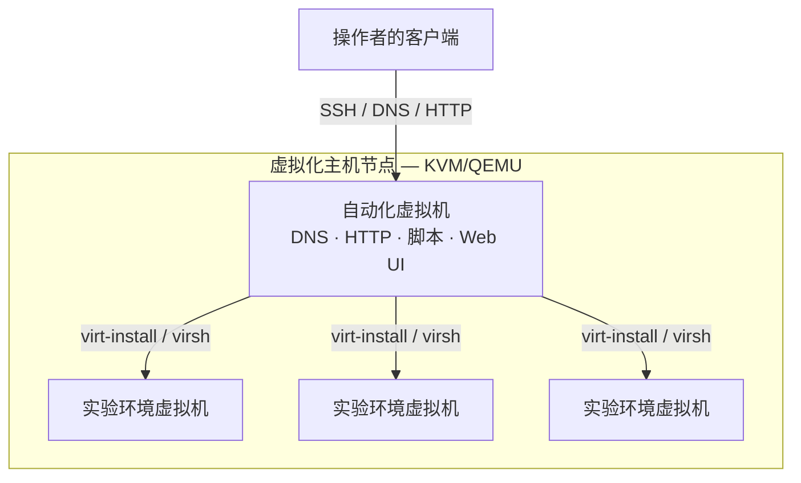
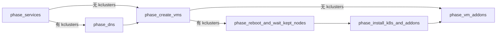
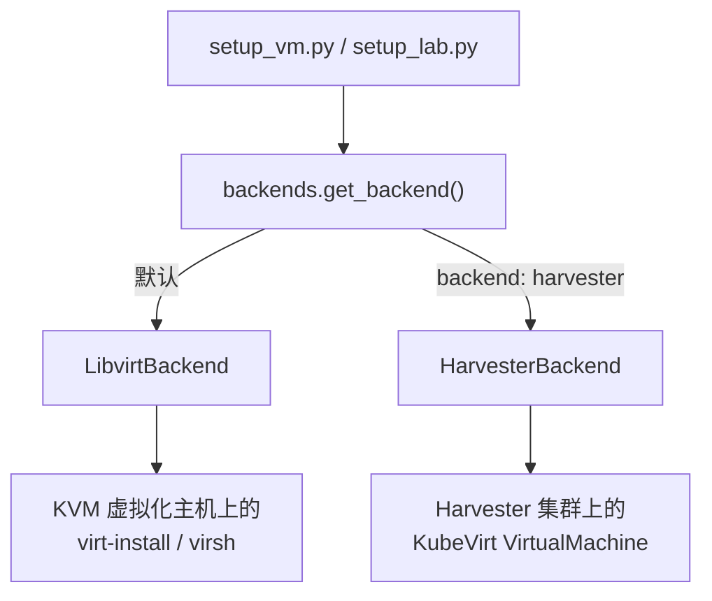
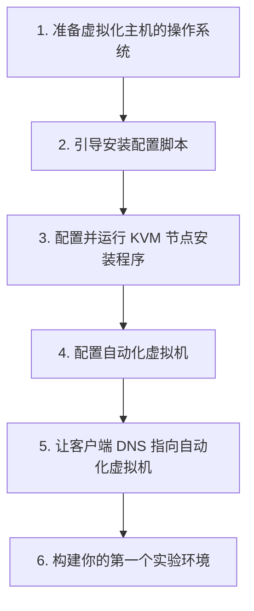
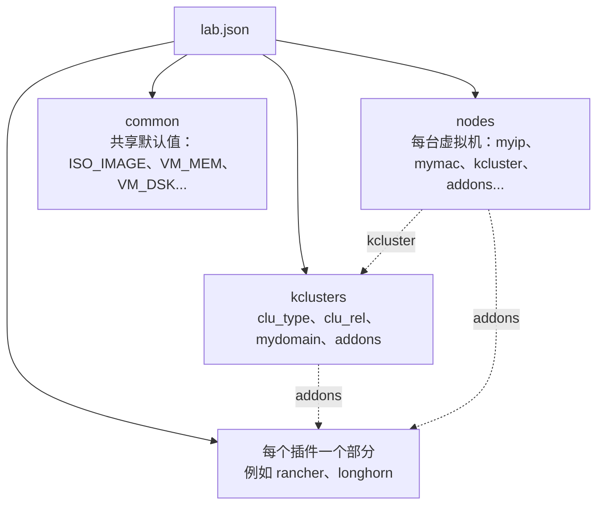

<a id="top"></a>
# lab-in-a-box

<p align="center">
  
  <br/>
  
</p>

<p align="center">
  <a href="https://github.com/SUSE-Technical-Marketing/lab-in-a-box/actions/workflows/ci.yml"></a>
  
  
  
  
</p>

<p align="center">
  <sub>🌐 <a href="README.md">English</a> · <a href="README.es.md">Español</a> · <a href="README.de.md">Deutsch</a> · <a href="README.fr.md">Français</a> · <a href="README.pt-BR.md">Português (Brasil)</a> · <a href="README.ja.md">日本語</a> · <a href="README.zh-CN.md"><strong>简体中文</strong></a></sub>
</p>

> *这是社区翻译版本。权威来源是英文的 [README.md](README.md)，其内容可能比本页面更新。*

<p align="center"><em>指向一个 JSON 或 YAML 文件，得到一个可用的实验环境——虚拟机、DNS、Kubernetes 和插件，一应俱全。</em></p>

<p align="center" float="left">
  <kbd></kbd>
</p>

**lab-in-a-box** 能把一台裸机变成一座自给自足的"实验环境工厂"：只需指向一个描述所需虚拟机、Kubernetes 集群和软件的 JSON 或 YAML 文件，它就会构建出全部内容——DNS、系统配置、集群搭建以及各类插件——完全不需要你手动操作 `virt-install` 或 Ansible。

## 为什么选择 lab-in-a-box？

<table>
<tr>
<td width="50%" valign="top">

`setup_lab.py` · **一个 JSON/YAML 文件，一条命令。**
以声明式方式描述虚拟机、Kubernetes 集群（RKE2/K3s）和插件；它会按正确的顺序把一切都构建出来。

`install_<addon>` · **41 个开箱即用的插件。**
Rancher、Longhorn、NeuVector、Harbor、Keycloak、Jenkins、Argo CD、SUSE Manager/Uyuni（激活密钥、RBAC、Content Lifecycle Management、Ansible 集成等）、用于安全培训的漏洞演示应用，以及更多。

[`lab-builder`](#web-ui-lab-builder) · **动态 Web 界面。**
直接根据各插件自身的 schema 生成表单——只要给脚本加一个字段，界面无需任何前端改动即可识别它。

</td>
<td width="50%" valign="top">

`KVM_HOSTS` · **支持多台虚拟化主机。**
一份实验环境定义可以把虚拟机分布到多台 KVM 主机上，既可以根据空闲 CPU/内存/磁盘自动选择，也可以按节点固定指定。

`podman` · **完全容器化的测试套件。**
每项检查都在各自独立的一次性容器中运行，并接入了 pre-commit 钩子。

`config_method` · **可插拔的系统配置方式。**
Ignition+Combustion（SLE Micro）、cloud-init（openSUSE/Ubuntu）、`virt-customize`（用于不支持 cloud-init/Ignition 的老旧发行版），或基于脚本的 ISO 安装（AutoYaST/Kickstart/Preseed/AutoInstall）。

</td>
</tr>
</table>

---

## 目录

- [架构](#architecture)
- [工作原理](#how-it-works)
- [快速开始](#quick-start)
- [Web 界面（lab-builder）](#web-ui-lab-builder)
- [实验环境定义格式](#lab-definition-format)
- [示例](#examples)
- [分步教程](#step-by-step-walkthroughs)
- [可用命令](#available-commands)
- [可用插件](#available-addons)
- [配置参考](#configuration-reference)
- [测试](#testing)
- [贡献 / 开发环境搭建](#contributing--developer-setup)

<p align="right"><a href="#top">↑ 回到顶部</a></p>

---

<a id="architecture"></a>
## 架构

<p align="center" float="left">
  <kbd></kbd>
  <kbd></kbd>
</p>

整个系统围绕**双层架构**构建：



### 虚拟化主机节点

一台或多台运行 KVM/QEMU 的物理裸机。每台主机都承载实验环境的虚拟机，并在 `/var/lib/libvirt/images/sources/` 中保存源 QCOW2 镜像。一台 NUC、一台工作站，或任何能够运行 KVM 的 x86_64 机器都可以胜任。需要超出单台机器容量的实验环境，可以跨越**多台 KVM 主机**——详见下文的[多主机实验环境](#multi-host-labs)。

### 自动化虚拟机

运行在虚拟化主机上的一台小型虚拟机，充当整个实验环境的控制平面。它提供：

- **DNS** —— BIND（`named`）负责解析实验环境的域名并转发外部请求，因此任何指向它的客户端都能解析实验环境中的所有主机名
- **HTTP** —— 在 `/srv/www/htdocs/lab_creation/` 下提供系统配置文件（Ignition、Combustion、cloud-init）
- **脚本** —— 所有实验环境管理命令都安装在 `/usr/local/bin/`
- **Web 界面**（可选）—— [lab-builder](#web-ui-lab-builder)，一个基于浏览器的 lab.json 设计工具

所有用户命令都在**自动化虚拟机上**执行。它通过 SSH 连接到虚拟化主机和已创建的虚拟机。初始配置完成后，无需再直接访问虚拟化主机。

### 底层实现

命令行工具和每个插件都用 Python 3.11 编写，位于 `libs/` 和 `scripts/` 中，安装到 `/usr/local/lib/lab_creation/`——围绕一小组共享库模块（`lab_creation.py`、`backends.py`、`services.py`、`spacecmd_common.py` 等）组织，而不是互相依赖。虚拟机的创建通过一个可插拔的 `VMBackend` 接口（目前是 `LibvirtBackend`）实现，这样同一套编排代码将来可以在不改动插件的情况下支持其他虚拟化后端（KubeVirt、Harvester）。有一个遗留插件（`install_ds389`）仍是纯 bash 实现——它早于 Python 移植，且在 bash 时代就已经损坏，所以不值得移植。这些插件所取代的 bash 时代实现被归档保留在 `legacy_bash/` 下。

<p align="right"><a href="#top">↑ 回到顶部</a></p>

---

<a id="how-it-works"></a>
## 工作原理

### 部署流水线

`setup_lab.py` 按固定的阶段顺序执行；对于纯虚拟机实验环境（没有 `kclusters` 部分），两个仅与 Kubernetes 相关的阶段会被完全跳过：



### 虚拟机配置

每台虚拟机按以下步骤创建：
1. 确定它属于哪台 KVM 主机（显式的 `kvm_host` 字段，或根据空闲容量自动选择——参见[多主机实验环境](#multi-host-labs)）
2. 在该主机上复制并调整源 QCOW2 镜像的大小
3. 根据 `config_method` 从模板生成系统配置文件
4. 在 BIND 中注册一条 DNS 记录
5. 通过 SSH 在虚拟化主机上执行 `virt-install`
6. 等待 SSH 变为可用

系统配置方式由实验环境 JSON 中的 `config_method`（按节点或在 `common` 中）控制：

| 值 | 方式 | 适用于 |
|---|---|---|
| _(空，默认)_ | Ignition + Combustion | SLE Micro |
| `cloud-init` | cloud-init ISO | openSUSE Leap、Ubuntu |
| `virt_customize` | 直接在虚拟化主机上修改 QCOW2（`virt-customize`）——客户机无需支持 Ignition/cloud-init | CentOS 7、旧版 Debian/RHEL，或任何不支持 Ignition/cloud-init 的镜像 |
| `install_iso` | 从真正的安装 ISO 进行脚本化安装（根据 `install_type` 选择 AutoYaST、Kickstart、Preseed 或 AutoInstall） | 没有其他配置方式的发行版 |

### 虚拟机后端

究竟由哪种虚拟化技术来创建一个节点，取决于一个可插拔的 `VMBackend` 接口，每个节点解析一次（该节点配置中的 `backend: harvester` 会选择 `HarvesterBackend`；其他情况默认使用 `LibvirtBackend`）——无论解析出的是哪个后端，每个插件和编排脚本都以同样的方式与它交互：



### Kubernetes 配置

虚拟机启动后，`setup_lab.py` 会根据 JSON 中的 `kclusters` 部分在每个节点上安装 Kubernetes。RKE2 和 K3s 均受支持。集群就绪后，其插件会依次运行；虚拟机级别的插件（绑定到单个节点而非集群）会在该节点配置完成后运行。

### 多主机实验环境

<a id="multi-host-labs"></a>
一个实验环境并不局限于单台虚拟化主机。在自动化虚拟机的 `/etc/lab_creation.cfg` 中设置 `KVM_HOSTS`（以空格分隔），即可使用多台虚拟化主机：

```ini
KVM_HOSTS="hv1.mydemo.lab hv2.mydemo.lab hv3.mydemo.lab"
```

之后，对于实验环境 JSON 中的每个节点，你可以：
- **显式固定**——在该节点的配置中设置 `"kvm_host": "hv2.mydemo.lab"`，或者
- **让其自动选择**——省略 `kvm_host`；该节点会被分配到当前拥有足够空闲 CPU/内存/磁盘的已配置主机上（通过 SSH 实时探测）。

未指定 `kvm_host` 的节点，以及只配置了一台主机的环境，其行为与该功能出现之前完全一致——对单主机实验环境而言没有任何变化。

### 库加载顺序

每个脚本按以下顺序加载配置：

1. `/etc/lab_creation.defaults` —— 系统级默认值、路径、软件包列表
2. `/usr/local/lib/lab_creation/primary.py` —— 输入验证、配置加载
3. `/etc/lab_creation.cfg` —— 节点特定设置（`REMOTE_HOST`、`ROOT_SSH_KEY`、`VIRT_SRV`、`KVM_HOSTS` 等）
4. `/usr/local/lib/lab_creation/lab_creation.py` —— 虚拟机、DNS 和编排相关函数
5. `/usr/local/lib/lab_creation/k8s.py` —— Kubernetes 集群相关函数

<p align="right"><a href="#top">↑ 回到顶部</a></p>

---

<a id="quick-start"></a>
## 快速开始



### 前提条件

- 一台能够运行 KVM 的机器（已启用 Intel VT-x 或 AMD-V）
- 用于下载软件包和镜像的互联网访问（或本地镜像源）
- 将所选操作系统的 QCOW2 镜像放置在虚拟化主机的 `/var/lib/libvirt/images/sources/` 中

> [!IMPORTANT]
> 自动化虚拟机需要专门的 `python3.11`——工具链明确固定使用该版本。大多数发行版会额外自带一个更旧的默认 `python3`；如果缺少 `python3.11`，安装脚本会拒绝继续执行。

已测试过的镜像：
- [SLE Micro](https://www.suse.com/download/sle-micro/) —— 推荐，配合 Ignition+Combustion 使用
- openSUSE Leap Micro —— 受支持，配合 cloud-init 使用

### 第 1 步 —— 准备虚拟化主机的操作系统

在硬件上安装 SLES（或其他支持 KVM 的 Linux）。安装过程中，请选择：
- **网络**：创建一个绑定到主网卡、带静态 IP 的网桥接口（`br0`）
- **系统角色**：KVM Virtualization Host

<details>
<summary>在 Linux 上制作可启动 U 盘</summary>

```shell
# 插入 U 盘之前：
cat /proc/partitions > /tmp/partb4

# 插入 U 盘后：
cat /proc/partitions > /tmp/parta

# 找到新出现的设备：
diff /tmp/part*
```

> [!WARNING]
> 下面的命令会**销毁目标设备上的所有数据**。执行前请务必将 `sdX` 与上面 `diff` 的输出仔细核对。

```shell
# 写入 ISO（将 sdX 替换为你自己的设备）：
dd if=SLE-15-SP6-Online-x86_64-GM-Media1.iso of=/dev/sdX bs=4k && sync
```

</details>

### 第 2 步 —— 引导安装配置脚本

在任意一台可以通过 SSH 访问虚拟化主机的 Linux 机器上：

```shell
curl https://raw.githubusercontent.com/SUSE-Technical-Marketing/lab-in-a-box/main/install_demo_server_scripts.sh | bash -
```

这会将配置脚本下载到 `/var/tmp/setup_demo_server/`。

### 第 3 步 —— 配置并运行 KVM 节点安装程序

<a id="step-3--configure-and-run-the-kvm-node-setup"></a>

```shell
cd /var/tmp/setup_demo_server/setup_demo_server/
vim lab.cfg
```

`lab.cfg` 中的关键设置：

| 设置项 | 说明 |
|---|---|
| `ROOT_PWD_HASH` | root 密码哈希——使用 `mkpasswd --method=SHA-512 --stdin` 生成 |
| `ROOT_SSH_PUB_KEY` | 用于免密码访问的 SSH 公钥 |
| `AUTOMATION_HOSTNAME` | 自动化虚拟机的主机名（例如 `automation.mydemo.lab`） |
| `_QCOW_IMAGE` | 源 QCOW2 镜像的文件名 |
| 网络设置 | 实验环境网络的 IP、网关、子网掩码、DNS |

然后运行安装程序（将 `<IP>` 替换为你的虚拟化主机 IP，本地运行则省略）：

```shell
./setup_kvm_node.py <IP>
```

这会配置好自动化虚拟机并启动所有必需的服务。

### 第 4 步 —— 配置自动化虚拟机

通过 SSH 连接到自动化虚拟机并安装实验环境脚本：

```shell
ssh <AUTOMATION_HOSTNAME>
./install_automation_node_scripts.sh

cp /etc/lab_creation.cfg.example /etc/lab_creation.cfg
vim /etc/lab_creation.cfg
```

`lab_creation.cfg` 中的关键设置：

| 设置项 | 说明 |
|---|---|
| `REMOTE_HOST` | （主）KVM 虚拟化主机的主机名或 IP |
| `KVM_HOSTS` | _(可选)_ 以空格分隔的额外虚拟化主机列表，用于[多主机实验环境](#multi-host-labs) |
| `ROOT_SSH_KEY` | 注入到虚拟机中的 SSH 公钥内容 |
| `VIRT_SRV` | libvirt 连接 URI（例如 `qemu+ssh://root@hypervisor/system`） |
| `NETWORK` | 虚拟机使用的默认 libvirt 网络（例如 `bridge=br0`） |

### 第 5 步 —— 让客户端 DNS 指向自动化虚拟机

<a id="step-5--point-your-client-dns-at-the-automation-vm"></a>

为了让主机名能从你的桌面解析：

```shell
# Linux（NetworkManager）：
nmcli con mod <connection> ipv4.dns <AUTOMATION_IP>

# 或添加到 /etc/resolv.conf：
nameserver <AUTOMATION_IP>
```

### 第 6 步 —— 构建你的第一个实验环境

```shell
setup_lab.py examples/cluster.json.template
```

更多起点请参见下面的[示例](#examples)，或者打开 [Web 界面](#web-ui-lab-builder)，无需手写 JSON。

<p align="right"><a href="#top">↑ 回到顶部</a></p>

---

<a id="web-ui-lab-builder"></a>
## Web 界面（lab-builder）

一个基于浏览器的 `lab.json` 设计工具，能在运行时**自省项目自身的 Python 库**——它对任何插件都没有硬编码的了解。选择一个组件，界面就会直接根据该组件自身的 schema 生成表单；给脚本加一个字段，界面无需任何前端改动即可显示它。

```shell
# 最快的体验方式——除 Python 外没有任何依赖：
python3.11 webui/run-local.py            # → http://localhost:8677/
```

关于生产环境部署（Apache，或独立于 init 系统的 systemd 服务，外加通过幂等生成的自签名证书实现的 HTTPS），请参阅 **[README.webui.md](README.webui.md)**——其中涵盖了全部三种部署模式、HTTP API 以及故障排查。

<p align="right"><a href="#top">↑ 回到顶部</a></p>

---

<a id="lab-definition-format"></a>
## 实验环境定义格式

实验环境以 JSON 或 YAML 文件的形式定义（自动检测格式 —— 见下方说明）。当前格式支持每个实验环境包含多个 Kubernetes 集群（`kclusters`）；旧版单集群格式（`cluster`）请参见 `examples/cluster.json.template`。



```jsonc
{
  "nodes": {
    "node101.mydemo.lab": {
      "myip":  "192.168.88.101",
      "mymac": "34:8a:b1:4b:1a:c1",
      "INSTALL_RKE2_TYPE": "server",   // "server" 或 "agent"
      "kcluster": "cluster1"           // 该节点属于哪个 kclusters 条目
    },
    "node102.mydemo.lab": {
      "myip":  "192.168.88.102",
      "mymac": "34:8a:b1:4b:1a:c2",
      "INSTALL_RKE2_TYPE": "agent",
      "kcluster": "cluster1"
    }
  },
  "common": {
    "ISO_IMAGE":  "SL-Micro.x86_64-6.1-Default-qcow-GM.qcow2",
    "VM_MEM":     "24576",
    "VM_DSK":     "80",
    "VM_CPU":     "6",
    "VM_BOOT":    "uefi",             // uefi（默认）、firmware=bios、bios、uefi=off
    "mymask":     "24",
    "mygw":       "192.168.88.1",
    "mydns":      "192.168.88.73",
    "mynet_reverse": "88.168.192"
  },
  "kclusters": {
    "cluster1": {
      "clu_type":  "rke2",             // "rke2" 或 "k3s"
      "clu_rel":   "stable",
      "mydomain":  "mydemo.lab",
      "addons": ["rancher", "longhorn"]
    }
  },
  "rancher": {
    "rancher_shorthn":   "rancher",
    "rancher_rel":       "rancher-prime",
    "rancher_repo_url":  "https://charts.rancher.com/server-charts/prime",
    "rancher_helm_rel":  "rancher",
    "rancher_helm_chart": "rancher-prime/rancher",
    "rancher_Version":   "--version 2.13.3",
    "cert_manager_ver":  "--version v1.14.4"
  }
}
```

<details>
<summary>同一个实验环境，用 YAML 表示</summary>

```yaml
nodes:
  node101.mydemo.lab:
    myip: "192.168.88.101"
    mymac: "34:8a:b1:4b:1a:c1"
    INSTALL_RKE2_TYPE: server   # "server" 或 "agent"
    kcluster: cluster1          # 该节点属于哪个 kclusters 条目
  node102.mydemo.lab:
    myip: "192.168.88.102"
    mymac: "34:8a:b1:4b:1a:c2"
    INSTALL_RKE2_TYPE: agent
    kcluster: cluster1

common:
  ISO_IMAGE: SL-Micro.x86_64-6.1-Default-qcow-GM.qcow2
  VM_MEM: "24576"
  VM_DSK: "80"
  VM_CPU: "6"
  VM_BOOT: uefi                # uefi（默认）、firmware=bios、bios、uefi=off
  mymask: "24"
  mygw: "192.168.88.1"
  mydns: "192.168.88.73"
  mynet_reverse: "88.168.192"

kclusters:
  cluster1:
    clu_type: rke2              # "rke2" 或 "k3s"
    clu_rel: stable
    mydomain: mydemo.lab
    addons: [rancher, longhorn]

rancher:
  rancher_shorthn: rancher
  rancher_rel: rancher-prime
  rancher_repo_url: https://charts.rancher.com/server-charts/prime
  rancher_helm_rel: rancher
  rancher_helm_chart: rancher-prime/rancher
  rancher_Version: "--version 2.13.3"
  cert_manager_ver: "--version v1.14.4"
```

</details>

节点级别的可选字段：

| 字段 | 说明 |
|---|---|
| `addons` | 仅针对该虚拟机运行的插件脚本列表 |
| `config_method` | 覆盖系统配置方式（`cloud-init`、`virt_customize`、`install_iso`） |
| `kvm_host` | 在[多主机实验环境](#multi-host-labs)中将该虚拟机固定到特定的虚拟化主机 |
| `extra_dsk` | 要挂载的额外磁盘——`"/dev/sdb"`，或使用 `"/dev/sdb,bus=scsi"` 为该磁盘覆盖默认总线类型 |
| `salt_states` | 要应用的 Salt state（仅限 cloud-init 方式） |

kcluster 的可选字段：

| 字段 | 说明 |
|---|---|
| `mgm_node` | 运行集群插件安装程序的节点主机名；默认为第一个服务器节点 |

每个插件脚本还支持 `--schema`（`--input-definition` 的别名），它会以机器可读的 JSON 或 YAML 格式输出自身的配置键——这与 [Web 界面](#web-ui-lab-builder)读取以构建表单的 schema 完全相同：

```shell
install_longhorn --schema
setup_lab.py --input-definition yaml   # 基础拓扑 schema（common/nodes/kclusters）
```

<p align="right"><a href="#top">↑ 回到顶部</a></p>

---

<a id="examples"></a>
## 示例

### 最小的单虚拟机实验环境

尽可能小的实验环境——一台虚拟机，不含 Kubernetes：

```jsonc
{
  "nodes": {
    "standalone.mydemo.lab": { "myip": "192.168.88.50" }
  },
  "common": {
    "ISO_IMAGE": "SL-Micro.x86_64-6.1-Default-qcow-GM.qcow2",
    "VM_MEM": "4096", "VM_DSK": "40", "VM_CPU": "2",
    "mymask": "24", "mygw": "192.168.88.1", "mydns": "192.168.88.73"
  }
}
```

```shell
setup_lab.py standalone.json
```

### RKE2 + Rancher + Longhorn（"hello world" 集群）

一个包含管理平台和分布式存储的双节点集群——完整示例见上文的[实验环境定义格式](#lab-definition-format)。

```shell
setup_lab.py rancher-cluster.json
# 之后重新运行，跳过任何已启动且可访问的虚拟机：
setup_lab.py --keep rancher-cluster.json
```

### 将一个集群分布到两台主机上

把服务器固定到一台虚拟化主机，让代理节点自动选择空间充足的[已配置主机](#multi-host-labs)：

```jsonc
{
  "nodes": {
    "srv1.mydemo.lab":   { "myip": "192.168.88.10", "kvm_host": "hv1.mydemo.lab", "kcluster": "prod" },
    "agent1.mydemo.lab": { "myip": "192.168.88.11", "kcluster": "prod" },
    "agent2.mydemo.lab": { "myip": "192.168.88.12", "kcluster": "prod" }
  },
  "common": { "ISO_IMAGE": "SL-Micro.x86_64-6.1-Default-qcow-GM.qcow2", "VM_MEM": "8192", "VM_DSK": "60", "VM_CPU": "4" },
  "kclusters": { "prod": { "clu_type": "rke2", "clu_rel": "stable", "mydomain": "mydemo.lab" } }
}
```

### SUSE Manager（Uyuni）服务器 + 一台已注册的客户端

启动一台带有激活密钥的 Uyuni 服务器，然后将第二台虚拟机注册为它的 Salt 客户端——完整功能集（`orgs`、RBAC、Content Lifecycle Management、Ansible 集成等）请参见[可用插件](#available-addons)：

```jsonc
{
  "nodes": {
    "uyuni.mydemo.lab":  { "myip": "192.168.88.30", "addons": ["uyuni"] },
    "client1.mydemo.lab": { "myip": "192.168.88.31", "addons": ["client_registration"] }
  },
  "common": { "ISO_IMAGE": "SL-Micro.x86_64-6.1-Default-qcow-GM.qcow2", "VM_MEM": "8192", "VM_DSK": "60", "VM_CPU": "4" },
  "uyuni": {
    "uyuni_admin": "admin", "uyuni_password": "Uyuni12345",
    "uyuni_activation_key": "1-lab-clients", "uyuni_activation_key_base_channel": "sle-micro-6.1-pool"
  },
  "client_registration": {
    "client_registration_server_type": "uyuni",
    "client_registration_server": "uyuni.mydemo.lab",
    "client_registration_activation_key": "1-lab-clients"
  }
}
```

<p align="right"><a href="#top">↑ 回到顶部</a></p>

---

<a id="step-by-step-walkthroughs"></a>
## 分步教程

上面的[示例](#examples)是可直接复制粘贴的起点。下面三个教程会从头到尾完整走一遍真实场景——运行什么、每一步会发生什么，以及如何验证它确实生效了。下面出现的每个 JSON 字段和命令形式都与本项目自身的测试套件（`tests/run_tests.sh`）及源码保持一致。

> [!TIP]
> 教程 2 和 3 都经过**实机测试**——是在真实的服务器/硬件上运行的，而不仅仅是孤立验证。

### 教程 1 —— 你的第一个集群：RKE2 + Rancher + Longhorn

目标：两台 SLE Micro 虚拟机、一个 RKE2 集群、用于管理的 Rancher、用于存储的 Longhorn——最终可以通过浏览器访问。

1. **编写实验环境文件。** 保存为 `rancher-cluster.json`（将 IP/网络调整为你自己的实验环境域名）：

   ```jsonc
   {
     "nodes": {
       "node101.mydemo.lab": {
         "myip": "192.168.88.101", "mymac": "34:8a:b1:4b:1a:c1",
         "INSTALL_RKE2_TYPE": "server", "kcluster": "cluster1"
       },
       "node102.mydemo.lab": {
         "myip": "192.168.88.102", "mymac": "34:8a:b1:4b:1a:c2",
         "INSTALL_RKE2_TYPE": "agent", "kcluster": "cluster1"
       }
     },
     "common": {
       "ISO_IMAGE": "SL-Micro.x86_64-6.1-Default-qcow-GM.qcow2",
       "VM_MEM": "24576", "VM_DSK": "80", "VM_CPU": "6",
       "mymask": "24", "mygw": "192.168.88.1", "mydns": "192.168.88.73"
     },
     "kclusters": {
       "cluster1": {
         "clu_type": "rke2", "clu_rel": "stable", "mydomain": "mydemo.lab",
         "addons": ["rancher", "longhorn"]
       }
     },
     "rancher": {
       "rancher_shorthn": "rancher", "rancher_rel": "rancher-prime",
       "rancher_repo_url": "https://charts.rancher.com/server-charts/prime",
       "rancher_helm_rel": "rancher", "rancher_helm_chart": "rancher-prime/rancher",
       "rancher_Version": "--version 2.13.3", "cert_manager_ver": "--version v1.14.4"
     }
   }
   ```

2. **构建它：**

   ```shell
   setup_lab.py rancher-cluster.json
   ```

   `setup_lab.py` 会在做任何其他事情之前自动对文件进行预检——错误的 IP、指向不存在的 `kcluster` 的引用、缺失的 `ISO_IMAGE` 等类似错误都会被检测出来并打印（`✗ Preflight FAILED — N error(s)`），且不会创建任何内容，而不是执行到一半才失败。一个正确的文件会打印 `✓ Preflight passed`，然后直接进入构建阶段。

   按顺序，它会：把两个节点都注册到 DNS → 创建两台虚拟机（复制 QCOW2 镜像、生成 Combustion 文件、启动、等待 SSH）→ 在 `node101` 上以 server 身份安装 RKE2，然后在 `node102` 上以 agent 身份安装 → 在集群的管理节点（`mgm_node`，默认为第一个服务器节点——此处为 `node101`）上安装 `rancher` 和 `longhorn`。带 Rancher 的双节点集群通常需要 15–25 分钟；其中大部分时间花在 RKE2 的引导过程和 Rancher 自身的 Helm 安装上。

3. **验证 DNS 是否可以解析**（在你自己的桌面上，前提是[已将其指向自动化虚拟机的 DNS](#step-5--point-your-client-dns-at-the-automation-vm)）：

   ```shell
   dig +short node101.mydemo.lab rancher.mydemo.lab
   ```

   两者都应返回 `192.168.88.101`（Rancher 的 ingress 主机名是 `rancher_shorthn` 的值 `rancher`，位于集群的 `mydomain` 之下）。

4. **登录。** 访问 `https://rancher.mydemo.lab`（自签名证书——浏览器会警告一次），使用自动化虚拟机上 `/etc/lab_creation.cfg` 中的 `rancher_initial_pwd` 登录。

5. **无需重建全部即可迭代。** 修改了某个节点的配置，或某台虚拟机崩溃了？加上 `--keep` 重新运行：任何已存在、与其定义的 IP/MAC 匹配且可通过 SSH 访问的虚拟机都会被保留不动；只有实际缺失或损坏的部分才会被（重新）创建：

   ```shell
   setup_lab.py --keep rancher-cluster.json
   ```

6. 完成后**销毁**它：

   ```shell
   destroy_lab.py rancher-cluster.json
   ```

### 教程 2 —— 带有已注册客户端的 SUSE Manager（Uyuni）服务器

目标：一台拥有真实激活密钥的 Uyuni 服务器，以及一台将自身注册为其 Salt 托管客户端的第二台虚拟机。已针对真实 Uyuni 服务器完成**端到端实机测试**。

1. **编写实验环境文件**——一个节点用于 Uyuni 服务器，另一个用于客户端：

   ```jsonc
   {
     "nodes": {
       "uyuni.mydemo.lab":   { "myip": "192.168.88.30", "addons": ["uyuni"] },
       "client1.mydemo.lab": { "myip": "192.168.88.31", "addons": ["client_registration"] }
     },
     "common": {
       "ISO_IMAGE": "SL-Micro.x86_64-6.1-Default-qcow-GM.qcow2",
       "VM_MEM": "8192", "VM_DSK": "60", "VM_CPU": "4",
       "mymask": "24", "mygw": "192.168.88.1", "mydns": "192.168.88.73", "mydomain": "mydemo.lab"
     },
     "uyuni": {
       "uyuni_admin": "admin", "uyuni_password": "Uyuni12345",
       "uyuni_activation_key": "1-lab-clients", "uyuni_activation_key_base_channel": "sle-micro-6.1-pool"
     },
     "client_registration": {
       "client_registration_server_type": "uyuni",
       "client_registration_server": "uyuni.mydemo.lab",
       "client_registration_activation_key": "1-lab-clients"
     }
   }
   ```

2. **构建它：**

   ```shell
   setup_lab.py uyuni-lab.json
   ```

   虚拟机级别的插件（`uyuni` 和 `client_registration` 都绑定到节点而非集群，因为这里没有 `kclusters` 部分）会在各自的节点启动后运行。`install_uyuni` 启动服务器，等待它变为可访问，然后创建激活密钥。随后 `install_client_registration` 会针对该服务器为 `client1` 完成引导——安装引导脚本并运行它，然后定期轮询，直到新 minion 的 Salt 密钥显示为待处理状态，再将其接受。

3. **验证客户端确实已注册。** 通过 SSH 连接到 Uyuni 服务器并直接查询：

   ```shell
   ssh uyuni.mydemo.lab
   mgrctl exec 'spacecmd -- system_list'
   ```

   `client1.mydemo.lab` 应该出现在列表中。

4. 使用 `uyuni_admin`/`uyuni_password` **登录 Web 界面**（`https://uyuni.mydemo.lab`），以可视化方式查看同样的信息、浏览激活密钥，或运行一次 highstate。

已知的上游小问题（并非本项目的 bug，记录于此以防你遇到）：`salt-transactional-update` 自身的软件包升级脚本片段可能会在客户端的 `/etc/salt/minion.d/transactional_update.conf` 中留下重复的 YAML 键，导致 `salt-minion` 陷入崩溃循环，直到手动去除重复项为止。本仓库中的代码不会触碰这个文件。

### 教程 3 —— NAT 模式下的自动化虚拟机（单网卡笔记本电脑作为虚拟化主机）

目标：在没有多余网卡可用于网桥的主机上引导自动化虚拟机——转而使用由 libvirt 管理的私有网络，并将特定端口通过 DNAT 从主机自身的真实 IP 转发进来。已在一次性的嵌套虚拟机上完成**端到端实机测试**。

如果你不启用它，这不会改变[默认快速开始](#quick-start)流程的任何内容——`_network_mode` 默认是 `"bridge"`，与所有现有配置逐字节保持一致。

1. **在 `lab.cfg` 中**（快速开始的[第 3 步](#step-3--configure-and-run-the-kvm-node-setup)），设置：

   ```ini
   _network_mode="nat"
   _nat_network_name="labnat"          # 图中所示为默认值——一个新的 libvirt 虚拟网络，不是你主机真正的局域网
   _nat_network_cidr="192.168.150.0/24" # 图中所示为默认值
   _nat_forwarded_ports="22:22/TCP 80:80/TCP 443:443/TCP"  # 图中所示为默认值——“<宿主机真实 IP 上的端口>:<automation VM 上的端口>/<协议>”
   ```

   这会把**宿主机自身真实、可从外部访问的 IP**（`<外部端口>`）上的 22/80/443 端口，转发到 **automation VM 的私有 NAT 地址**（`<内部端口>`）上的相同端口——此时这个私有网络里唯一在监听的就是 automation VM，所以这里的“内部”始终指“在 automation VM 上”。（下面的第 5 步会复用同样的 `<外部端口>:<内部端口>/<协议>` 语法，把端口转发到某个*实验室*虚拟机上——前提是这台虚拟机已经存在；届时“内部”指的是那台虚拟机自己的私有 NAT 地址，而不是 automation VM 的。）

2. **像往常一样运行安装程序：**

   ```shell
   ./setup_kvm_node.py
   ```

   这会定义 libvirt 网络 `labnat`（NAT 模式，DHCP/网关由 libvirt 自身处理——与 libvirt 内置的 `default` 网络机制相同，只是使用了本项目自己的名称/CIDR）来代替网桥，然后在其上创建自动化虚拟机，为其分配该私有网段内的静态 IP，最后将上述三个端口通过 DNAT 从主机自身的真实 IP 转发进来。

3. **在虚拟化主机上验证网络和转发规则是否存在**：

   ```shell
   virsh net-list                              # labnat: active
   iptables -t nat -L LAB_PORTFWD -n -v         # 指向自动化虚拟机私有 IP 的 DNAT 规则
   iptables -L LAB_PORTFWD_FWD -n -v            # FORWARD 链中对应的 ACCEPT 规则
   ```

4. **从虚拟化主机外部访问自动化虚拟机**，使用的是虚拟化主机自身的真实 IP——而不是自动化虚拟机那个从其他任何地方都无法路由到的私有地址 `192.168.150.x`：

   ```shell
   ssh root@<虚拟化主机的真实IP>          # 通过 DNAT 转发到自动化虚拟机的 SSH（22 端口）
   ```

   80 和 443 端口默认也会被转发（用于系统配置文件的 HTTP 服务器，以及在你配置好 [Web 界面](#web-ui-lab-builder)之后的 HTTPS 监听端口)——同样可以通过虚拟化主机的真实 IP 访问。

5. **为某台实验环境虚拟机添加端口转发**，而不仅仅是自动化虚拟机本身：给该节点添加一个 `forwarded_ports` 字段，并在 `common.services` 中启用一次 `portforward` 服务：

   ```jsonc
   {
     "nodes": {
       "app1.mydemo.lab": {
         "myip": "192.168.150.20",
         "forwarded_ports": ["8080:80/TCP", "8443:443/TCP"]
       }
     },
     "common": { "services": ["portforward"], "...": "…common 的其余部分照常配置" }
   }
   ```

   一旦实验环境中任意一个节点首次声明了 `forwarded_ports`，`setup_lab.py`/`setup_vm.py` 就会以同样的方式，将这两个端口通过 DNAT 从虚拟化主机的真实 IP 转发进来。

<p align="right"><a href="#top">↑ 回到顶部</a></p>

---

<a id="available-commands"></a>
## 可用命令

所有命令都在**自动化虚拟机上**运行，并以实验环境定义的 JSON 文件作为第一个参数。

| 命令 | 说明 |
|---|---|
| `setup_lab.py [--keep] <lab.json>` | 创建所有虚拟机，搭建 Kubernetes 集群，并按顺序安装每个集群级和虚拟机级插件。`--keep` 会跳过任何已存在、与定义的 IP/MAC 匹配且可通过 SSH 访问的虚拟机——不使用该选项时，每台虚拟机都会被销毁并重新创建。 |
| `setup_vm.py <lab.json> <hostname>` | 创建或重新创建单台虚拟机 |
| `destroy_vm.py <lab.json> <hostname>` | 销毁单台虚拟机 |
| `destroy_lab.py <lab.json>` | 销毁一个实验环境中的所有虚拟机 |

每个命令和每个 `install_<addon>` 脚本都支持：

```shell
setup_lab.py --version              # 打印已安装的版本
install_longhorn --schema           # 打印该插件的配置 schema（JSON 格式）
install_longhorn --schema yaml      # ……或 YAML 格式
```

<p align="right"><a href="#top">↑ 回到顶部</a></p>

---

<a id="available-addons"></a>
## 可用插件

插件通过名称在 kcluster 或节点的 `addons` 数组中被引用。对应的 `install_<name>` 脚本必须位于 `PATH` 中。

<sub>快速跳转: <a href="#addons-k8s">Kubernetes 与 GitOps</a> · <a href="#addons-security">安全与合规</a> · <a href="#addons-suma">SUSE Manager / Uyuni</a> · <a href="#addons-storage">存储与数据库</a> · <a href="#addons-cicd">CI/CD 与工具</a> · <a href="#addons-ai">AI / ML</a> · <a href="#addons-virt">虚拟化与演示</a></sub>

<a id="addons-k8s"></a>
<details open>
<summary><strong>Kubernetes 平台与 GitOps</strong></summary>

| 插件名称 | 说明 |
|---|---|
| `rancher` | SUSE Rancher Prime Kubernetes 管理平台 |
| `longhorn` | SUSE Longhorn 分布式块存储 |
| `harbor` | 容器镜像仓库 |
| `argocd` | Argo CD GitOps 控制器 |
| `kubewarden` | Kubernetes 策略引擎 |
| `istio` | 服务网格 |
| `linkerd` | 服务网格 |
| `traefik` | Ingress 控制器 |
| `nginx` | Ingress 控制器 / 反向代理 |
| `coredns` | 集群 DNS |
| `kucero` | Kubernetes 集群证书轮换 |
| `fluid` | 面向云原生工作负载的数据编排/缓存 |

</details>

<a id="addons-security"></a>
<details open>
<summary><strong>安全与合规</strong></summary>

| 插件名称 | 说明 |
|---|---|
| `neuvector` | SUSE NeuVector 容器安全平台 |
| `nv_testing` | NeuVector 安全测试工作负载（nginx/node/redis pod） |
| `nv-demo-helm` | 基于 Helm 的 NeuVector 演示工作负载 |
| `complianceascode` | OpenSCAP/ComplianceAsCode 操作器 |
| `keycloak` | 身份与访问管理 |
| `kagent` | 面向 Kubernetes 的智能体式 AI 安全助手 |
| `insecure_app` | 故意存在漏洞的 Web 应用（用于演示/培训） |
| `struts_demo` | 存在漏洞的 Apache Struts2 演示应用（CVE-2017-5638） |

</details>

<a id="addons-suma"></a>
<details open>
<summary><strong>SUSE Manager / Uyuni</strong></summary>

| 插件名称 | 说明 |
|---|---|
| `uyuni` | Uyuni 服务器（上游）：激活密钥、组织、RBAC、Content Lifecycle Management、Ansible 集成、SCAP/CVE 审计、dev/QA/prod 环境拓扑——完整字段列表见 `install_uyuni --schema` |
| `smlm` | SUSE Manager Lifecycle Management 服务器——与 `uyuni` 相同的功能集，通过 Kubernetes/Helm 部署 |
| `smlm_proxy` | SMLM 代理 |
| `client_registration` | 将任意虚拟机注册为现有 `uyuni`/`smlm` 服务器的 Salt 客户端（激活密钥引导 + salt 密钥接受） |
| `suma` | SUSE Manager（SUMA），通过 `mgradm` 直接安装在操作系统上——不基于 Kubernetes |

</details>

<a id="addons-storage"></a>
<details open>
<summary><strong>存储与数据库</strong></summary>

| 插件名称 | 说明 |
|---|---|
| `mariadb` | MariaDB 数据库 |
| `postgresql` | PostgreSQL 数据库 |
| `openldap` | OpenLDAP 目录服务 |
| `ds389` | 389 Directory Server（LDAP）——唯一仍以 bash 实现的插件 |

</details>

<a id="addons-cicd"></a>
<details open>
<summary><strong>CI/CD 与开发者工具</strong></summary>

| 插件名称 | 说明 |
|---|---|
| `jenkins` | Jenkins CI |
| `appcollection` | SUSE Application Collection |
| `stackpack` | StackState 监控集成 |
| `trento` | SAP 基础设施监控 |

</details>

<a id="addons-ai"></a>
<details open>
<summary><strong>AI / ML</strong></summary>

| 插件名称 | 说明 |
|---|---|
| `ollama` | 本地 LLM 运行时 |
| `deepseek` | 通过 Ollama 提供的 DeepSeek 模型 |
| `gemini` | Google Gemini API 集成 |
| `phoebe` | （参见 `install_phoebe --schema`） |

</details>

<a id="addons-virt"></a>
<details open>
<summary><strong>虚拟化与演示</strong></summary>

| 插件名称 | 说明 |
|---|---|
| `harvester` | SUSE Virtualization（Harvester/KubeVirt）节点配置 |
| `wordpress` | WordPress + MySQL 演示应用 |
| `kiwi` | KIWI 镜像构建工具 |
| `fluentd` | 日志聚合 |

</details>

要添加一个新插件：参照现有插件的模式创建 `scripts/install_<name>.py`（引入 `addon_common`，通过 `load_definition()` 加载相应的 JSON 部分，通过 SSH 完成实际工作），如有需要在 `templates/addons/<name>/` 下添加模板，并在你的 JSON 的 `addons` 数组中引用 `"<name>"`——`install_automation_node_scripts.sh` 的部署循环和 Web 界面都会自动发现它。

<p align="right"><a href="#top">↑ 回到顶部</a></p>

---

<a id="configuration-reference"></a>
## 配置参考

### `/etc/lab_creation.defaults`

由每个脚本加载的系统级默认值。定义了路径、默认等待计时器和软件包列表。除非你清楚自己在做什么，否则**不要编辑**。

### `/etc/lab_creation.cfg`

自动化虚拟机的节点特定配置。在配置过程中从 `/etc/lab_creation.cfg.example` 复制而来。关键变量：

| 变量 | 说明 |
|---|---|
| `REMOTE_HOST` | KVM 虚拟化主机的主机名或 IP |
| `KVM_HOSTS` | _(可选)_ 用于[多主机实验环境](#multi-host-labs)的、以空格分隔的虚拟化主机列表；默认仅为 `REMOTE_HOST` |
| `VIRT_SRV` | 用于远程虚拟化主机的 libvirt URI |
| `ROOT_SSH_KEY` | 注入到已配置虚拟机中的 SSH 公钥内容 |
| `NETWORK` | 默认的 libvirt 网络字符串 |
| `REMOTE_DNS_SERVERS` | 需要更新的额外 DNS 服务器列表，以空格分隔 |
| `delay_min` | 各配置阶段之间的等待分钟数（在较慢的硬件上应增大） |

### `/usr/local/lib/lab_creation/`

已安装的 Python 库模块。在自动化虚拟机上从仓库运行 `install_automation_node_scripts.sh` 即可更新。

| 文件 | 内容 |
|---|---|
| `lab_creation.py` | 虚拟机生命周期、DNS、多主机解析以及编排相关的辅助函数 |
| `backends.py` | `VMBackend` 接口 + `LibvirtBackend`（创建/删除/重启虚拟机、推送配置文件） |
| `services.py` | DNS 服务管理 |
| `spacecmd_common.py` | 被 `install_uyuni`/`install_smlm`/`install_client_registration` 使用的共享 SUSE Manager/Uyuni 自动化逻辑（激活密钥、组织、RBAC、CLM、Ansible、SCAP/CVE） |
| `primary.py` | 输入验证与配置加载 |
| `k8s.py` | Kubernetes 集群发行版接口（RKE2/K3s） |
| `addon_common.py` | 每个 `install_*` 插件共用的 CLI 基础设施（`--help`/`--version`/`--schema` 分发、schema 校验） |

四个 bash 辅助脚本（`lab_creation.bash`、`k8s_functions.bash`、`primary_functions.bash`、`extensions.sh`）也仍与这些文件一同安装——为了 `install_ds389`（唯一从未移植到 Python 的插件）而被无限期保留。

<p align="right"><a href="#top">↑ 回到顶部</a></p>

---

<a id="testing"></a>
## 测试

每项检查都在其**自己独立的一次性 `podman` 容器**中运行——某一项检查的崩溃、挂起或残留状态都不会影响到任何其他检查：

```shell
tests/run_tests.sh
```

覆盖整个代码树的 bash 和 Python 语法、schema/Web 界面一致性、针对每个核心库和编排脚本的模拟 SSH 单元测试，以及针对实机测试中发现的 bug 的回归测试。要添加一项新检查，只需在 `tests/checks/` 中放入一个可执行脚本——它会被自动发现，无需额外接线。

已接入 pre-commit 钩子（每个克隆仓库启用一次，参见[贡献](#contributing--developer-setup)）——它会在每次提交时自动运行，如果未安装 `podman`，会给出警告并跳过，而不是阻止提交。

<p align="right"><a href="#top">↑ 回到顶部</a></p>

---

<a id="contributing--developer-setup"></a>
## 贡献 / 开发环境搭建

完整指南（开发环境搭建、编码规范、如何添加插件、PR 流程）请参见 **[CONTRIBUTING.md](CONTRIBUTING.md)**（英文）。本项目遵循 [Contributor Covenant 行为准则](CODE_OF_CONDUCT.md)；报告漏洞请参见 [SECURITY.md](SECURITY.md)。每一次 push 和 pull request 都会经过 [CI](https://github.com/SUSE-Technical-Marketing/lab-in-a-box/actions/workflows/ci.yml)——Python 3.11 语法/导入检查、每个插件的 schema 检查、`shellcheck`，以及下文完整的容器化测试套件。

### 一次性 git 设置

克隆仓库后，运行：

```shell
git config core.hooksPath .githooks
```

这会启用 `.githooks/` 中的钩子，它们会：
- 在每次提交前运行完整的[测试套件](#testing)
- 管理按脚本的版本戳记（见下文）

### 版本管理的工作原理

> [!NOTE]
> 这完全由上述 git 钩子处理——你永远不需要手动编辑 `__LABVERSION__`。

每个脚本都包含如下占位符：

```python
__LABVERSION__ = "__LABVERSION__"
```

`.githooks/` 中的钩子会自动展开并恢复这个占位符：

| 钩子 | 触发条件 | 动作 |
|---|---|---|
| `post-checkout` | `git checkout` / `git switch` | 将每个脚本中的 `__LABVERSION__` 替换为最后一次修改该文件的提交哈希 |
| `post-merge` | `git pull` / `git merge` | 同上 |
| `post-rewrite` | `git rebase` / `git commit --amend` | 同上 |
| `pre-commit` | `git commit` | 在提交写入之前，恢复任何已暂存脚本中的 `__LABVERSION__`，确保哈希值永远不会被存储进仓库 |

最终效果：你工作目录中的每个脚本都可以通过 `--version` 显示自己的版本号，而仓库本身始终只保存干净的占位符。通过 `install_automation_node_scripts.sh` 安装脚本时，会在安装期间使用 `git log -1 --format=%h` 应用相同的按文件哈希替换。

### 将脚本安装到自动化虚拟机

在自动化虚拟机上（或任何克隆了该仓库的机器上）的仓库根目录下：

```shell
./install_automation_node_scripts.sh
```

这会备份现有的安装（既包括它自己生成的带时间戳的归档文件，也包括你自己的备份流程另外保留的内容），将每个脚本/库/模板复制到其系统路径，并为每个已安装的文件打上版本哈希戳记。

### 依赖项

运行时（自动化虚拟机上）：
`python3.11`、`jq`、`ssh`、`rsync`、`nc`、`helm`、`kubectl`、`named`（BIND）

虚拟化主机的配置还需要：
`virt-install`、`virsh`、`qemu-img`、`zypper`，以及位于 `/var/lib/libvirt/images/sources/` 中的源 QCOW2 镜像

运行[测试套件](#testing)还需要：
`podman`
